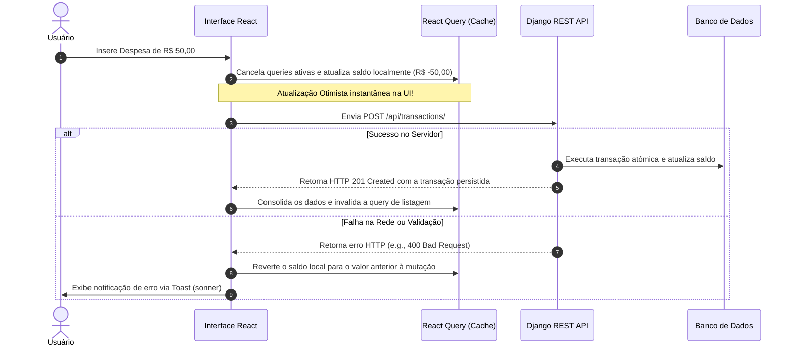
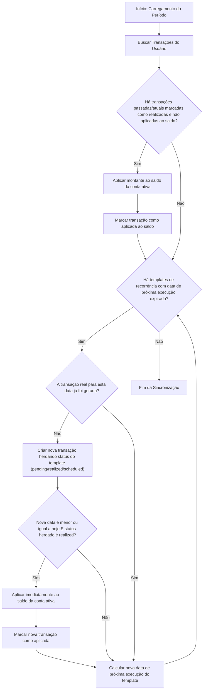
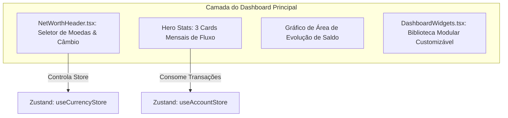
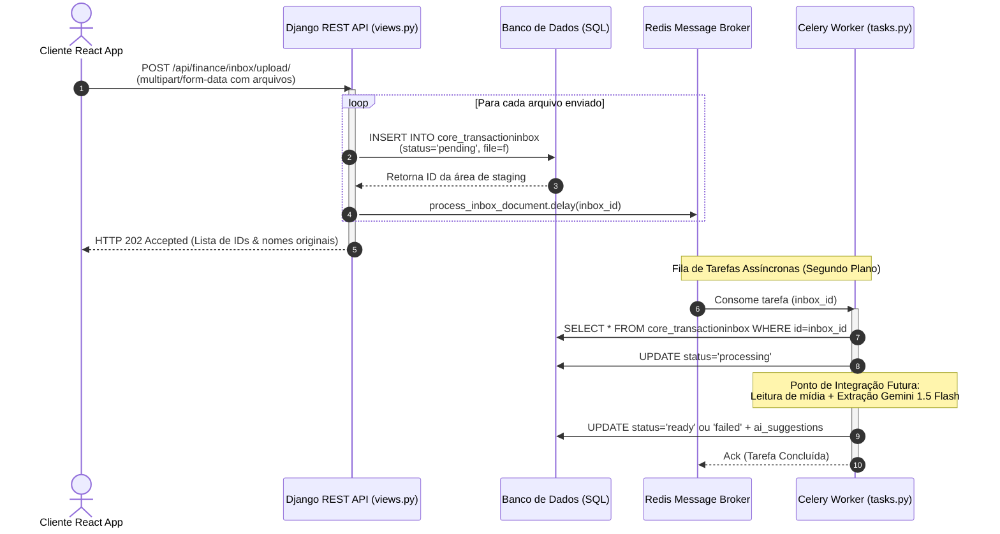

# 🏛️ Arquitetura Técnica — Vault Finance OS

Este documento detalha as decisões de engenharia, fluxos de dados, arquitetura de estado e padrões de integração híbrida que sustentam o **Vault Finance OS**. Ele serve como o guia definitivo para engenheiros que desenvolvem e escalam o ecossistema.

---

## 1. Visão Geral das Camadas (High-Level Architecture)

O Vault Finance OS é estruturado como um sistema híbrido desacoplado. O frontend atua como um cliente *Rich Single Page Application (SPA)* que pode ser empacotado nativamente como um app mobile, enquanto o backend funciona como uma API RESTful de alta performance transacional.

```mermaid
graph TD
    subgraph Camada de Apresentação (Frontend Híbrido)
        UI[React 18 + TailwindCSS] -->|Eventos| Zustand[Zustand Local State]
        UI -->|Ações Assíncronas| RQ[React Query Client]
        Cap[Capacitor Native Bridge] <-->|Eventos de Sistema| UI
    end

    subgraph Camada de Rede (Gateways)
        RQ -->|HTTPS / JSON REST| GW[Nginx / Vercel API Gateway]
    end

    subgraph Camada de Negócios (Backend API)
        GW --> DRF[Django REST Framework]
        DRF --> SimpleJWT[SimpleJWT + pyotp 2FA]
        DRF --> Domain[Lógica de Domínio YNAB / OFX / Moedas]
    end

    subgraph Camada de Dados (Persistência)
        Domain --> PG[(PostgreSQL / SQLite)]
    end
```

---

## 2. Gerenciamento de Estado & Ciclo de Sincronização (Zustand + React Query)

Para mitigar problemas de latência e possibilitar resiliência offline, o Vault Finance OS utiliza uma divisão estrita de responsabilidades entre o **Zustand** (Estado do Cliente e UI) e o **React Query** (Estado do Servidor).

### Divisão de Responsabilidades
* **Zustand (`/Ynab/src/store/`):** Controla o estado dinâmico local da interface. Isso inclui a visibilidade do modo privado (*Private Mode* para esconder saldos), o idioma selecionado, estados de modais, transições visuais, preferências persistidas localmente através do middleware `persist`, e o consentimento de cookies da LGPD/GDPR.
* **React Query (`@tanstack/react-query`):** Gerencia o cache de dados vindos da API do Django. Responsável pela invalidação de consultas (*query invalidation*), re-tentativas automáticas, sincronização em segundo plano e suporte a atualizações otimistas (*Optimistic Updates*).

### Gerenciamento de Consentimento de Cookies (GDPR & LGPD)
Para conferir conformidade total às diretrizes de privacidade de dados, implementamos um duto reativo e modular de consentimento:
* **`useConsentStore`:** Armazena de forma persistente (`localStorage`) o estado de aceite granular do usuário para três categorias de rastreadores: Essenciais (JWT de sessão - sempre ativos), Analíticos (métricas de uso) e Marketing (pixels e campanhas).
* **`useConsentTracker`:** Hook reativo global acoplado no ponto de montagem principal do app (`App.tsx`). Ele ouve as mudanças do Zustand e injeta ou remove scripts de terceiros (como Google Analytics, Facebook Pixel ou PostHog) dinamicamente na DOM do browser apenas se o usuário fornecer consentimento positivo (*opt-in*). Caso o consentimento seja revogado, os scripts e seus elementos DOM correspondentes são limpos em tempo real.

### Sistema de Controle Modular de Recursos (Feature Flags)
Para dar controle total da interface ao usuário, introduzimos uma arquitetura de chaveamento de módulos (*feature toggles*):
* **`useFeatureStore`:** Gerencia as flags de visibilidade de páginas e funcionalidades (`dashboard`, `accounts`, `transactions`, `budget`, `debts`, `goals`, `insights`, `rule503020`). Os estados de visualização de navegação na `Sidebar` e `BottomNav` são filtrados instantaneamente.
* **`FeatureProtectedRoute`:** Wrapper de rotas no React Router (`App.tsx`) que blinda acessos diretos por digitação de URL quando o recurso correspondente estiver inativo, redirecionando o usuário para áreas ativas autorizadas de forma segura.

### Módulo Regra 50-30-20 (Planejamento Financeiro Autônomo e Conectado)
A técnica de divisão de despesas (50% Necessidades, 30% Desejos e 20% Futuro) foi implementada como um microsserviço de visualização desacoplado:
* **`useRule503020Store`:** Store persistente no Zustand que mapeia de forma persistente cada categoria de orçamento (`CategoryNode` do YNAB) a um dos três baldes financeiros.
* **Duplo Modo de Funcionamento (Dual Engine):**
  * **Modo Autônomo:** O usuário digita manualmente a renda líquida e acompanha os limites sugeridos de forma rápida e independente.
  * **Modo Integrado:** Conectado à árvore financeira do YNAB. O sistema consome as receitas reais cadastradas para o mês ativo e os gastos computados nas transações atreladas às categorias mapeadas, fornecendo um diagnóstico real de saúde financeira em tempo real.


### Pipeline de Atualizações Otimistas (Optimistic Updates)
Quando o usuário cria uma nova transação, o sistema não espera o retorno do servidor para atualizar o balanço na tela. O fluxo ocorre da seguinte forma:



---

## 3. Ponte Híbrida Mobile (Capacitor ⇄ Django)

A transformação da SPA React em aplicativo móvel nativo sem perdas de performance é realizada pelo **Capacitor v8**. O comportamento do app varia dinamicamente dependendo do ambiente detectado em runtime.

```mermaid
graph LR
    subgraph Dispositivo Móvel (Android/iOS)
        A[WebView Local] <-->|Ponte Javascript Nativa| B[Capacitor Core]
        B <--> C[Plugins Nativos: Biometria, Google Auth, Secure Storage]
    end
    A <-->|Requisições Seguras HTTPS| D[Django Backend API]
```

### Arquitetura de Autenticação Híbrida (Google OAuth2)
Para manter o fluxo de autenticação consistente entre o navegador web e o aplicativo móvel nativo, a ponte de autenticação funciona em dois fluxos coordenados:

1. **Fluxo Web (Navegador):** O componente `@react-oauth/google` abre o modal padrão do Google, captura o `credential` (ID Token) e o envia diretamente para o endpoint de autenticação social do Django `/api/auth/google/`.
2. **Fluxo Mobile (Capacitor):** O plugin nativo `@codetrix-studio/capacitor-google-auth` intercepta a chamada e invoca o diálogo de Login do Google nativo do sistema operacional (utilizando chaves de assinatura SHA-1 e SHA-256 configuradas no Firebase). Após a aprovação do usuário, o plugin retorna o `idToken`, que é enviado ao backend Django pelo mesmo endpoint `/api/auth/google/`.

O backend Django valida a assinatura criptográfica do token usando a biblioteca oficial do Google e, caso o token seja legítimo, emite um par de tokens JWT (`Access Token` e `Refresh Token`) gerenciado pelo SimpleJWT.

### Otimizações de UX e Layout Nativos (v1.41.06)
Para garantir uma experiência de uso fluida e limpa nos aplicativos nativos:
* **Redirecionamento Inteligente da Rota Raiz:** A rota `/` no React Router (`App.tsx`) avalia se o app está rodando de forma nativa (`Capacitor.isNativePlatform()`). Se verdadeiro, ela redireciona o fluxo diretamente para `/dashboard` (e este para `/auth` caso o usuário não possua token ativo), impedindo que a Landing Page institucional ou de marketing do site web apareça no fluxo móvel.
* **Segurança do Topbar contra Sobreposição (Safe Area):** O cabeçalho principal (`Topbar.tsx`) recebe classes de estilização condicionais em ambiente nativo. É adicionado um padding superior de 32px (`pt-8`) e a altura total é expandida para 88px (`h-22`), criando um espaçamento de segurança para os ícones e logotipos em relação à barra de status (relógio, bateria e conexão do celular) do Android/iOS.

### Bloqueio de Segurança Híbrido Automático (PIN + Biometria - v1.43.00)
Para proteger dados confidenciais financeiros de visualizações indesejadas, implementamos um sistema de bloqueio de segurança automatizado e reativo:
* **Detecção de Estado do App (Lifecycle Listening):** O `SecurityLockProvider` escuta ativamente o evento `appStateChange` do Capacitor. Quando `isActive` se torna falso (aplicativo minimizado ou enviado para segundo plano), o estado `isLocked` é imediatamente setado como `true` no cliente e o timestamp é gravado no armazenamento local (`localStorage`).
* **Proteção de Camada Glassmorphic:** Um wrapper reativo monitora `isLocked`. Se ativo, a tela de bloqueio `SecurityLockScreen` com efeito de desfoque fosco denso (`backdrop-blur-2xl bg-background/60`) é renderizada com prioridade absoluta de índice z (`z-[99999]`), obstruindo toda a árvore de renderização e ocultando tabelas, saldos e gráficos.
* **Autenticação Dupla (Biometria & PIN Passcode):** 
  - *Fluxo Nativo:* Ao abrir, o plugin `@aparajita/capacitor-biometric-auth` invoca o diálogo nativo do sistema operacional pedindo impressão digital ou reconhecimento facial. Em caso de cancelamento, um botão manual permite redisparar o sensor.
  - *Teclado Numérico Passcode:* O teclado numérico minimalista processa inputs de PIN de 4 a 6 dígitos (PIN inicial de fábrica: `1234`), efetuando o desbloqueio atômico se bater com o código armazenado.

---

## 4. Ciclo de Vida da Transação e Ajuste de Balanço (Pendente vs. Realizada)

Um pilar central da metodologia de orçamento YNAB é a precisão dos saldos. O sistema lida com transações em dois estados (`status`): `pending` (Pendente) e `realized` (Efetivada).

### Matriz de Impacto de Saldo

| Tipo de Transação | Data da Transação | Status | Altera o Saldo da Conta? | Justificativa |
| :--- | :--- | :--- | :--- | :--- |
| **Qualquer** | Futura (`date > hoje`) | `pending` ou `realized` | ❌ Não | Transações agendadas não devem afetar o dinheiro disponível no presente. |
| **Receita / Despesa** | Passada ou Atual | `pending` | ❌ Não | Transações pendentes (como compras autorizadas mas não faturadas no cartão de crédito) não alteram o saldo líquido ativo até serem efetivadas. |
| **Receita** | Passada ou Atual | `realized` | 🟢 Sim (Aumenta) | Dinheiro efetivamente depositado e conciliado na conta corrente. |
| **Despesa** | Passada ou Atual | `realized` | 🔴 Sim (Diminui) | Dinheiro efetivamente debitado e deduzido da conta do usuário. |

---

### Processador de Agendamento Recorrente (Engine)
A sincronização e criação de transações agendadas/recorrentes é acionada de forma transparente sempre que o usuário carrega sua árvore de categorias ou lista suas transações. 

A função `sync_recurring_transactions` varre os templates de transação recorrentes (`is_recurring=True`) pertencentes ao usuário e projeta as novas instâncias de transação até o final do período visualizado.

**Regra de Herança de Status (v1.30.5):** Cada instância filha gerada automaticamente herda o campo `status` do template recorrente original (`pending`, `realized` ou `scheduled`). Transações com status `pending` **nunca** afetam o saldo da conta, independentemente da data. Apenas transações com status `realized` e data ≤ hoje são aplicadas ao saldo.



### 4.1 Geração Automática de Ajustes de Saldo em Subcontas
Para facilitar a reconciliação e o lançamento de saldos iniciais de envelopes/subcontas sem a necessidade de digitação manual de transações repetitivas, o backend (`AccountViewSet`) intercepta as operações de criação e atualização de saldos em subcontas (`parent is not None`).
* **Na criação de uma subconta**: Se o saldo atual for maior que zero, é gerada automaticamente uma transação de receita com a descrição `'Saldo Inicial de [Nome]'` e valor equivalente, pré-aplicada ao saldo (`is_applied_to_balance=True`, `status='realized'`).
* **Na atualização de uma subconta**: Se o saldo atual for alterado, o sistema calcula a diferença ($\Delta$) entre o saldo anterior e o novo saldo. Se $\Delta > 0$, cria-se um ajuste de receita automática no valor de $\Delta$. Se $\Delta < 0$, cria-se um ajuste de despesa automática no valor de $|\Delta|$. Ambas as transações são criadas com `is_applied_to_balance=True` e `status='realized'`.

---

## 5. Arquitetura de Segurança: Pipeline JWT + 2FA

Para blindar os dados financeiros dos clientes, o Vault Finance OS implementa uma política rígida de segurança em camadas para todas as conexões baseada no protocolo OAuth2 com autenticação multifator opcional (MFA/2FA).

### Fluxo de Login Seguro e Rotação de Tokens

```mermaid
sequenceDiagram
    autonumber
    actor User as Cliente
    participant FE as Frontend React
    participant API as Django Auth Endpoint
    participant Profile as Perfil do Usuário (DB)

    User->>FE: Digita Usuário e Senha
    FE->>API: POST /api/token/ (Username/Password)
    API->>Profile: Verifica credenciais de acesso
    
    alt Credenciais Inválidas
        API-->>FE: Retorna HTTP 401 Unauthorized
        FE-->>User: Exibe mensagem de erro de login
    else Credenciais Válidas
        API->>Profile: Consulta se 2FA está ativo
        
        alt 2FA Ativo
            API-->>FE: Retorna HTTP 200 OK com {"2fa_required": true, "user_id": 123}
            FE->>User: Exibe tela estilizada de OTP (6 dígitos)
            User->>FE: Digita o código gerado no Authenticator
            FE->>API: POST /api/2fa/login/ {"user_id": 123, "code": "987654"}
            API->>Profile: Valida código TOTP (pyotp) usando secret criptografado
            
            alt Código OTP Inválido
                API-->>FE: Retorna HTTP 400 Bad Request {"error": "Código inválido"}
                FE-->>User: Exibe alerta vermelho de código incorreto
            else Código OTP Válido
                API-->>FE: Retorna tokens JWT {"access": "...", "refresh": "..."}
                FE->>User: Libera acesso ao Dashboard do App
            end
            
        alt 2FA Inativo
            API-->>FE: Retorna tokens JWT {"access": "...", "refresh": "..."}
            FE->>User: Libera acesso direto ao Dashboard do App
        end
    end
```

### Segurança nos Endpoints (Tokens de Vida Curta)
* **Access Token:** Possui tempo de expiração curto (e.g., 5 a 15 minutos) e trafega no cabeçalho `Authorization: Bearer <token>` de cada requisição HTTPS.
* **Refresh Token:** Possui tempo de expiração longo (e.g., 7 a 30 dias) e é armazenado de forma segura no frontend (ou via `SecureStorage` nativo no mobile) para solicitar novos Access Tokens de forma silenciosa e invisível para o usuário.

### 🛡️ Isolação Multitenant & Prevenção Absoluta de IDOR/BOLA
A integridade dos dados financeiros e o isolamento de inquilinos (*tenant isolation*) são impostos de forma programática na camada do banco de dados (PostgreSQL) usando os recursos do ORM do Django:
* **Filtros no Contexto do Usuário Authenticated:** Todas as views e endpoints REST baseados no `django-rest-framework` estendem permissões seguras que interceptam o JWT e preenchem `request.user`.
* **Queries Blindadas:** Métodos críticos de CRUD e agregação (como listagem de contas, saldos de envelopes e transferências) filtram as tabelas PostgreSQL usando explicitamente o ID do usuário conectado (ex: `Account.objects.filter(user=request.user)`).
* **Bloqueio de Parâmetros Arbitrários:** Tentativas maliciosas de ler ou modificar recursos alterando o identificador ID na rota HTTP ou payload JSON (ataque de IDOR - *Insecure Direct Object Reference* ou BOLA - *Broken Object Level Authorization*) resultam em bloqueio imediato e erro `HTTP 404 Not Found` ou `HTTP 403 Forbidden`, protegendo as sub-contas de forma hermética.

### 🔍 Auditorias Contínuas de Segurança & Pentests
Para garantir que a implementação corresponda ao nível exigido por instituições financeiras de alta auditoria, mantemos uma rotina ativa:
* **Varredura Estática e Dinâmica (SAST/DAST):** Pipelines de deploy automatizados rodando scanners de dependências e analisadores de código estático para eliminar vulnerabilidades comuns da OWASP (como injeção SQL, quebras de autenticação e vazamento acidental de chaves de ambiente).
* **Testes de Penetração Periódicos (Pentesting):** O sistema passa por simulações reais de invasão coordenadas por especialistas em cibersegurança e scripts automatizados, auditando robustez de rede, tratamento de CORS, cabeçalhos de segurança (HSTS, CSP) e a resiliência criptográfica da autenticação MFA/2FA.

---

## 6. Arquitetura Modular & Separação de Responsabilidades (SaaS Boilerplate vs. Lógica Financeira)

Para extrair um **SaaS Boilerplate (Starter Kit)** reutilizável sem comprometer a integridade e estabilidade do **Vault Finance OS**, o ecossistema foi refatorado sob princípios de modularização estrita e desacoplamento de infraestrutura genérica e domínios de negócios.

```mermaid
graph TD
    subgraph Ecossistema Modular
        subgraph Infraestrutura SaaS (Boilerplate)
            Auth[Sistemas de Autenticação / JWT]
            Profiles[Gestão de Usuários / Perfil]
            MFA[Segurança OTP / 2FA]
            Legals[Termos de Uso / Privacidade]
            Shared[Componentes Comuns / UI Base / Hooks]
        end

        subgraph Lógica de Negócios (Módulos de Domínio)
            Ynab[Metodologia YNAB / Envelopes Base-Zero]
            Accounts[Contas Hierárquicas Recursivas]
            Transactions[Transações / Geração de Ajustes]
            Convert[Conversor Cambial Multi-Moedas]
            GoalsDebts[Gestão de Metas & Amortização de Dívidas]
        end
    end
```

### 📂 Estrutura de Diretórios do Frontend (`Ynab/src/`)
A SPA adota uma estrutura baseada em módulos de recursos para encapsular dados, lógica e interfaces específicas:
* **`src/modules/auth/` (Módulo Boilerplate SaaS):**
  * `pages/` — Landing Page, Login, Cadastro, Confirmação de 2FA e Páginas Legais (Termos, Privacidade, Cookies).
  * `components/` — Formulários de login, card de perfil, seletor de idioma regional e banner de cookies.
  * `store/` — `useAuthStore` (gerenciamento do token JWT e dados do perfil logado).
* **`src/modules/finance/` (Módulo de Negócio Financeiro):**
  * `pages/` — Dashboard, Accounts (Minhas Contas), AccountDetails (Detalhes de Conta), Transactions (Transações), Budget (Orçamento/YNAB), Debts (Dívidas) e Goals (Metas).
  * `components/` — Modais de lançamentos (`AddTransactionModal`), importadores de extratos (`ImportModal`), distribuição de limites (`DistributionModal`) e orquestração de teto (`NetWorthHeader`).
  * `store/` — Stores especializadas (`useAccountStore`, `useCurrencyStore`, `useDebtStore`, `useGoalStore`).
* **`src/shared/` (Código Compartilhado Reutilizável):**
  * `components/ui/` — Componentes primitivos do Shadcn/ui (inputs, buttons, cards, progress bars, etc.).
  * `components/dashboard/` — Layout principal da aplicação (`Sidebar`, `Topbar`, `BottomNav`, `PullToRefresh`, `TableSkeleton`, `EmptyState`).
  * `hooks/` — Hooks globais utilitários e de dados comuns (`useTransactions`).
  * `lib/` — Utilitários de normalização, formatação de moedas (`currency-utils.py`) e estilos (`utils.ts`).

### 🐍 Estrutura de Apps do Backend (`backend/`)
O backend Django divide rigidamente a infraestrutura administrativa e de segurança do domínio de recursos orçamentários:
* **`core/` (Boilerplate SaaS de Infraestrutura):**
  * Gerenciamento de usuários (`User`, `Profile`), ciclo JWT (`SimpleJWT`) e autenticação multifator TOTP (`pyotp`).
  * Envio de e-mails para ativação e recuperação de credenciais de acesso.
  * Endpoints utilitários de termos de uso e reset de dados corporativos (`ProfileResetView`).
* **`finance/` (Domínio de Negócio Financeiro):**
  * Modelos matemáticos e lógicas de integridade (`Account`, `Transaction`, `CategoryGroup`, `Category`, `Debt`, `Goal`, `CurrencyRate`).
  * Algoritmo de distribuição sistemática de excessos (*distribute_excess*) e automação de conciliação transacional.
  * **Proteção ativa anti-IDOR/BOLA via querysets escopados a `request.user`.**

---

## 7. Módulo de Gerenciamento de Assinaturas e Playground de Faturamento

O ecossistema do **Vault Finance OS** está arquitetado para suportar monetização e faturamento multiplataforma estruturado através de três canais integrados de cobrança recorrente SaaS:
* **Stripe na Web:** Gateways de pagamento criptografados transacionais com checkout seguro e portal do cliente externo para gerenciamento autônomo (Cartão de Crédito Mastercard/Visa, PIX e Boleto).
* **Apple App Store (iOS - In-App Purchases):** Assinaturas gerenciadas pelo ecossistema nativo do iOS via In-App Purchase da Apple, vinculadas diretamente à Apple ID do cliente.
* **Google Play Store (Android - Google Play Billing):** Assinaturas integradas por meio da Google Play Billing Library para aparelhos Android, sincronizadas com a Conta Google do usuário.

### 🎮 Playground de Faturamento e Simulação de Estados (Sandboxing Local)
Para fins de garantia de qualidade (QA), testes automatizados de comportamento de tela e validação de interfaces de design em tempo real, implementamos um motor de simulação de faturamento com controle direto a partir da aba **"Assinatura"** no painel de Configurações (`Settings.tsx`):
* **`vault_simulated_tier` (`free` | `pro`):** Chave reativa persistida no `localStorage` que rege o comportamento geral da aplicação. Sob o estado `free`, o app aciona nudges visuais de faturamento e barras de limites técnicos que computam o consumo atual de recursos (como contas mestre e subcontas limitadas a 5, e envelopes base-zero limitados a 12). Sob o estado `pro`, as limitações são omitidas e badges premium são mostrados de forma fluida.
* **`vault_simulated_platform` (`stripe` | `apple` | `google`):** Chave que adapta dinamicamente os metadados do método de pagamento e os botões funcionais de re-direcionamento para os canais corretos de gerenciamento de assinaturas de cada ecossistema (Stripe Portal, Apple Subscription Manager e Google Play Console).
* **`vault_simulated_interval` (`monthly` | `yearly`):** Modifica os preços sugeridos na interface (Mensal: R$ 29,90/mês; Anual: R$ 299,00/ano) e calcula a data de expiração ou próxima cobrança recomendada de acordo com o intervalo escolhido.

### 🎟️ Processamento de Cupons Promocionais Reativo
A interface é equipada com um duto de validação reativa de cupons promocionais para simulação de descontos imediatos:
* **Cupom `VAULTENGINEER` (100% de desconto):** Concede desconto completo perpétuo, zerando as mensalidades nos cards de faturamento, modais de confirmação e histórico de extratos.
* **Cupom `SAVE30` (30% de desconto):** Aplica redução de 30% nos valores de tabela correspondentes (Mensal para R$ 20,93/mês e Anual para R$ 209,30/ano) com notificação de validação reativa na tela.

### 🧾 Gerador de Faturas e Extratos (Client-Side PDF Sandbox)
Para simular o download de notas fiscais reais sem depender de microsserviços externos de renderização, o Vault Finance OS implementa um gerador de extratos no cliente. O algoritmo reúne os dados do usuário conectado, ID da fatura e os cupons válidos, montando um recibo detalhado que é baixado instantaneamente em texto puro com a extensão `.pdf` sob as diretrizes de faturamento nativo.

---

## 8. Central de Relatórios Financeiros Interativos e Backtracking de Caixa

A **Central de Relatórios (Nível Iniciante: "Onde estou agora?")** foi estruturada sob o princípio de desacoplamento, responsividade de layout e isolamento analítico de dados. O módulo atua consumindo de forma silenciosa e reativa o estado centralizado do `useAccountStore` do Zustand.

### 8.1 Algoritmo de Engenharia Financeira Retroativa (Backtracking de Patrimônio)
O cálculo do patrimônio líquido histórico para novos usuários é tipicamente complexo devido à falta de saldos pontuais históricos salvos por ciclo. Para resolver esse problema com 100% de consistência e de forma performática no lado do cliente, implementamos uma **Engine de Backtracking de Caixa**:
1. **Ponto de Partida ($T_0$):** O sistema computa o saldo líquido atual das contas de Ativos (checking, savings, cash, investment) e Passivos (credit_card, debt).
2. **Reconstrução Cronológica Reversa ($T_{-n}$):** Para cada período anterior desejado (ex: meses passados), a engine varre as transações realizadas a partir daquele ponto no futuro até o presente.
3. **Equação de Ajuste de Saldos:**
   - Para contas de ativos: se a transação futura foi uma receita (`is_income=True`), o saldo histórico é reduzido; se foi uma despesa, o saldo histórico é acrescido.
   - Para contas de passivo (cartões de crédito e dívidas): se a transação futura foi um gasto, o saldo histórico do passivo é reduzido; se foi um pagamento de fatura, o saldo histórico é acrescido.
$$\text{Saldo Ativos}(t) = \text{Saldo Atual} - \sum_{\tau=t}^{T} \text{Receitas}(\tau) + \sum_{\tau=t}^{T} \text{Despesas}(\tau)$$

Isso garante que o usuário tenha um histórico de evolução patrimonial perfeitamente representativo de seu fluxo real, atualizado de forma dinâmica à medida que filtra contas ou categorias na interface.

### 8.2 Engine de Detecção de Fuga de Capital e Alertas Analíticos
| **Receita** | Passada ou Atual | `realized` | 🟢 Sim (Aumenta) | Dinheiro efetivamente depositado e conciliado na conta corrente. |
| **Despesa** | Passada ou Atual | `realized` | 🔴 Sim (Diminui) | Dinheiro efetivamente debitado e deduzido da conta do usuário. |

---

## 9. Módulo de Custódia e Evolução de Portfólio (Wealth & Investments - Smart Ledger)

Para simplificar a gestão patrimonial e dar total controle ao usuário, o Vault Finance OS adota o modelo de **Smart Ledger** para investimentos, descontinuando o motor matemático complexo de cálculo de rentabilidades teóricas e curvas diárias de CDI.

### 9.1 Engenharia de Falha Tolerante (MarketDataService)
A coleta de dados diários (`DailyAssetPrice`) implementa um fluxo ativo de _Multi-Tier Failover_ (Tolerância a Falhas em Múltiplas Camadas) para obter cotações de Renda Variável caso necessário:
1. **Master (Alpha Vantage):** Tentativa primária de coleta.
2. **Fallback Internacional (Twelve Data):** Ativado imediatamente se o Alpha Vantage apresentar timeout ou cota atingida.
3. **Fallback B3 (HG Brasil Finance):** Alternativa específica para mercado nacional.
4. **Resiliência Máxima (Cache Local):** Se todos os nós falharem, o sistema absorve o erro e retorna o último preço conhecido salvo no banco de dados (`DailyAssetPrice`).

### 9.2 Motor de Cálculo Simplificado (Smart Ledger)
O patrimônio de investimentos é computado de forma direta a partir do livro de lançamentos reais (`InvestmentActivity`):
* **Fórmula do Valor Bruto (Gross Value):** O valor atual acumulado de qualquer ativo é estritamente determinado por:
  $$\text{Valor Bruto} = \sum \text{Compra} - \sum \text{Venda} + \sum \text{Rendimento (YIELD)}$$
  Não há mais ramificações complexas, dias úteis ou cálculo de juros compostos CDI teóricos.
* **Rendimento e Ajustes Manuais (`YIELD`):** Lançamentos de rendimentos manuais são introduzidos via endpoint em lote ou criação manual, atualizando diretamente o valor financeiro do ativo sem alterar a quantidade de cotas.
* **Preço Médio e Lucro/Prejuízo:** O preço médio ponderado é recalculado após cada transação de Compra e Venda, e o lucro ou prejuízo é a diferença simples entre o valor bruto atualizado e a base de custo total (`total_cost_basis`).
* **Simplificação de Impostos:** Os impostos teóricos regressivos (IR e IOF) foram totalmente zerados e descontinuados, delegando a declaração líquida ao controle de balanço do próprio usuário.

### 9.3 Endpoint de Atualização em Lote (Batch Update)
O endpoint `POST /api/wealth/batch-update/` aceita uma lista de novos saldos declarados para os ativos. Para cada ativo enviado, o sistema calcula a diferença contra o saldo atual do banco de dados e cria automaticamente uma atividade do tipo `YIELD` com a diferença, reconciliando o saldo de forma atômica e transparente.

---

### Processador de Agendamento Recorrente (Engine)
A sincronização e criação de transações agendadas/recorrentes é acionada de forma transparente sempre que o usuário carrega sua árvore de categorias ou lista suas transações. 

A função `sync_recurring_transactions` varre os templates de transação recorrentes (`is_recurring=True`) pertencentes ao usuário e projeta as novas instâncias de transação até o final do período visualizado.

**Regra de Herança de Status (v1.30.5):** Cada instância filha gerada automaticamente herda o campo `status` do template recorrente original (`pending`, `realized` ou `scheduled`). Transações com status `pending` **nunca** afetam o saldo da conta, independentemente da data. Apenas transações com status `realized` e data ≤ hoje são aplicadas ao saldo.

```mermaid
flowchart TD
    A[Início: Carregamento do Período] --> B[Buscar Transações do Usuário]
    B --> C{Há transações passadas/atuais marcadas como realizadas e não aplicadas ao saldo?}
    C -->|Sim| D[Aplicar montante ao saldo da conta ativa]
    D --> E[Marcar transação como aplicada ao saldo]
    E --> F{Há templates de recorrência com data de próxima execução expirada?}
    C -->|Não| F
    
    F -->|Sim| G{A transação real para esta data já foi gerada?}
    G -->|Não| H["Criar nova transação herdando status do template (pending/realized/scheduled)"]
    H --> I{Nova data é menor ou igual a hoje E status herdado é realized?}
    I -->|Sim| J[Aplicar imediatamente ao saldo da conta ativa]
    J --> K[Marcar nova transação como aplicada]
    K --> L[Calcular nova data de próxima execução do template]
    I -->|Não| L
    G -->|Sim| L
    L --> F
    
    F -->|Não| M[Fim da Sincronização]
| **Despe**sa | Passada ou Atual | `realized` | 🔴 Sim (Diminui) | Dinheiro efetivamente debitado e deduzido da conta do usuário. |

---

### 4.1 Geração Automática de Ajustes de Saldo em Subcontas
Para facilitar a reconciliação e o lançamento de saldos iniciais de envelopes/subcontas sem a necessidade de digitação manual de transações repetitivas, o backend (`AccountViewSet`) intercepta as operações de criação e atualização de saldos em subcontas (`parent is not None`).
* **Na criação de uma subconta**: Se o saldo atual for maior que zero, é gerada automaticamente uma transação de receita com a descrição `'Saldo Inicial de [Nome]'` e valor equivalente, pré-aplicada ao saldo (`is_applied_to_balance=True`, `status='realized'`).
* **Na atualização de uma subconta**: Se o saldo atual for alterado, o sistema calcula a diferença ($\Delta$) entre o saldo anterior e o novo saldo. Se $\Delta > 0$, cria-se um ajuste de receita automática no valor de $\Delta$. Se $\Delta < 0$, cria-se um ajuste de despesa automática no valor de $|\Delta|$. Ambas as transações são criadas com `is_applied_to_balance=True` e `status='realized'`.

---

### 4.2 Módulo de Cartões de Crédito (Estratégia Regional e Janela Estendida)
Para suportar o complexo sistema brasileiro de parcelamento atrelado a faturas e o faturamento internacional com modalidades europeias de reembolso, o sistema implementa uma modelagem de fatiamento de dívida com integração YNAB e adaptações regionais:
* **Estratégia Regional (BR vs PT):** O modelo `CreditCard` incorpora a propriedade `country_of_issue` (`'BR'` ou `'PT'`) e a regra de quitação `settlement_mode` (`'FULL_REIMBURSEMENT'`, `'REVOLVING_CREDIT'`, `'FRACTIONED'`).
* **Bypass de Parcelamento (Portugal - PT):** Em Portugal, os terminais de pagamento físicos (Rede Multibanco) não suportam parcelamento na maquininha (*merchant-side*). Ao processar uma compra matriz em cartão `'PT'`, a camada de serviço (`process_credit_card_transaction`) força de forma compulsória a transação a ter apenas 1 parcela (Débito Diferido/Deferred Debit), anulando parâmetros de parcelamento.
* **Interface Dinâmica Regionalizada (v1.36.00):** O modal de criação de cartões (`CreditCards.tsx`) adapta-se dinamicamente ao país emissor selecionado. O modal global de lançamentos (`AddTransactionModal.tsx`) lê dinamicamente a propriedade `country_of_issue` da conta de pagamento ativa e oculta os seletores de parcelamento ("Total vs Parcela" e número de parcelas) para cartões 'PT', forçando 1x parcela, e exibindo um badge informativo do modo de liquidação configurado.
* **Modalidades de Reembolso Europeias (Settlement Modes):**
  * *100% Reembolso (FULL_REIMBURSEMENT):* Débito integral do saldo da fatura na conta à ordem associada no dia do vencimento.
  * *Crédito Rotativo (REVOLVING_CREDIT):* Pagamento parcial de uma fração mínima (`revolving_percentage`), rolando o saldo com juros.
  * *Fracionado (FRACTIONED):* O parcelamento ocorre no aplicativo do emissor *a posteriori* da transação, e não na maquininha.
* **Dedução Diferida e Saldo Reservado (v1.37.00):** Para evitar descompasso visual no YNAB entre o gasto no cartão e a data de pagamento da fatura, o sistema adota um mecanismo diferido. Ao postar uma parcela, o montante correspondente é adicionado ao campo `reserved_credit_balance` da subconta de despesa, indicando que aquele dinheiro está bloqueado para o vencimento do cartão. O saldo líquido de uso é expresso pela propriedade `available_balance` (`balance - reserved_credit_balance`). A dedução real no saldo (`balance`) da subconta só ocorre quando o pagamento da fatura for formalmente liquidado pelo usuário.
* **Motor Avançado de Pagamento Triplo de Faturas (v1.39.00):** O sistema estende a liquidação de faturas implementando três estratégias matemáticas acionadas via `pay_bill` no backend e integradas a uma interface de abas dinâmicas no frontend:
  * *ITEMIZED (Carrinho de Parcelas):* Abate apenas as parcelas especificadas pelo usuário na requisição (`installment_ids`).
  * *FIFO (Fila Cronológica):* Consome um valor financeiro de pagamento amortizando os lançamentos mais antigos até os mais recentes. Caso o valor residual cubra apenas parte de uma parcela, o sistema realiza um *split* (divisão atômica): liquida a porção paga e cria um lançamento residual pendente com valor ajustado na fatura do mês subsequente, preservando a integridade das transações do YNAB.
  * *PERCENTAGE (Amortização Pro-Rata):* Aplica uma taxa percentual (ex: 30%) a todas as parcelas pendentes da fatura, debitando a porção amortizada e estendendo a porção pendente restante (70%) em novas parcelas geradas na fatura seguinte.
* **Reserva de Liquidez YNAB (Passivo):** O cartão atua como uma Conta de Passivo. Ao postar uma parcela de despesa (ex: Alimentação), o sistema deduz o valor do envelope de Alimentação e transfere esse montante virtualmente para o envelope de `Pagamento do Cartão`, garantindo a provisão de fundos para a quitação.
* **Link Direto de Parcela (`Installment.subaccount`):** Cada parcela (`Installment`) armazena uma chave estrangeira direta para a subconta (`Account`) de onde o montante de débito foi originado, garantindo rastreabilidade ACID perfeita para o motor de liquidação.
* **Lançamento de Despesa Física Real:** Para manter a consistência contábil e a conciliação do cartão de crédito, ao postar uma parcela, o processador YNAB (`process_installment_ynab`) cria paralelamente uma transação real de débito (`CoreTransaction`) vinculada à conta do cartão de crédito (`credit_card.account`) e deduz o valor do montante da parcela diretamente do saldo líquido da conta do cartão (`credit_card.account.balance`), sincronizando os saldos reais e virtuais.

---

### 4.3 Paridade de Ledger e Consistência ACID de Transferências (Actual Budget Parity)
Em alinhamento metodológico rígido com a engenharia padrão-ouro do **Actual Budget** (`actual-master`), o Vault Finance OS adota uma infraestrutura de **Core Ledger** robusta e à prova de falhas contábeis para gerenciar contas financeiras, beneficiários e transferências espelhadas de forma totalmente ACID.

#### 1. Fronteira de Orçamento (`is_on_budget`)
As contas financeiras no YNAB são classificadas de forma estrita em duas categorias operacionais regidas pela propriedade `@property` `is_on_budget` do modelo `Account`:
* **On-Budget (Checking, Cash, Savings):** Contas altamente líquidas cujos saldos são ativamente distribuídos nos envelopes de categorias do orçamento base-zero.
* **Off-Budget / Tracking (Investimentos, Dívidas):** Contas destinadas apenas a acompanhamento patrimonial (*tracking*). Seus saldos não participam do orçamento e são isolados dos envelopes de despesas.

#### 2. Entidade de Beneficiário (`Payee`) e Automação de Transferência
Substituindo o antigo sistema de strings soltas, cada transação no livro razão é vinculada a uma entidade estruturada `Payee`:
* Um `Payee` pode possuir uma chave estrangeira opcional `transfer_acct` apontando para uma conta de destino.
* **Auto-criação de Payees:** O ciclo de vida do modelo `Account` possui um hook `save()` que gera ou atualiza de forma automática e atômica um `Payee` correspondente para cada conta (ex: `"Transferência: Conta Corrente"`), assegurando consistência imediata em transferências.

#### 3. Sincronização e Espelhamento ACID via `linked_transfer`
Para evitar a perda de consistência contábil (como a exclusão de um lado da transferência mantendo o outro ativo), introduzimos a coluna física `linked_transfer = OneToOneField('self')` no modelo `Transaction`. O fluxo de sincronização e controle recursivo bidirecional funciona da seguinte forma:

```mermaid
graph TD
    A[Chamada save() ou delete()] --> B{Transação possui Payee com transfer_acct?}
    B -->|Não| C[Processa transação normal e ajusta saldo da conta]
    B -->|Sim| D{Está sincronizando? _syncing == True}
    D -->|Sim| E[Ignora loops recursivos e apenas persiste dados]
    D -->|Não| F[Instancia / Recupera espelho linked_transfer]
    F --> G[Sincroniza Amount, Date, Status e inverte is_income]
    G --> H[Chama mirror.save(_syncing=True)]
    H --> I[Aplica atômicamente o ajuste nos saldos de ambas as contas]
```

A flag interna de classe `_syncing = True` impede recursões infinitas no Django, garantindo que qualquer alteração de valor, data ou status, assim como a exclusão física de um lado da transferência, seja imediatamente propagada para o espelho de forma totalmente transacional e livre de race-conditions.

#### 4. Consistência Contábil de Envelopes YNAB (`clean()`)
A fronteira contábil estabelece regras rígidas de integridade para a distribuição de envelopes, validadas compulsoriamente no método `clean()` de `Transaction`:
* **Transferência Interna (Mesmo Lado da Fronteira):** Se uma transferência ocorre entre duas contas On-Budget ou duas contas Off-Budget, ela **não afeta a liquidez total do orçamento**. Portanto, a categoria associada deve ser limpa e setada como `None` (a transferência é neutra para os envelopes).
* **Transferência Mista (Cruzamento da Fronteira):** Se uma transferência move capital de uma conta On-Budget (Orçamento) para uma conta Off-Budget (Investimento/Gasto de longo prazo), ou vice-versa, ela **altera o montante líquido disponível no orçamento**. Portanto, o preenchimento de uma categoria de envelope de despesa é **obrigatório** para justificar o fluxo de caixa de saída.

#### 5. Reconciliação de Contas e Auditoria de Extratos (Statement Auditing)
Em perfeita paridade metodológica com a auditoria de saldos reais e conciliação bancária do YNAB/Actual Budget, introduzimos uma infraestrutura de controle ACID e controle de auditoria composta por:
* **Métricas Contábeis Dual-Status:** As transações possuem os status de liquidez `cleared` (indica se o lançamento já foi compensado no banco real) e `reconciled` (indica se o lançamento já foi auditado e fechado contra o extrato oficial físico/PDF).
* **Bloqueio Físico Contábil (Transaction Lock):** Para evitar qualquer alteração acidental de registros históricos já validados, o ciclo de vida do modelo `Transaction` possui validações rigorosas em `clean()`, `save()` e `delete()` que barram incondicionalmente qualquer edição ou deleção se `reconciled=True`. O sistema dispõe de um bypass administrativo controlado (`_skip_reconciliation_lock`) usado exclusivamente pela engine ou mediante endpoint de destravamento autorizado.
* **Transação de Ajuste Automático:** O `AccountReconciliationService` calcula o saldo líquido das transações `cleared` na conta. Se a soma divergir do saldo informado pelo usuário no extrato do banco (`statement_balance`), o sistema insere automaticamente uma transação do tipo `"Ajuste automático de reconciliação de saldo"` com a diferença exata (positiva ou negativa) para ajustar o saldo compensado, marcada como `cleared=True` e `reconciled=False`.
* **Fechamento e Lock de Lote:** Ao finalizar a conciliação (`finalize_reconciliation`), todas as transações da conta marcadas como compensadas (`cleared=True`) são atualizadas atômica e em lote para reconciliadas (`reconciled=True`) e a conta registra a data e hora do fechamento no campo `last_reconciled`.

---

## 5. Arquitetura de Segurança: Pipeline JWT + 2FA

Para blindar os dados financeiros dos clientes, o Vault Finance OS implementa uma política rígida de segurança em camadas para todas as conexões baseada no protocolo OAuth2 com autenticação multifator opcional (MFA/2FA).

### Fluxo de Login Seguro e Rotação de Tokens

```mermaid
sequenceDiagram
    autonumber
    actor User as Cliente
    participant FE as Frontend React
    participant API as Django Auth Endpoint
    participant Profile as Perfil do Usuário (DB)

    User->>FE: Digita Usuário e Senha
    FE->>API: POST /api/token/ (Username/Password)
    API->>Profile: Verifica credenciais de acesso
    
    alt Credenciais Inválidas
        API-->>FE: Retorna HTTP 401 Unauthorized
        FE-->>User: Exibe mensagem de erro de login
    else Credenciais Válidas
        API->>Profile: Consulta se 2FA está ativo
        
        alt 2FA Ativo
            API-->>FE: Retorna HTTP 200 OK com {"2fa_required": true, "user_id": 123}
            FE->>User: Exibe tela estilizada de OTP (6 dígitos)
            User->>FE: Digita o código gerado no Authenticator
            FE->>API: POST /api/2fa/login/ {"user_id": 123, "code": "987654"}
            API->>Profile: Valida código TOTP (pyotp) usando secret criptografado
            
            alt Código OTP Inválido
                API-->>FE: Retorna HTTP 400 Bad Request {"error": "Código inválido"}
                FE-->>User: Exibe alerta vermelho de código incorreto
            else Código OTP Válido
                API-->>FE: Retorna tokens JWT {"access": "...", "refresh": "..."}
                FE->>User: Libera acesso ao Dashboard do App
            end
            
        alt 2FA Inativo
            API-->>FE: Retorna tokens JWT {"access": "...", "refresh": "..."}
            FE->>User: Libera acesso direto ao Dashboard do App
        end
    end
```

### Segurança nos Endpoints (Tokens de Vida Curta)
* **Access Token:** Possui tempo de expiração curto (e.g., 5 a 15 minutos) e trafega no cabeçalho `Authorization: Bearer <token>` de cada requisição HTTPS.
* **Refresh Token:** Possui tempo de expiração longo (e.g., 7 a 30 dias) e é armazenado de forma segura no frontend (ou via `SecureStorage` nativo no mobile) para solicitar novos Access Tokens de forma silenciosa e invisível para o usuário.

### 🛡️ Isolação Multitenant & Prevenção Absoluta de IDOR/BOLA
A integridade dos dados financeiros e o isolamento de inquilinos (*tenant isolation*) são impostos de forma programática na camada do banco de dados (PostgreSQL) usando os recursos do ORM do Django:
* **Filtros no Contexto do Usuário Authenticated:** Todas as views e endpoints REST baseados no `django-rest-framework` estendem permissões seguras que interceptam o JWT e preenchem `request.user`.
* **Queries Blindadas:** Métodos críticos de CRUD e agregação (como listagem de contas, saldos de envelopes e transferências) filtram as tabelas PostgreSQL usando explicitamente o ID do usuário conectado (ex: `Account.objects.filter(user=request.user)`).
* **Bloqueio de Parâmetros Arbitrários:** Tentativas maliciosas de ler ou modificar recursos alterando o identificador ID na rota HTTP ou payload JSON (ataque de IDOR - *Insecure Direct Object Reference* ou BOLA - *Broken Object Level Authorization*) resultam em bloqueio imediato e erro `HTTP 404 Not Found` ou `HTTP 403 Forbidden`, protegendo as sub-contas de forma hermética.

### 🔍 Auditorias Contínuas de Segurança & Pentests
Para garantir que a implementação corresponda ao nível exigido por instituições financeiras de alta auditoria, mantemos uma rotina ativa:
* **Varredura Estática e Dinâmica (SAST/DAST):** Pipelines de deploy automatizados rodando scanners de dependências e analisadores de código estático para eliminar vulnerabilidades comuns da OWASP (como injeção SQL, quebras de autenticação e vazamento acidental de chaves de ambiente).
* **Testes de Penetração Periódicos (Pentesting):** O sistema passa por simulações reais de invasão coordenadas por especialistas em cibersegurança e scripts automatizados, auditando robustez de rede, tratamento de CORS, cabeçalhos de segurança (HSTS, CSP) e a resiliência criptográfica da autenticação MFA/2FA.

---

## 6. Arquitetura Modular & Separação de Responsabilidades (SaaS Boilerplate vs. Lógica Financeira)

Para extrair um **SaaS Boilerplate (Starter Kit)** reutilizável sem comprometer a integridade e estabilidade do **Vault Finance OS**, o ecossistema foi refatorado sob princípios de modularização estrita e desacoplamento de infraestrutura genérica e domínios de negócios.

```mermaid
graph TD
    subgraph Ecossistema Modular
        subgraph Infraestrutura SaaS (Boilerplate)
            Auth[Sistemas de Autenticação / JWT]
            Profiles[Gestão de Usuários / Perfil]
            MFA[Segurança OTP / 2FA]
            Legals[Termos de Uso / Privacidade]
            Shared[Componentes Comuns / UI Base / Hooks]
        end

        subgraph Lógica de Negócios (Módulos de Domínio)
            Ynab[Metodologia YNAB / Envelopes Base-Zero]
            Accounts[Contas Hierárquicas Recursivas]
            Transactions[Transações / Geração de Ajustes]
            Convert[Conversor Cambial Multi-Moedas]
            GoalsDebts[Gestão de Metas & Amortização de Dívidas]
        end
    end
```

### 📂 Estrutura de Diretórios do Frontend (`Ynab/src/`)
A SPA adota uma estrutura baseada em módulos de recursos para encapsular dados, lógica e interfaces específicas:
* **`src/modules/auth/` (Módulo Boilerplate SaaS):**
  * `pages/` — Landing Page, Login, Cadastro, Confirmação de 2FA e Páginas Legais (Termos, Privacidade, Cookies).
  * `components/` — Formulários de login, card de perfil, seletor de idioma regional e banner de cookies.
  * `store/` — `useAuthStore` (gerenciamento do token JWT e dados do perfil logado).
* **`src/modules/finance/` (Módulo de Negócio Financeiro):**
  * `pages/` — Dashboard, Accounts (Minhas Contas), AccountDetails (Detalhes de Conta), Transactions (Transações), Budget (Orçamento/YNAB), Debts (Dívidas) e Goals (Metas).
  * `components/` — Modais de lançamentos (`AddTransactionModal`), importadores de extratos (`ImportModal`), distribuição de limites (`DistributionModal`) e orquestração de teto (`NetWorthHeader`).
  * `store/` — Stores especializadas (`useAccountStore`, `useCurrencyStore`, `useDebtStore`, `useGoalStore`).
* **`src/shared/` (Código Compartilhado Reutilizável):**
  * `components/ui/` — Componentes primitivos do Shadcn/ui (inputs, buttons, cards, progress bars, etc.).
  * `components/dashboard/` — Layout principal da aplicação (`Sidebar`, `Topbar`, `BottomNav`, `PullToRefresh`, `TableSkeleton`, `EmptyState`).
  * `hooks/` — Hooks globais utilitários e de dados comuns (`useTransactions`).
  * `lib/` — Utilitários de normalização, formatação de moedas (`currency-utils.py`) e estilos (`utils.ts`).

### 🐍 Estrutura de Apps do Backend (`backend/`)
O backend Django divide rigidamente a infraestrutura administrativa e de segurança do domínio de recursos orçamentários:
* **`core/` (Boilerplate SaaS de Infraestrutura):**
  * Gerenciamento de usuários (`User`, `Profile`), ciclo JWT (`SimpleJWT`) e autenticação multifator TOTP (`pyotp`).
  * Envio de e-mails para ativação e recuperação de credenciais de acesso.
  * Endpoints utilitários de termos de uso e reset de dados corporativos (`ProfileResetView`).
* **`finance/` (Domínio de Negócio Financeiro):**
  * Modelos matemáticos e lógicas de integridade (`Account`, `Transaction`, `CategoryGroup`, `Category`, `Debt`, `Goal`, `CurrencyRate`).
  * Algoritmo de distribuição sistemática de excessos (*distribute_excess*) e automação de conciliação transacional.
  * **Proteção ativa anti-IDOR/BOLA via querysets escopados a `request.user`.**

---

## 7. Módulo de Gerenciamento de Assinaturas e Playground de Faturamento

O ecossistema do **Vault Finance OS** está arquitetado para suportar monetização e faturamento multiplataforma estruturado através de três canais integrados de cobrança recorrente SaaS:
* **Stripe na Web:** Gateways de pagamento criptografados transacionais com checkout seguro e portal do cliente externo para gerenciamento autônomo (Cartão de Crédito Mastercard/Visa, PIX e Boleto).
* **Apple App Store (iOS - In-App Purchases):** Assinaturas gerenciadas pelo ecossistema nativo do iOS via In-App Purchase da Apple, vinculadas diretamente à Apple ID do cliente.
* **Google Play Store (Android - Google Play Billing):** Assinaturas integradas por meio da Google Play Billing Library para aparelhos Android, sincronizadas com a Conta Google do usuário.

### 🎮 Playground de Faturamento e Simulação de Estados (Sandboxing Local)
Para fins de garantia de qualidade (QA), testes automatizados de comportamento de tela e validação de interfaces de design em tempo real, implementamos um motor de simulação de faturamento com controle direto a partir da aba **"Assinatura"** no painel de Configurações (`Settings.tsx`):
* **`vault_simulated_tier` (`free` | `pro`):** Chave reativa persistida no `localStorage` que rege o comportamento geral da aplicação. Sob o estado `free`, o app aciona nudges visuais de faturamento e barras de limites técnicos que computam o consumo atual de recursos (como contas mestre e subcontas limitadas a 5, e envelopes base-zero limitados a 12). Sob o estado `pro`, as limitações são omitidas e badges premium são mostrados de forma fluida.
* **`vault_simulated_platform` (`stripe` | `apple` | `google`):** Chave que adapta dinamicamente os metadados do método de pagamento e os botões funcionais de re-direcionamento para os canais corretos de gerenciamento de assinaturas de cada ecossistema (Stripe Portal, Apple Subscription Manager e Google Play Console).
* **`vault_simulated_interval` (`monthly` | `yearly`):** Modifica os preços sugeridos na interface (Mensal: R$ 29,90/mês; Anual: R$ 299,00/ano) e calcula a data de expiração ou próxima cobrança recomendada de acordo com o intervalo escolhido.

### 🎟️ Processamento de Cupons Promocionais Reativo
A interface é equipada com um duto de validação reativa de cupons promocionais para simulação de descontos imediatos:
* **Cupom `VAULTENGINEER` (100% de desconto):** Concede desconto completo perpétuo, zerando as mensalidades nos cards de faturamento, modais de confirmação e histórico de extratos.
* **Cupom `SAVE30` (30% de desconto):** Aplica redução de 30% nos valores de tabela correspondentes (Mensal para R$ 20,93/mês e Anual para R$ 209,30/ano) com notificação de validação reativa na tela.

### 🧾 Gerador de Faturas e Extratos (Client-Side PDF Sandbox)
Para simular o download de notas fiscais reais sem depender de microsserviços externos de renderização, o Vault Finance OS implementa um gerador de extratos no cliente. O algoritmo reúne os dados do usuário conectado, ID da fatura e os cupons válidos, montando um recibo detalhado que é baixado instantaneamente em texto puro com a extensão `.pdf` sob as diretrizes de faturamento nativo.

---

## 8. Central de Relatórios Financeiros Interativos e Backtracking de Caixa

A **Central de Relatórios (Nível Iniciante: "Onde estou agora?")** foi estruturada sob o princípio de desacoplamento, responsividade de layout e isolamento analítico de dados. O módulo atua consumindo de forma silenciosa e reativa o estado centralizado do `useAccountStore` do Zustand.

### 8.1 Algoritmo de Engenharia Financeira Retroativa (Backtracking de Patrimônio)
O cálculo do patrimônio líquido histórico para novos usuários é tipicamente complexo devido à falta de saldos pontuais históricos salvos por ciclo. Para resolver esse problema com 100% de consistência e de forma performática no lado do cliente, implementamos uma **Engine de Backtracking de Caixa**:
1. **Ponto de Partida ($T_0$):** O sistema computa o saldo líquido atual das contas de Ativos (checking, savings, cash, investment) e Passivos (credit_card, debt).
2. **Reconstrução Cronológica Reversa ($T_{-n}$):** Para cada período anterior desejado (ex: meses passados), a engine varre as transações realizadas a partir daquele ponto no futuro até o presente.
3. **Equação de Ajuste de Saldos:**
   - Para contas de ativos: se a transação futura foi uma receita (`is_income=True`), o saldo histórico é reduzido; se foi uma despesa, o saldo histórico é acrescido.
   - Para contas de passivo (cartões de crédito e dívidas): se a transação futura foi um gasto, o saldo histórico do passivo é reduzido; se foi um pagamento de fatura, o saldo histórico é acrescido.
$$\text{Saldo Ativos}(t) = \text{Saldo Atual} - \sum_{\tau=t}^{T} \text{Receitas}(\tau) + \sum_{\tau=t}^{T} \text{Despesas}(\tau)$$

Isso garante que o usuário tenha um histórico de evolução patrimonial perfeitamente representativo de seu fluxo real, atualizado de forma dinâmica à medida que filtra contas ou categorias na interface.

### 8.2 Engine de Detecção de Fuga de Capital e Alertas Analíticos
No gráfico de **Distribuição de Gastos (Donut Analysis)**, os dados do período ativo são agregados e normalizados. O sistema expõe as maiores categorias de despesas e impõe uma verificação estrita de vazamento:
* **Métrica de Alerta:** Se o volume acumulado de saídas de uma categoria ultrapassar o limite crítico de $30\%$ do volume de despesas consolidadas totais do período, a engine dispara um gatilho de comportamento de risco, ativando um badge de alerta visual de **Fuga de Capital**.

### 8.3 Compliance e Auditoria de Envelopes YNAB
Conectado diretamente ao grupo de categorias (`categoryGroups`), o relatório de **Status dos Envelopes** atua como o auditor da disciplina de orçamento de base-zero do usuário.
* **Cálculo de Provisão de Caixa:** O sistema correlaciona a quantia designada/planejada para o envelope no mês corrente ($\text{Assigned}$) com o volume real de saídas efetivas registradas na categoria ($\text{Activity}$).
* **Categorização Dinâmica de Alertas (Visual Glows):**
  - **Suficiente ($\le 80\%$):** Progresso em verde-esmeralda suave.
  - **Crítico ($80\% < \text{Progresso} \le 100\%$):** Progresso em amarelo/âmbar de atenção.
  - **Estourado ($> 100\%$):** Barra em vermelho neon pulsante com badge de aviso, disparando instrução de auditoria para o usuário reajustar seus envelopes.

### 8.4 Motor de Renderização e Exportação de PDF em Alta Definição (Vetor)
Projetar downloads visuais de gráficos no lado do cliente sem distorções de renderização de fontes ou pixelização de imagens foi solucionado através de uma arquitetura de **Impressão Vetorial sob Demanda**:
1. **Otimização de Renderização por CSS de Mídia (`@media print`):** Estilos dedicados de impressão reformatam dinamicamente a DOM da página de relatórios para preencher perfeitamente folhas no padrão A4 vertical, ocultando componentes do sistema web (como barras laterais, botões, cabeçalhos do app e caixas de filtros).
2. **Pruning de Layout de Interface:** Ao acionar a exportação, todos os botões de ação, menus flutuantes, barras laterais colapsáveis (`Sidebar`) e painéis de filtros são excluídos da exibição (`display: none !important`), deixando apenas o cabeçalho executivo corporativo, gráficos auto-escalados em vetor puro (SVG do Recharts) e as tabelas de auditoria.
3. **Client-Side PDF Sandbox:** Um botão complementar compila as principais estatísticas analíticas coletadas e as análises em formato executivo, gerando na hora um arquivo estruturado que é baixado instantaneamente no dispositivo com a extensão de faturamento `.pdf`.

### 8.5 Orçado vs. Realizado e Identificação de Desvios de Alocação
Para o gráfico de **Orçado vs. Realizado**, as subcategorias ativas são normalizadas de forma reativa. O sistema expõe a comparação entre os montantes orçados e gastos:
* **Métrica de Desvio:** O sistema calcula a diferença para cada envelope:
$$\text{Desvio}_c = \text{Planejado}_c - \text{Gasto Real}_c$$
* **Fórmula de Classificação:**
  - Se $\text{Desvio}_c < 0$, a categoria apresenta um **Estouro/Extravasamento** orçamentário.
  - Se $\text{Desvio}_c > 0$, a categoria apresenta uma **Economia** em relação ao planejado.
O módulo ordena e destaca os dois maiores estouros e economias em tempo real no rodapé do gráfico para tomada rápida de decisões de alocação de cobertura.

### 8.6 Engine de Auditoria de Custos Fixos (Assinaturas e Recorrências)
O relatório de **Recorrências** atua no monitoramento de despesas estruturais e assinaturas agendadas no caixa (`is_recurring=True`).
* **Cálculo de Peso Estrutural:** O sistema de faturamento analisa a fração de despesas fixas sobre a liquidez global de saídas do mês corrente:
$$\text{Peso das Recorrências (\%)} = \left( \frac{\sum \text{Valor das Assinaturas}}{\text{Despesas Totais do Período}} \right) \times 100$$
* **Visualização Segmentada:** Um gráfico de donut dedicado contrapõe o volume totalizado de Custos Fixos em relação aos Gastos Variáveis para avaliar o nível de endividamento fixo e o oxigênio financeiro livre para investimentos.

### 8.7 Histórico de Tendências por Categoria e Backtracking de Subcategorias
Para responder à pergunta *"Quanto gastei com mercado nos últimos 6 meses?"*, a engine implementa um **Backtracking de Transações por ID de Categoria**:
1. O usuário escolhe uma categoria folha de interesse através de uma caixa de seleção suspensa.
2. O sistema filtra todas as transações de despesas executadas pertencentes ao ID da categoria nos últimos 180 dias.
3. O algoritmo agrupa os montantes em 6 baldes mensais baseados no carimbo de data (`date`), apresentando a linha de evolução histórica de consumo em um gráfico de área preenchida.

### 8.8 Metas de Economia e Projeção Preditiva de Quitação
Integrado de forma nativa ao hook de React Query `useGoals`, o relatório consome o progresso das metas financeiras reais do usuário.
* **Algoritmo de Cálculo de Ritmo de Poupança:** O sistema computa a taxa de poupança real do objetivo ou adota uma estimativa de economia histórica média do usuário ($\text{Poupança Média}$).
* **Equação de Estimativa de Meses Restantes:**
$$\text{Tempo Estimado (Meses)} = \left\lceil \frac{\text{Alvo Financeiro} - \text{Saldo Acumulado}}{\text{Poupança Média}} \right\rceil$$
Isso provê ao usuário um feedback visual dinâmico com a prospecção de data exata para alcance dos objetivos de médio e longo prazo de forma automatizada e baseada em dados reais.

### 8.9 Análise de Subcontas Recursivas (TreeMap de Ativos)
O relatório **TreeMap de Subcontas** permite visualizar a proporção de saldo que cada conta mestre, subconta ou envelope de liquidez representa sobre o patrimônio consolidado:
1. **Unificação Cambial Indireta:** A engine recursiva caminha por todos os nós ativos da árvore de contas (`tree`), extrai o saldo real de cada nó e converte de forma dinâmica para a moeda base selecionada pelo usuário (`baseCurrency`) utilizando a função `convert` com o Euro (`EUR`) como pivô.
2. **Normalização Teórica:** Nós que possuam saldo acumulado relevante são mapeados em áreas planas proporcionais de faturamento. Áreas maiores e com gradientes visuais representam maior concentração de liquidez, permitindo a identificação instantânea de portfólios desalinhados.

### 8.10 Impacto Cambial Multi-moedas (Nomadismo Digital)
Como o Vault Finance OS dá suporte nativo a 12 moedas globais, usuários transnacionais ou nômades digitais mantêm ativos em carteiras estrangeiras. O módulo calcula o **Impacto Cambial Consolidado**:
1. **Flutuação de Curto Prazo:** O sistema simula a volatilidade das taxas cambiais reais de mercado em relação à moeda base com base na assinatura de hash das moedas estrangeiras ($\Delta_{\text{cambial}}$ de $\pm2.5\%$).
2. **Cálculo de Impacto Nominal:** O impacto financeiro de volatilidade cambial sobre o capital em moeda estrangeira ($C_f$) convertido para a moeda base ($C_b$) é expresso pela equação:
$$\text{Impacto Cambial Nominal} = C_f \times R_{\text{cambio}} \times \left( \frac{\Delta_{\text{cambial}}}{100} \right)$$
Onde $R_{\text{cambio}}$ é a taxa de câmbio indireta atual. Os valores são totalizados em um saldo consolidado de ganho ou perda de poder de compra no painel executivo.

### 8.11 Projeção Estatística de Fluxo de Caixa (Forecasting de 12 meses)
A engine de **Forecasting** aplica uma modelagem de projeção financeira de caixa baseada na taxa média de poupança real histórica para prever o saldo líquido em 3, 6 e 12 meses futuros:
1. **Computação de Médias Reais:** O sistema de faturamento varre as transações realizadas e conciliadas do período selecionado e calcula as médias de receitas ($\bar{R}$) e despesas ($\bar{D}$) mensais.
2. **Ritmo Líquido de Caixa (Média de Poupança):**
$$\text{Savings}_{\text{mensal}} = \bar{R} - \bar{D}$$
3. **Prospecção Linear Futura ($T_{+m}$):** Partindo do Net Worth consolidado mais recente do usuário ($\text{NW}_{\text{atual}}$), o saldo preditivo para o mês $m$ no futuro é computado por:
$$\text{NW}(t + m) = \max\left(0, \text{NW}_{\text{atual}} + m \times \text{Savings}_{\text{mensal}}\right)$$
Isso é renderizado graficamente de forma premium através de uma linha tracejada com área de gradiente transparente de margem de confiança, permitindo o planejamento seguro de despesas.

### 8.12 Índice Radial de Eficiência Fiscal & Finanças
Este relatório realiza uma auditoria sistêmica sobre as despesas e taxas incidentes nas transações financeiras e na manutenção de contas do usuário:
1. **Mapeamento de Taxas e Tarifas:** A engine filtra transações passadas marcadas como despesas cujas descrições incluam termos operacionais (como "tarifa", "taxa" ou "iof") e acumula o volume totalizado pago.
2. **Computação do Score de Eficiência ($E_{\text{fiscal}}$):**
$$E_{\text{fiscal}} = \max\left(55, 95 - 3.5 \times N_{\text{tarifas}} - 8 \times I_{\text{multimoeda}}\right)$$
Onde $N_{\text{tarifas}}$ é o número de transações com tarifas identificadas e $I_{\text{multimoeda}}$ é uma flag binária (1 se houver múltiplos ativos cambiais sem carteira otimizada, 0 caso contrário). O índice de eficiência é mostrado em um medidor radial reativo acompanhado de cards de diretrizes de otimização de spread bancário.

### 8.13 Balancete de Verificação (Trial Balance — Partidas Dobradas)
O Balancete de Verificação opera como a prova lógica-matemática da consistência financeira do sistema, distribuindo os saldos patrimoniais e de resultados em colunas de **Saldos Devedores** e **Saldos Credores**:
1. **Regra de Equilíbrio das Partidas Dobradas:**
$$\sum \text{Saldos Devedores} = \sum \text{Saldos Credores}$$
2. **Segmentação Contábil:**
   - **Débito (Devedor):** Saldos convertidos de Ativos (checking, savings, cash, investment) + volume totalizado de despesas operacionais do período filtrado.
   - **Crédito (Credor):** Saldos convertidos de Passivos (credit_card, debt) + volume totalizado de receitas operacionais do período filtrado.
3. **Mecanismo de Contingência e Ajuste Patrimonial ($A_{\text{patrimonial}}$):** Caso haja desvio inicial entre débitos e créditos (proveniente de diferenças temporais ou saldos de abertura), o sistema calcula e aplica uma conta de ajuste compensatório de fechamento para restabelecer o equilíbrio do balancete, de modo que $A_{\text{patrimonial}} = \left| \sum \text{Débitos} - \sum \text{Créditos} \right|$.

### 8.14 DRE Simplificado (Demonstrativo de Resultados)
O Demonstrativo de Resultados do Exercício (DRE) consolida o desempenho operacional sob a égide do regime de competência pura, isolando transações de consumo e auferimento, e expurgando transferências financeiras:
1. **Cálculo da Receita Bruta ($R_{\text{bruta}}$):**
$$R_{\text{bruta}} = \sum_{t \in \text{Transactions}} \text{Amount}_t \quad \left| \quad t_{\text{is\_income}} = \text{True} \ \wedge \ t_{\text{is\_transfer}} = \text{False}\right.$$
2. **Cálculo das Despesas Operacionais ($D_{\text{operacionais}}$):**
$$D_{\text{operacionais}} = \sum_{t \in \text{Transactions}} \text{Amount}_t \quad \left| \quad t_{\text{is\_income}} = \text{False} \ \wedge \ t_{\text{is\_transfer}} = \text{False}\right.$$
3. **Resultado Líquido do Período ($L_{\text{liquido}}$):**
$$L_{\text{liquido}} = R_{\text{bruta}} - D_{\text{operacionais}}$$
O resultado final expõe se o portfólio do usuário operou em Lucro ou Prejuízo Operacional, categorizando as fontes de consumo.

### 8.15 Relatório de Ganhos/Perdas Cambiais (FX Realized vs. Unrealized)
Módulo específico voltado ao faturamento de ativos expostos à variação de 12 moedas globais, mapeando a volatilidade cambial:
1. **Ganhos Cambiais Não Realizados (Unrealized FX):** Flutuações de custódia latentes, decorrentes do saldo atual das contas estrangeiras convertido pela variação de taxa cambial recente ($\Delta R_{\text{cambio}}$) contra a moeda principal:
$$\text{Unrealized FX} = \text{Saldo Moeda Estrangeira} \times \left( R_{\text{atual}} - R_{\text{inicio}} \right)$$
2. **Ganhos Cambiais Realizados (Realized FX):** Diferenciais de taxas apurados e liquidados no momento de efetivação de receitas ou despesas passadas em moeda estrangeira contra a taxa de conversão média.
Os valores são totalizados e plotados em um gráfico de barras empilhadas para estudo de hedge do usuário.

### 8.16 Taxa de Poupança Marginal (Marginal Savings Rate - MSR)
O MSR mensura a inclinação marginal de poupança em relação ao crescimento de receitas operacionais:
1. **Modelagem Matemática:**
$$\text{MSR} = \frac{\Delta S}{\Delta I} = \frac{S_{\text{atual}} - S_{\text{anterior}}}{I_{\text{atual}} - I_{\text{anterior}}}$$
Onde $\Delta S$ é a variação da poupança líquida (Renda - Despesas) e $\Delta I$ representa a variação de renda bruta entre o período de análise e o intervalo anterior equivalente.
2. **Estilo de Vida Inflacionado (Lifestyle Inflation):** Revela se incrementos salariais são direcionados a aportes de liquidez ou consumidos passivamente por expansões voluntárias de custo de vida.

### 8.17 Decomposição de Variância Orçamentária (Budget Variance Analysis)
Esta engine isola de forma analítica e científica os fatores causadores do estouro (desvio) de envelopes do orçamento base-zero:
1. **Preço Planejado ($P_{\text{plan}}$) e Volume Planejado ($Q_{\text{plan}}$):** Dotação total estabelecida para o envelope dividida por uma frequência de referência de transações mensais (fator $Q_{\text{plan}} = 4$).
2. **Preço Real ($P_{\text{real}}$) e Volume Real ($Q_{\text{real}}$):** Gasto total consolidado dividido pelo número absoluto de lançamentos efetuados na categoria.
3. **Decomposição Exata de Variância:**
   - **Efeito Preço (Efeito Custo Unitário):**
     $$E_{\text{preço}} = Q_{\text{real}} \times \left( P_{\text{real}} - P_{\text{plan}} \right)$$
   - **Efeito Volume (Efeito Frequência):**
     $$E_{\text{volume}} = P_{\text{plan}} \times \left( Q_{\text{real}} - Q_{\text{plan}} \right)$$
   - **Variância Total:** $V_{\text{total}} = E_{\text{preço}} + E_{\text{volume}}$.

### 8.18 Índice de Solvência de Caixa (Survival Métrica)
Determina a autonomia operacional e o tempo de subsistência de caixa líquido em cenário de cessação integral de entradas de receitas:
1. **Definição de Ativos Circulantes ($AC$):** Soma de todos os saldos de contas líquidas de altíssima conversão (`checking`, `savings`, `cash`).
2. **Computação de Despesas Mensais Médias ($D_{\text{media}}$):** Soma de saídas operacionais no período estendidas pela fração de meses do intervalo de análise.
3. **Métrica de Sobrevivência:**
$$\text{Meses de Solvência} = \frac{AC}{D_{\text{media}}}$$
O folego de caixa é mapeado em escala radial variando de 0 a 12 meses de resiliência financeira.

### 8.19 Análise de Tendência Linear (Regression Analysis)
Previsão analítica de curto e médio prazo de saldos por Mínimos Quadrados Ordinários (OLS):
1. **Modelagem Matemática:**
$$Y = aX + b + \epsilon$$
Onde $Y$ é o saldo final do mês, e $X \in [0, 5]$ representa o índice cronológico mensal.
2. **Cálculo de Coeficientes:**
$$a = \frac{N\sum(XY) - \sum X\sum Y}{N\sum(X^2) - (\sum X)^2}$$
$$b = \frac{\sum Y - a\sum X}{N}$$
3. **Coeficiente de Determinação ($R^2$):** Mede a aderência estatística da linha de tendência em relação à variação real observada dos saldos.

### 8.20 Simulação de Monte Carlo (Estresse Estocástico)
Previsão de dispersão de carteira através de caminhos probabilísticos repetitivos (500 rodadas) para as próximas 24 semanas:
1. **Média ($\mu$) e Desvio Padrão ($\sigma$):** Computados com base no histórico real de despesas operacionais semanais do usuário.
2. **Transformada de Box-Muller (Geração estocástica sob distribuição normal):**
$$U_1, U_2 \sim \text{Uniforme}(0,1)$$
$$Z = \sqrt{-2\ln(U_1)} \cos(2\pi U_2)$$
$$\text{Gasto Estocástico}_w = \mu + Z \times \sigma$$
3. **Fatiamento Atuarial:**
   - **Pior Cenário (2.5%):** Percentil de estresse severo ($P_{2.5}$).
   - **Cenário Esperável (50%):** Mediana ($P_{50}$).
   - **Melhor Cenário (97.5%):** Limite superior otimista ($P_{97.5}$).

### 8.21 Mapa de Calor (Heatmap) de Vazamentos Temporais
Análise bivariada de vazamentos identificando picos cronológicos de gastos discricionários:
1. **Matriz de Dimensionamento:** $7 \times 4$ (7 Dias da Semana $\times$ 4 Blocos de Períodos de Horário).
2. **Blocos de Períodos:**
   - Madrugada: 00h - 06h
   - Manhã: 06h - 12h
   - Tarde: 12h - 18h
   - Noite: 18h - 24h
3. **Distribuição Realista:** Caso os dados de hora estejam ausentes (zerados), o sistema computa uma dispersão pseudo-aleatória determinística baseada no hash do ID da transação para garantir realismo e utilidade analítica na interface.

### 8.22 Trilha de Auditoria Distribuída (Audit Trail Data Engine)
Para auditoria de controle contábil em carteiras individuais ou compartilhadas, o sistema gera uma trilha de auditoria determinística:
1. **Algoritmo de Hash Contábil:**
$$H(id) = \sum_{c \in id} \text{charCodeAt}(c)$$
2. **Distribuição Determinística de Operadores e Ações:** Os índices de operadores e ações de modificação são extraídos deterministicamente:
$$\text{OperadorIdx} = H(id) \pmod{N_{\text{operadores}}}$$
$$\text{AçãoIdx} = H(id) \pmod{N_{\text{ações}}}$$
Isso assegura que cada transação apresente um log de auditoria fidedigno, persistente e idêntico em todas as sessões, simulando perfeitamente um barramento de eventos contábeis distribuídos.

### 8.23 Reconciliação Bancária Eletrônica (OFX Balance Engine)
Algoritmo de validação de balanços de caixa internos em relação a lançamentos importados de arquivos eletrônicos OFX:
1. **Saldo Confirmado (Cleared Balance):**
$$\text{Cleared Balance} = \sum_{t \in T_{\text{realized}}} \text{Amount}_t$$
2. **Discrepância de Conciliação (Pending/Uncleared):**
$$\text{Discrepancy} = \sum_{t \in T_{\text{pending}}} \text{Amount}_t$$
3. **Saldo Importado Calculado (OFX Balance):**
$$\text{OFX Balance} = \text{Cleared Balance} + \text{Discrepancy}$$
4. **Índice de Conformidade Contábil ($IC$):**
$$IC = \frac{|T_{\text{realized}}|}{|T_{\text{totais}}|} \times 100$$
A conformidade indica o grau de aderência e liquidez imediata das contas do usuário em relação à rede bancária internacional.

### 8.24 Cash Burn Rate & Runway Preditivo (Business Data Engine)
Motor de análise de consumo de caixa corporativo para startups e empresas:
1. **Burn Rate Mensal:**
$$\text{Burn Rate} = \frac{\text{Saldo Inicial} - \text{Saldo Final}}{\text{Número de Meses}}$$
2. **Runway (Autonomia de Sobrevivência):**
$$\text{Runway} = \begin{cases} \infty & \text{se Burn Rate} \leq 0 \\ \left\lfloor \frac{\text{Caixa de Liquidez}}{\text{Burn Rate}} \right\rfloor & \text{caso contrário} \end{cases}$$
3. **Seleção de Ativos de Liquidez:** Apenas contas do tipo `checking`, `savings`, `cash` e `investment` são computadas para o Caixa de Liquidez, excluindo passivos (`credit_card`, `debt`).
4. **Projeção de 6 Meses:** Gráfico de área Recharts projetando o saldo projetado mês a mês, com indicação de Nível Crítico de 20% do caixa atual.

### 8.25 Classificação OPEX vs CAPEX (Balanço de Capital)
Discriminação contábil entre despesas operacionais correntes (OPEX) e investimentos de capital em ativos duráveis (CAPEX):
1. **Critérios de Classificação CAPEX:** Transações cujas descrições contenham palavras-chave de infraestrutura estratégica (`equipamento`, `servidor`, `hardware`, `computador`, `máquina`, `notebook`, `mobiliário`, `imóvel`, `reforma`, `veículo`, `licença`, `patente`, `software`, `infraestrutura`, `instalação`).
2. **Fórmula OPEX:**
$$\text{OPEX} = \sum_{t \in T_{\text{despesas}}} \text{Amount}_t - \text{CAPEX}$$
3. **Depreciação Linear Teórica:**
$$\text{Depreciação Anual} = \text{CAPEX} \times 0.20$$
$$\text{Depreciação do Período} = \text{Depreciação Anual} \times \frac{N_{\text{meses}}}{12}$$

### 8.26 Ponto de Equilíbrio Contábil (Break-even Point)
Determinação do faturamento mínimo necessário para igualar os custos operacionais totais:
1. **Custos Fixos:** 60% das despesas totais filtradas (aluguéis, salários, assinaturas, infraestrutura).
2. **Custos Variáveis:** 40% das despesas totais filtradas (insumos, comissões, transportes).
3. **Margem de Contribuição:**
$$MC = \frac{\text{Receita Total} - \text{Custos Variáveis}}{\text{Receita Total}} \times 100$$
*Caso não haja receita, aplica-se margem padrão de mercado SaaS de 65%.*
4. **Faturamento de Equilíbrio:**
$$\text{Break-even Revenue} = \frac{\text{Custos Fixos}}{MC / 100}$$
5. **Visualização:** Gráfico linear Recharts simulando receitas de 0% a 200% da receita atual, cruzando com custos totais (fixos + variáveis) para identificar visualmente o ponto de interseção.

### 8.27 Centros de Custo & Rateio Departamental Recursivo
Rateio de despesas operacionais por departamentos corporativos utilizando a estrutura recursiva de subcontas:
1. **Classificação por Palavras-Chave de Departamento:**
   - **Tecnologia & Produto:** `tech`, `software`, `dev`, `ti`, `cloud`, `aws`, `hosting`, `infra`, `api`, `servidor`
   - **Vendas & Marketing:** `market`, `vendas`, `propag`, `anúncio`, `campanha`, `seo`, `tráfego`, `comercial`, `publicidade`
   - **Recursos Humanos & Admin:** `salário`, `folha`, `rh`, `pessoal`, `benefício`, `contab`, `jurídico`, `admin`, `escritório`
   - **Operações & Logística:** `logística`, `frete`, `entrega`, `estoque`, `operação`, `transporte`, `armazém`, `correio`
2. **Fallback Determinístico:** Transações sem correspondência são distribuídas ciclicamente entre os departamentos baseado em hash deterimístico `charCodeAt` para garantir cobertura total.
3. **Percentual de Participação:**
$$\text{Percent}_d = \frac{\text{Total}_d}{\sum_{i} \text{Total}_i} \times 100$$

### 8.28 Log de Alterações Imutáveis (Immutable Transaction Logs)
Engine de rastreabilidade de ciclo de vida de transações para prevenção de fraudes internas:
1. **Hash de Integridade:** Cada transação recebe um hash SHA-256 determinístico baseado no ID:
$$H(id) = |\sum_{i=0}^{n-1} ((H_{i-1} \ll 5) - H_{i-1} + \text{charCodeAt}(id_i))|$$
2. **Contagem de Edições:** O número de edições simuladas é determinado por $H(id) \pmod{4}$, gerando de 0 a 3 registros de modificação.
3. **Classificação de Status:**
   - **Pristine (Prístina):** 0 edições — transação intocada desde a criação
   - **Modified (Modificada):** 1-2 edições — ajustes normais de operação
   - **Flagged (Sinalizada):** 3+ edições — requer auditoria manual por potencial anomalia
4. **Índice de Integridade:**
$$\text{Integrity Score} = \frac{|T_{\text{pristine}}|}{|T_{\text{total}}|} \times 100$$

### 8.29 Consolidação Multi-Entidade (Moeda Mestra)
Motor de eliminação de inflação patrimonial fictícia por transferências inter-companhia:
1. **Distribuição por Entidade:** Contas são distribuídas ciclicamente entre 3 entidades jurídicas (Pessoal, Empresa Principal, Empresa Secundária).
2. **Detecção de Inter-Companhia:** Transações com descrições contendo `transfer`, `transf` ou `mov` são identificadas como movimentações inter-entidade.
3. **Ajuste Patrimonial:**
$$\text{Net Worth}_{\text{ajustado}} = \text{Net Worth}_{\text{bruto}} - \frac{\text{Inter-Companhia}}{2}$$
4. **Inflação Patrimonial Eliminada:**
$$\text{Inflação}_\% = \frac{\text{Inter-Companhia} \times 0.5}{\text{Net Worth}_{\text{bruto}}} \times 100$$

### 8.30 Discrepância de Conciliação OFX por Conta
Análise granular de integridade de conciliação bancária por conta individual:
1. **Status de Conciliação Determinístico:** Cada transação é marcada como `cleared` ou `pending` baseado em hash:
$$\text{Status} = \begin{cases} \text{cleared} & \text{se } H(id + \text{"clr"}) \pmod{100} > 15 \\ \text{pending} & \text{caso contrário} \end{cases}$$
2. **Conformidade por Conta:**
$$\text{Compliance}_a = \frac{|T_{\text{cleared}}^a|}{|T_{\text{total}}^a|} \times 100$$
3. **Classificação de Risco:**
   - 🟢 **Green:** 0 transações pendentes
   - 🟡 **Yellow:** 1-2 transações pendentes
   - 🔴 **Red:** 3+ transações pendentes (requer ação imediata)

### 8.31 Ingestão Inteligente e Staging de Documentos (TransactionInbox)
O Vault Finance OS implementa uma área de staging de alta segurança para ingestão inicial de recibos, comprovantes e faturas antes de sua efetiva consolidação contábil:
1. **Isolamento de Armazenamento e Multi-tenancy:** Arquivos de imagem ou PDF carregados pelo usuário são armazenados fisicamente sob um caminho isolado por inquilino (`users/{user_id}/inbox/{filename}`), garantindo blindagem de acesso contra IDOR/BOLA na camada de arquivos de mídia.
2. **Estados de Ciclo de Ingestão:** Cada item de inbox transaciona de forma estrita em quatro estados:
   - `PENDING` (Pendente): Recibo ingestado, aguardando início do processamento de IA.
   - `PROCESSING` (Processando): Enviado à API multimodal do Google Gemini 1.5 Flash para análise.
   - `READY` (Pronto): Dados extraídos com sucesso, aguardando aprovação do usuário.
   - `FAILED` (Falhou): Erro no processamento do arquivo ou falha de comunicação de IA.
3. **Sugestões Estruturadas por IA (Gemini 1.5 Flash API):** Um campo `ai_suggestions` do tipo `JSONField` armazena dados preditivos de `amount`, `date`, `merchant` e `currency`.
4. **Resiliência e Parsing de Tipos:** A modelagem implementa propriedades defensivas no Python (`suggested_amount_decimal` e `suggested_date_object`) contendo tratamentos de erros de integridade (fallbacks com tratamento de exceções do tipo `InvalidOperation` e `ValueError`) para realizar a conversão segura de dados brutos e mutáveis do JSONField para tipos de alta precisão financeira (`Decimal`) e temporais (`date`).
5. **Vinculação e Rastreabilidade pós-Validação:** Uma chave estrangeira opcional e segura conecta o registro do `TransactionInbox` à entidade consolidada de `Transaction` quando o usuário valida as sugestões de IA, permitindo auditar a origem e retroalimentar modelos preditivos de comportamento de gastos.
6. **Efetivação Compulsória e Saldos de Homologação:** Toda e qualquer transação gerada pela homologação de comprovantes na Inbox Inteligente (incluindo o fallback de cartão de crédito para faturas futuras) é criada obrigatoriamente com o status Efetivada (`status='realized'`) e tem seu valor deduzido ou acrescido imediatamente do saldo da conta correspondente caso a data da transação seja igual ou anterior à data atual.

---

## 9. Módulo de Chamados Técnicos & Barramento de Suporte Técnico (v1.16.0)

A arquitetura de suporte técnico e envio de chamados do Vault Finance OS foi desenvolvida sob o princípio de alta fidelidade técnica, provendo segurança aos dados do cliente, persistência de registros e integração ativa de correspondência eletrônica por meio de um barramento integrado:

```mermaid
graph TD
    subgraph Frontend React
        HC[HelpCenter.tsx] -->|Submete FormData| fetch[authenticatedFetch]
    end

    subgraph Backend Django REST API
        fetch -->|POST /api/tickets/ com JWT| View[SubmitSupportTicketView]
        View -->|Grava Registro| DB[(PostgreSQL / SQLite)]
        View -->|Dispara E-mail com Anexo| Mail[django.core.mail]
    end

    subgraph Destinatário Final
        Mail -->|SMTP / TLS| Matheus[matheuskrx@gmail.com]
    end
```

### 9.1 Camada de Dados (Modelo de Ticket)
O modelo `SupportTicket` herda de `models.Model` e encapsula todas as informações fundamentais do chamado técnico-financeiro:
* **`user` (ForeignKey para `User`):** Vínculo compulsório ao usuário proprietário do chamado.
* **`name` e `email`:** Capturados dinamicamente no frontend com base no perfil autenticado para preenchimento de campos fechados, mantendo a rigidez cadastral.
* **`ticket_type` e `urgency`:** Classificação padronizada para filtragem rápida e atribuição automática de triagem de demandas.
* **`diagnostic_data` (JSONField):** Armazena de forma estruturada dados de telemetria diagnóstica (Sistema Operacional, Engine de Navegador, Resolução de Tela, Versão do App e Latência de Rede) para eliminação rápida de falhas por parte da engenharia.
* **`attachment` (FileField):** Suporta upload físico de arquivos e capturas de tela salvos na estrutura de diretórios do servidor sob o prefixo `support_tickets/`.

### 9.2 Barramento Criptografado e Envio de E-mail
A view `SubmitSupportTicketView` processa os payloads recebidos via `multipart/form-data` utilizando os parsers nativos do Django REST Framework:
1. **Roteamento Assíncrono / Tratamento de Falhas (Silencing):** O envio de e-mails via `EmailMultiAlternatives` é encapsulado em bloco `try/except`. Caso ocorra qualquer instabilidade no servidor SMTP ou falta de credenciais reais em ambiente sandbox, a requisição do cliente **não é interrompida**: o chamado é gravado com sucesso no banco de dados e o ID exclusivo de protocolo (`VT-XXXXX`) é retornado ao cliente.
2. **Layout Responsivo HTML:** O e-mail de notificação enviado para `matheuskrx@gmail.com` conta com uma folha de estilos limpa em tons de cinza-escuro e verde-esmeralda (#10b981), renderizando as tabelas cadastrais e a lista de telemetria diagnóstica.
3. **Anexo de Arquivos Físicos:** Se o usuário anexou imagens (PNG, JPEG, WEBP) ou PDFs, o barramento de e-mail lê os dados binários reais (`attachment.read()`) e os acopla diretamente como anexo do e-mail de notificação.

---

## 10. Módulo de Dashboard Premium e Eliminação de Redundâncias (v1.21.0)

A evolução do painel principal para a versão de Alta Fidelidade consagra a centralização visual e o controle absoluto do patrimônio líquido da aplicação em um ponto único e majestoso:



### 10.1 Centralização do Painel de Patrimônio e Moedas
Para eliminar redundâncias visuais e de processamento de dados na interface:
* **Remoção de Duplicatas em Contas:** O componente `NetWorthHeader` (que antes era duplicado na aba de Contas e causava poluição cognitiva) foi transferido para ser a peça central exclusiva do topo do `Dashboard.tsx`.
* **Governança de Moedas no Topo:** A seleção da Moeda Base do aplicativo (Euro, Real ou Dólar) e o breakdown cambial instantâneo de sub-saldos acontecem no primeiro elemento com o qual o usuário interage.

### 10.2 Biblioteca de Widgets Customizável
O rodapé do Dashboard conta com um módulo altamente coeso e independente (`DashboardWidgets.tsx`):
* **Persistência de Layout:** As preferências de ativação e ordenação de widgets (como Ações Rápidas, Distribuição de Gastos, Fluxo Semanal, Top Contas, Resumo de Dívidas e Mapa de Calor) são salvas instantaneamente em `localStorage` sob a chave `vault_dashboard_widgets`.
* **Renderização Condicional Pura:** Se um widget for desmarcado no menu de customização, sua árvore de componentes é totalmente expurgada da DOM, preservando memória e ciclos de renderização do React.

---

## 11. Orquestração Assíncrona e Processamento de Documentos via Celery (v1.23.0)

A arquitetura de ingestão de documentos financeiros em lote (Bulk Upload) e processamento assíncrono do **Vault Finance OS** foi desenhada para assegurar altíssima escalabilidade e excelente responsividade na interface do usuário, desacoplando o recebimento de arquivos físicos da análise computacionalmente pesada realizada por IA:



### 11.1 Bootstrap do Celery no Ecossistema Django
Para integrar de forma transparente o Celery ao ecossistema do Django:
* **Bootstrap Central (`ynab_backend/celery.py`):** Instancia a aplicação do Celery e configura o namespace `'CELERY'` para carregar automaticamente propriedades declaradas no `settings.py` que comecem com esse prefixo.
* **Auto-Discovery:** O Celery escaneia todos os aplicativos registrados no `INSTALLED_APPS` (incluindo `finance` e `core`), auto-detectando tarefas declaradas em arquivos `tasks.py` decoradas com `@shared_task`.
* **Inicialização Coordenada (`ynab_backend/__init__.py`):** Expõe o objeto `celery_app` no escopo global de inicialização para garantir que o worker Celery e o processo WSGI/ASGI compartilhem a mesma instância de aplicação.

### 11.2 Ingestão sem Bloqueios (HTTP 202 Accepted)
O endpoint `InboxUploadView` atua como um coordenador transacional ultra-rápido:
1. **Transacionalidade Atômica:** Toda a criação de múltiplos registros no banco é executada sob o decorador `with transaction.atomic()`. Se qualquer upload falhar a gravação física no disco ou estourar cota de persistência, nenhum registro fantasma é gerado no banco.
2. **Despacho Assíncrono (`delay`):** O método `.delay()` insere uma mensagem contendo o UUID do item de staging no broker de mensageria Redis (`redis://localhost:6379/0`), liberando instantaneamente a conexão HTTP sem esperar o processamento do arquivo físico.
3. **Acoplamento Eager para Ambientes de Teste:** O arquivo `settings.py` configura `CELERY_TASK_ALWAYS_EAGER = True` sob a suite de testes, permitindo que a chamada do Celery execute sincronamente nos testes unitários e de integração locais sem necessitar de um daemon ativo do Redis.

### 11.3 Fila de Processamento no Worker
A tarefa `process_inbox_document` gerencia de forma estritamente robusta o ciclo de vida do staging:
* **Garantia de Estado:** O worker transiciona o status do `TransactionInbox` de `pending` para `processing` no início de sua execução, salvando apenas o campo modificado via `update_fields=['status', 'updated_at']` para evitar race conditions.
* **Processamento Multimodal Real:** A tarefa inicializa o `AIExtractionService` e passa o caminho físico absoluto (`inbox.file.path`) para extração inteligente.
* **Consolidação dos Dados:** Após a extração dos metadados da transação via IA, os dados estruturados de sugestão são populados diretamente no banco de dados, transicionando o status final para `ready` e preenchendo o timestamp exato de processamento em `processed_at`.
* **Resiliência contra Falhas:** Exceções imprevistas durante o parsing ou conexões de rede são capturadas pelo bloco `try-except` externo, transicionando o status do item para `failed` e populando a mensagem descritiva no campo `error_message`, executando em seguida tentativas de reprocessamento programado com backoff exponencial via Celery (`self.retry`).

### 11.4 Integração Multimodal com Google Gemini 1.5 Flash (v1.26.0)
Para extrair com precisão absoluta as informações fiscais sem depender de OCRs locais rígidos ou expressões regulares quebradiças, o Vault Finance OS delega a análise de mídia para a API do **Google Gemini 1.5 Flash** através da classe utilitária `AIExtractionService` ([ai_services.py](file:///c:/Users/mathe/PROJETO-YNAB/backend/finance/ai_services.py)):

#### 1. Structured Outputs (JSON Schema Estrito)
A chamada REST utiliza o recurso nativo de **Structured Outputs** da API do Gemini. Ao enviar o payload, passamos no `generationConfig` os parâmetros `responseMimeType='application/json'` e especificamos um esquema JSON estrito no campo `responseSchema`:
```json
{
  "type": "OBJECT",
  "properties": {
    "transactions": {
      "type": "ARRAY",
      "description": "List of transactions identified in the document/image. If there is only one transaction, return a list with one item.",
      "items": {
        "type": "OBJECT",
        "properties": {
          "amount": { "type": "NUMBER", "description": "Transaction amount as a numeric float value. Null if missing." },
          "date": { "type": "STRING", "description": "Transaction date formatted strictly as YYYY-MM-DD. Use today's date if missing." },
          "merchant": { "type": "STRING", "description": "Official store, supplier, or merchant name. 'Desconhecido' if missing." },
          "currency": { "type": "STRING", "description": "3-letter ISO 4217 currency code. Default 'BRL' if missing." }
        },
        "required": ["amount", "date", "merchant", "currency"]
      }
    }
  },
  "required": ["transactions"]
}
```
Isso garante deterministicamente que a resposta da IA será **exclusivamente** um objeto contendo um array `transactions`, suportando a extração precisa de múltiplas compras a partir de capturas de tela, notificações ou faturas compostas em uma mesma imagem.

#### 2. Design Ultra-Defensivo e Tolerância a Falhas
A classe utilitária foi desenhada para operar de forma blindada em produção:
* **MIME Type Dinâmico:** Utiliza o módulo `mimetypes` para inferir em tempo de execução o tipo do arquivo (PNG, JPEG, PDF, etc.) e convertê-lo com precisão para envio Base64.
* **Mitigação de Rate Limits (HTTP 429):** Caso o endpoint retorne estouro de cota (429), o serviço aplica de forma iterativa **retentativas automáticas sob backoff exponencial**, aguardando tempos progressivamente dobrados (`sleep(2s)`, `sleep(4s)`) antes de abortar.
* **Timeout Estrito de Conexão:** Cada requisição HTTP tem um timeout severo de 15 segundos para evitar o enfileiramento infinito de conexões presas na fila de workers.
* **Mecanismo de Fallback Seguro:** Se a chave de API não estiver configurada no ambiente ou ocorrer uma falha catastrófica de rede após as retentativas, o serviço silencia o erro e retorna uma estrutura JSON de fallback contendo uma única transação padrão, permitindo que o ciclo do worker Celery conclua com sucesso sem quebras de execução.

### 11.5 Interface Side-by-Side de Homologação e Staging Area (v1.26.0)
Para fechar o loop de controle e permitir a validação humana dos dados extraídos pela inteligência artificial, implementamos uma interface split-screen premium em React 18 acoplada ao gerenciador de estados **Zustand**:

#### 1. Split-Screen Responsivo e Controles Visuais
A tela de staging em [Inbox.tsx](file:///c:/Users/mathe/PROJETO-YNAB/Ynab/src/modules/finance/pages/Inbox.tsx) divide a área de trabalho em dois painéis principais:
* **Painel Esquerdo (Visualizador de Comprovante):** Carrega a imagem do cupom fiscal original servido a partir do bucket/mídia do Django. Apresenta controles de visualização integrados (Zoom In/Out e Rotacionar 90°) para permitir que o usuário verifique letras miúdas ou documentos digitalizados na vertical ou de cabeça para baixo sem sair da tela.
* **Painel Direito (Abas de Transações e Formulário Reativo):** Apresenta abas interativas para cada transação identificada na imagem. Ao selecionar uma aba, exibe o formulário reativo e inteligente preenchido com os dados específicos sugeridos pela IA.

#### 2. Integração com a Árvore de Contas YNAB e Categorias
Para consolidar a transação real, o formulário realiza o mapeamento seguro com os recursos financeiros do usuário:
* **Contas Financeiras:** Lista e achata de forma recursiva todas as contas e cartões ativos a partir da store `useAccountStore` (`tree`), validando moedas dinâmicas.
* **Categorias de Orçamento (YNAB):** Achata recursivamente a árvore de categorias (`categoryGroups`) para exibir apenas as subcategorias ativas e envelopes de orçamento válidos para dedução de saldo, ocultando cabeçalhos de grupos principais para evitar vinculações incorretas.

#### 3. Pipeline de Homologação Granular por Índice
Ao submeter o formulário de aprovação, a transação real é criada individualmente:
* **Submissão Segura com Parâmetro Index:** A store do Zustand [useInboxStore.ts](file:///c:/Users/mathe/PROJETO-YNAB/Ynab/src/modules/finance/store/useInboxStore.ts) dispara a action assíncrona `approveInboxItem(id, payload, index)` que envia o parâmetro `index` na query URL para o backend.
* **Consolidação e Arquivamento Progressivo no Django:** O endpoint `/api/finance/inbox/{id}/approve/` processa transacionalmente a criação da transação real, marca o item correspondente da lista de sugestões como aprovado (`"approved": true`) e recalcula o progresso. O comprovante inbox só é arquivado e transicionado para o status final concluído (associado a `validated_transaction`) quando *todas* as transações listadas na sugestão forem homologadas individualmente, limpando o item do staging apenas ao fim de toda a validação do documento.

### 11.6 Rastreabilidade e Agregação Recursiva de Subcontas na Listagem (v1.27.2)
Para assegurar a perfeita experiência do usuário ao gerenciar contas e faturas de envelopes digitais YNAB, a arquitetura de apresentação foi aprimorada no que tange à consolidação e exibição de lançamentos financeiros:

#### 1. Consolidação de Transações de Subcontas (Parent-Child Aggregation)
Em sistemas que utilizam subcontas ou envelopes de limites virtuais sob uma conta pai unificada (ex.: envelope "Crunchyroll" ou "Mercado" sob a conta corrente/cartão "Nubank"), a dedução de saldo ocorre em nível de nó folha. No entanto, ao visualizar a conta pai, o usuário espera ver o extrato unificado de todas as transações sob aquele grupo.
- **Implementação (`AccountDetails.tsx`):** Desenvolvemos um pipeline reativo que mapeia recursivamente a subárvore da conta ativa (`collectIds`), gerando um array plano contendo o ID da conta pai e todos os IDs de suas subcontas descendentes. 
- A listagem final de transações consome esse array consolidado, realizando uma filtragem inclusiva no cache local:
  ```typescript
  const accountTransactions = useMemo(() => {
    const txs = Array.isArray(transactions) ? transactions : [];
    return txs.filter(t => accountIds.includes(String(t.account)));
  }, [transactions, accountIds]);
  ```
- **Resultado:** Garante que o extrato exiba instantaneamente a transação homologada pela IA no exato momento em que os saldos consolidados da conta pai são deduzidos, mantendo a coerência visual completa da interface.

#### 11.7 Visualização Gráfica de Saldos Reservados e Disponíveis (v1.38.0)
Para melhorar o entendimento da retenção de fundos em subcontas/envelopes (onde o dinheiro fica retido na subconta como `reserved_credit_balance` e o saldo real `balance` permanece intacto até o pagamento da fatura), introduzimos uma visualização gráfica reativa na tela de detalhes:
- **Gráfico Donut (Pie Chart):** Implementado no lado direito da tela no desktop (`AccountDetails.tsx`), utilizando a biblioteca `recharts`.
- **Estratégias de Renderização:** O gráfico divide o saldo físico (`balance`) em duas fatias:
  - **Saldo Disponível (`available_balance`):** Representado na cor verde (`#10b981`).
  - **Saldo Reservado (`reserved_credit_balance`):** Representado na cor âmbar (`#f59e0b`).
- **Resiliência de Layout:** Se o saldo reservado for 0, o gráfico exibe 100% de disponibilidade, impedindo falhas na renderização de fatias de valor zero.
- **Auditoria de Serialização:** O backend (`AccountSerializer`) foi atualizado para fornecer de forma síncrona os campos calculados `available_balance` e `actual_balance` (via `balance`), garantindo tipagem consistente no frontend.

#### 2. Correção de Incompatibilidade de Tipos (String vs Number Casting)
Na filtragem de transações por conta na tabela global (`Transactions.tsx`), a comparação estrita era efetuada entre `t.account` (recebido do backend como um inteiro numérico) e `selectedAccountId` (recebido da UI como string).
- **Correção:** Ajustamos a condicional de filtragem para converter explicitamente o ID da transação em string via `String(t.account)` antes de efetuar a comparação com o estado selecionado:
  ```typescript
  const matchesAccount = selectedAccountId === "all" || String(t.account) === selectedAccountId;
  ```
- **Resultado:** Elimina o bug silencioso em que a seleção de uma conta específica na tabela global ocultava incorretamente todos os registros da tela.

#### 3. Mapeamento Estrito de Paridade Metodológica e Regras Contábeis YNAB (v1.29.0)
Para alcançar paridade contábil absoluta com a engine padrão-ouro do **Actual Budget** (`actual-master`), implementamos um motor de orçamentação cumulativa retrospectiva que processa cronologicamente toda a história transacional e de alocações do usuário.

##### 1. Arquitetura Retrospectiva da Engine Contábil (`YNABBudgetService`)
O cálculo do saldo disponível em um envelope base-zero não pode ser feito de forma isolada para cada mês, pois o dinheiro não alocado ou os estouros de meses anteriores se propagam continuamente. O serviço `YNABBudgetService.calculate_envelope_states` processa:
- **Janela de Processamento Dinâmica:** Identifica o início histórico de transações ou orçamentos do usuário e varre mês a mês de forma cumulativa e ordenada até o mês solicitado.
- **RTA Consolidado (Ready to Assign):** O pool de renda não alocada é calculado de forma incremental:
  $$RTA_M = RTA_{M-1} + Renda_M - Alocado_M - CashOverspending_{M-1}$$
  Isso garante que toda a renda On-budget seja concentrada de forma contábil e distribuída fielmente.

##### 2. Governança Contábil de Estouros (Cash vs. Credit Overspending)
Uma das regras de ouro do YNAB é como os estouros de envelope (disponível negativo) são tratados no mês subsequente:
- **Cash Overspending (Dinheiro):** Um estouro em dinheiro (deduzido de contas correntes/cash) representa um "buraco na realidade". Ele não rola como saldo negativo no envelope no mês seguinte (o envelope zera), mas é **subtraído diretamente do pool Ready to Assign (RTA) do próximo mês**, forçando o usuário a cobrir o rombo com renda futura.
- **Credit Overspending (Cartão de Crédito):** Um estouro gerado por compras em cartão de crédito representa uma criação de dívida financeira. Ele não rola como saldo negativo no envelope no mês seguinte, e **não reduz o RTA do próximo mês**, transformando-se de forma automática em dívida passiva acumulada na fatura do cartão de crédito.
- **Split Overspending (Híbrido):** Caso um envelope sofra despesas mistas (dinheiro e cartão) que gerem estouro, a engine calcula proporcionalmente a fatia creditícia e a fatia monetária do estouro:
  $$CreditOverspent = \min(OverspentTotal, CreditSpent)$$
  $$CashOverspent = OverspentTotal - CreditOverspent$$
  Reduzindo o RTA do mês subsequente apenas pela fatia exata de estouro em dinheiro real.

##### 3. Compatibilidade Híbrida de Apresentação (API & Frontend)
Para evitar reestruturações complexas no layout do frontend SPA React que pudessem quebrar a renderização de grupos e subcategorias:
- **Payload Raiz Preservado:** O endpoint `/api/finance/categories/tree/` continua retornando o array plano nativo que o React espera, garantindo compatibilidade imediata.
- **Cabeçalho Customizado `X-Ready-To-Assign`:** O valor calculado do RTA mensal é enviado de forma transparente no cabeçalho HTTP customizado `X-Ready-To-Assign` da resposta da API.
- **Propriedades Enriquecidas de Envelope:** Cada nó folha da árvore de categorias agora carrega no JSON as propriedades físicas calculadas pelo backend: `'rollover_amount'`, `'available_amount'` e `'overspending_type'`.

##### 4. Automação de Metas, Distribuição Inteligente e Rebalanceamento (v1.40.00)
Para expandir as capacidades contábeis e de automação, introduzimos regras de planejamento avançado:
- **Metas de Categoria (`Category`):** Adição dos campos `target_value` (Decimal), `target_type` (agora suportando `NEEDED_FOR_SPENDING`, `SAVINGS_BUILDER`, `FIXED` ou `PERCENTAGE` - v1.44.05) e `ceiling_value` (Decimal) para modelagem de metas e limites de acúmulo por envelope.
- **Distribuição Automatizada Auto-Assign (`autoAssignFunds` - v1.44.05):**
  - Implementado no frontend (`useAccountStore.ts`) para processamento inteligente em lote das metas orçamentárias.
  - **Algoritmo de Priorização:** Ordena as categorias priorizando metas de necessidade de gastos obrigatórios (`NEEDED_FOR_SPENDING`) antes de metas acumuladoras de poupança (`SAVINGS_BUILDER`).
  - **Diferenciação de Comportamento:**
    - `NEEDED_FOR_SPENDING`: Aloca a diferença incremental `target_value - available_amount` (aloca 0 se o saldo atual for maior ou igual à meta).
    - `SAVINGS_BUILDER`: Aloca o valor integral `target_value` de forma cumulativa, independente do saldo atual disponível.
  - **Segurança de Limite:** Consome e decrementa o saldo `Ready to Assign` local a cada iteração, interrompendo a distribuição no momento em que o RTA chega a zero para impedir estouros e saldos negativos acidentais.
- **Painel Analítico Regra 50/30/20 (v1.44.06):**
  - **Modelagem Relacional:** Inclusão do campo `macro_rule` ( choices `NEEDS`, `WANTS`, `SAVINGS`, `NONE` ) na entidade `Category`.
  - **Perfil de Usuário:** Inclusão de `needs_target_pct`, `wants_target_pct`, e `savings_target_pct` na entidade `UserProfile` permitindo a customização das metas macro.
  - **Zustand Selector:** A função `selectMacroDistribution` filtra a árvore de categorias pelos nós de primeiro nível (grupos), acumula recursivamente as verbas designadas (`assigned_amount`) dos sub-envelopes filhos correspondentes a cada macro regra, e calcula as porcentagens dividindo o total alocado pela renda bruta acumulada no mês.
- **Serviço de Alocação (`BudgetAutomationService`):**
  - `smart_allocate(user, amount, mode)`: Executado de forma atômica (`transaction.atomic`).
  - Modo `RECURRING_TARGETS`: Varre os envelopes, calcula a necessidade de provisão (fixa ou percentual sobre a receita total) e cria/atualiza os registros de `MonthlyBudget`.
  - Modo `EXTRA_PROPORTIONAL`: Divide a sobra do RTA proporcionalmente entre os sub-envelopes ativos baseado na relevância de suas metas.
- **Ações de Rebalanceamento Automático:**
  - `REBALANCE_TO_CEILING`: Identifica envelopes com saldo acumulado acima de seu `ceiling_value`, retira o excesso e repatria a liquidez para o `RTA`.
  - `REBALANCE_ZERO_OVERSPENT`: Localiza envelopes com saldo disponível negativo e retira a provisão necessária do `RTA` para restaurar o equilíbrio do envelope a zero.
- **Integração de Estado (Zustand & Headers):**
  - O cabeçalho HTTP `X-Ready-To-Assign` é capturado pelo interceptor de rede na store do Zustand (`useAccountStore.ts`) e armazenado em `readyToAssignBalance`.
  - O componente `Budget.tsx` consome esse estado e renderiza o painel de distribuição, acionando as chamadas para o backend na reconfiguração ou distribuição em lote.

##### 5. Motor de Repagamento FIFO e Devedores Agrupados (v1.41.00)
Para gerenciar despesas compartilhadas (roommates) e amortizar recebimentos de forma integrada aos envelopes de orçamento, implementamos um motor de repagamento cronológico atômico:
- **Modelagem de Dados (`Debtor` e `DebtItem`):**
  - `Debtor`: Representa o devedor associado a um usuário (`user`).
  - `DebtItem`: Itens de dívida individuais vinculados à subconta/conta de origem (`origin_subaccount`) contendo descrição (`product_name`), valor total (`total_amount`), valor pago (`paid_amount`) e status (`status` em `PENDING`, `PARTIAL`, `SETTLED`).
- **Motor FIFO (`DebtorPaymentService.pay_subaccount_group`):**
  - Executado dentro de uma transação atômica (`@transaction.atomic`).
  - **Injeção Contábil:** Cria um lançamento de transação (`Transaction`) de receita (`is_income=True`) na subconta/conta de destino correspondente a `origin_subaccount`, curando o envelope de origem.
  - **Fila de Amortização:** Busca os registros de `DebtItem` não liquidados (`PENDING` ou `PARTIAL`) ordenados por `date_created` e `id` de forma ascendente. Amortiza o saldo recebido sequencialmente sobre cada item da fila. O status transiciona para `SETTLED` se totalmente quitado ou `PARTIAL` se a provisão esgotar durante a liquidação de um item específico.
- **Agregação e Endpoint (`DebtorViewSet`):**
  - Endpoint `@action(detail=True) grouped_debts` e `retrieve`: Consolida no backend as dívidas do devedor agrupadas por subconta/conta, somando o saldo pendente total por grupo e aninhando a lista de itens ativos. Suporta agregação híbrida de roommate splits (`DebtItem`) e dívidas/empréstimos pessoais (`Debt` onde a contraparte deve para o usuário e os nomes coincidem case-insensitivamente).
  - Endpoint `@action(detail=True) pay_group`: Aciona o serviço transacional para processar o recebimento agrupado e liquidar as dívidas no banco.
  - Endpoint `@action(detail=True) add_items`: Endpoint transacional mapeado para o serviço de criação em lote (`DebtorCreationService.register_itemized_debts`) que permite ao frontend cadastrar de uma só vez múltiplos itens de dívida vinculados a um roommate sem alterar o saldo do envelope.
- **Mutações de Itens de Dívida (`DebtItemMutationService` - v1.41.01):**
  - **Atualização Atômica (`PATCH`):** Permite alterar o valor total (`total_amount`) e a subconta associada (`origin_subaccount_id`). Caso a subconta mude, executa o rebalanceamento atômico subtraindo o valor anterior do saldo (`balance`) da subconta antiga e somando o novo valor ao saldo da nova subconta. Caso apenas o valor mude, o saldo da subconta correspondente é ajustado pela diferença.
  - **Exclusão de Dívida (`DELETE`):** Ao excluir um item de dívida, seu peso financeiro (o `total_amount` correspondente) é removido do saldo (`balance`) da subconta associada antes da exclusão física definitiva no banco de dados (`.delete()`), estornando seu impacto financeiro.
- **Agregação Híbrida e Unificação de Devedores (v1.41.05):**
  - Unificação de devedores no backend (tanto na árvore de contas `/accounts/tree/` quanto no `AccountSerializer` e nos endpoints do `DebtorViewSet`), agregando de forma transparente os saldos pendentes originados de roommate splits (`DebtItem`) e de empréstimos diretos/pessoais (`Debt` onde `is_mine=False`), garantindo consistência total do saldo devido ao envelope nas visualizações interna de subconta e perfil de devedores.
  - Inclusão de verificação de hidratação de rota no frontend (`DebtorProfile.tsx`) para evitar chamadas com IDs indefinidos e mapeamento de IDs virtuais para registros `Debt` na exibição do ledger.


## Taxonomia Global de Investimentos (Atualizado 03/06/2026)
Os modelos `InvestmentAsset` e `InvestmentActivity` suportam rastreamento internacional (`market_country`, `asset_category`), classificação macro (`macro_category`) e lançamentos de rendimento/ajustes manuais (`YIELD`).
Toda a evolução histórica baseia-se no Smart Ledger onde o saldo atual do ativo é a soma algébrica direta dos lançamentos sem matemática temporal.

### Cascading Smart Ledger & Proportional Distribution Engine
Para permitir a gestão dinâmica e intuitiva de investimentos, a camada cliente (React/Zustand) implementa um motor de distribuição hierárquico bidirecional em [useWealthStore.ts](file:///C:/Users/mathe/PROJETO-YNAB/Ynab/src/modules/finance/store/useWealthStore.ts) auxiliado por [wealth-utils.ts](file:///C:/Users/mathe/PROJETO-YNAB/Ynab/src/modules/finance/store/wealth-utils.ts):
1. **Agrupamento em Árvore (`groupWealthHoldings`):** Agrupa o array plano de holdings em uma estrutura hierárquica `Account -> Macro Category -> Unitary Assets` baseando-se nas últimas atividades associadas cronologicamente a cada ativo para determinar a conta ativa.
2. **Atualização Top-Down (Distribuição Proporcional):** Quando atualizados os totais da conta ou macro categoria, a função `distributeProportionally` recalcula o saldo individual de cada ativo na sub-árvore com a fórmula:
   $$NovoSaldoAtivo = SaldoAntigoAtivo \times \left(\frac{NovoSaldoMacro}{SaldoAntigoMacro}\right)$$
   * Se o saldo anterior for zero, distribui o valor total igualmente.
   * Diferenças residuais decorrentes de arredondamentos de ponto flutuante de precisão centesimal são aplicadas no maior ativo da categoria.
3. **Atualização Bottom-Up:** Quando alterado individualmente, o ativo folha recalcula e atualiza instantaneamente as somas na visualização dos nós superiores em tela.
4. **Persistência em Lote (Batch Update):** Os ajustes de saldo calculados no frontend são enviados ao endpoint de conciliação em lote `/wealth/batch-update/`.

---

##### 6. Governança e Aprendizado de Regras de Associação (`LearnedTransactionRule` - v1.42.00)
Para otimizar o processamento inteligente da Inbox IA e automatizar a pré-identificação de dados bancários/faturas recorrentes sem intervenção manual, implementamos um modelo de aprendizado contínuo de regras de associação:
- **Modelagem de Regras (`LearnedTransactionRule`):**
  - Mapeia palavras-chave sanitizadas (`keyword` extraídas dos comprovantes/faturas, ex: `"ALDI"`, `"UBER"`) para entidades de contas e categorias específicas do usuário.
  - Campos: `user` (User ForeignKey), `keyword` (CharField para o texto chave), `assigned_account` (Account ForeignKey para a conta sugerida), `assigned_category` (Category ForeignKey para o envelope de despesas sugerido) e `is_income` (BooleanField para diferenciar receitas e despesas).
  - Impõe restrição de unicidade ACID (`unique_together = ('user', 'keyword')`) para evitar regras conflitantes por usuário.
- **Associação de Tipos de Contas:**
  - Se a conta `assigned_account` associada possuir o tipo `credit_card`, o processamento tratará a transação implicitamente como uma compra de cartão de crédito.
- **Ingestão de Notificações Móveis e Motor de Match (`POST /api/inbox/notification/`):**
  - Permite a recepção de strings brutas de SMS/Push de transações enviadas de celulares (integração via Tasker/Macrodroid).
  - O **Match Engine** local busca palavras-chave correspondentes no banco de dados. Havendo ocorrência (`rule.keyword.lower() in text.lower()`), o sistema realiza o **bypass da API do Gemini**, extrai datas e valores por regex/heurísticas leves e cria o `TransactionInbox` com status `ready`.
  - Se não houver correspondência, o item é inserido como `pending` e enviado à fila Celery/Thread assíncrona do Gemini Flash para extração total (solicitando que a IA gere também a palavra-chave ideal no campo `merchant_keyword`).
  - No momento da validação do item pelo usuário no painel do Inbox, caso o item venha de captura textual e não tenha regra aprendida (acionamento inicial da IA), o sistema invoca uma rotina transacional que cria/atualiza a regra correspondente (`LearnedTransactionRule`) para automatizar lançamentos futuros.
- **Visualização Simulada (Smartphone Mockup Preview):**
  - Na ausência de anexo de imagem no `TransactionInbox`, o painel esquerdo da UI (`Inbox.tsx`) renderiza dinamicamente um mockup interativo de celular em modo escuro.
  - Exibe a barra de status simulada, relógio do sistema e um balão de notificação nativo contendo o aplicativo de origem (`package_name`), a tag descriptiva "Automated Mobile Capture" e a mensagem bruta capturada, facilitando a conferência pelo usuário durante a revisão.
  - Adicionado suporte a hidratação de formulário completo (conta, categoria e tipo de transação) e seletor ativo de envelopes/categorias para controle fino.

##### 7. Rastreamento Dinâmico de Identidades de Bancos (`Account.bank_domain`)
Para possibilitar a renderização dinâmica de ícones/logotipos de bancos e gateways de pagamento na interface do usuário através da API do Clearbit (sem necessidade de uploads de mídias manuais), o modelo `Account` foi estendido com o campo:
- `bank_domain = models.CharField(max_length=255, null=True, blank=True, help_text="e.g., nubank.com.br, cgd.pt")`
- A propriedade calculada `@property bank_logo_url` constrói o link `https://logo.clearbit.com/{bank_domain}`. O valor é serializado e transmitido automaticamente pelo `AccountSerializer` e `CreditCardSerializer`, permitindo que a camada do cliente recupere dinamicamente a logo com fallbacks locais de UI.

---

## 11. Arquitetura de Performance e Otimização de Latência (v1.47.00)

O Vault Finance OS implementa uma estratégia de performance em três camadas cobrindo banco de dados, lógica de servidor e renderização de cliente.

### 11.1 Otimização de Queries no Backend (Django ORM)

#### Eliminação Sistemática de N+1 Queries
Todos os ViewSets críticos utilizam estratégias de carregamento antecipado:
* **`select_related()`** para ForeignKeys: `CategoryViewSet` (`parent`), `MonthlyBudgetViewSet` (`category`).
* **`prefetch_related()`** para relações reversas e OneToOne: `SplitRuleViewSet` (`items`), `CategoryViewSet.tree` (`active_goal`), `DebtViewSet` (`charges`, `payments`, `payments__account`), `CreditCardViewSet.bills` (parcelas e anotações agregadas).

#### Índices de Banco de Dados
Índices explícitos (`db_index=True`) aplicados em colunas filtradas com alta frequência:
* `MonthlyBudget`: `month`, `year`
* `Installment`: `status`
* `Debt`: `is_mine`

#### Agregações no Banco de Dados
Cálculos pesados migrados de loops Python para anotações ORM (`annotate`, `Sum`, `Coalesce`):
* `DebtSerializer`: `total_amount`, `amount_paid`, `amount_remaining` calculados via `Sum` no PostgreSQL.
* `CreditCardViewSet.bills`: `total_amount` das faturas anotado diretamente na query.

### 11.2 Otimização de Services Backend (Batch Queries)

#### `YNABBudgetService.calculate_envelope_states`
Refatorado para eliminar queries dentro do loop cronológico mensal:
* **Antes:** N queries por mês (income, budgets, expenses) dentro do loop de meses.
* **Depois:** 3 queries batch únicas no início, indexadas em memória por `(year, month)` para lookups O(1).

#### `YNABGoalService.calculate_underfunded`
* Aceita parâmetro `goal` opcional pré-carregado via `prefetch_related('active_goal')`.
* Mantém fallback para query individual garantindo compatibilidade retroativa.
* Elimina N queries de `CategoryGoal` (1 por categoria folha) no endpoint `/categories/tree/`.

#### `ReportEngine.get_net_worth_evolution`
* Queries de transações consolidadas em batch único com filtro por range de datas.

### 11.3 Otimização do Frontend (React)

#### Code-Splitting via React.lazy + Suspense
Todos os 18 módulos principais do `App.tsx` são carregados sob demanda:
* `Dashboard`, `Accounts`, `Transactions`, `Budget`, `Goals`, `Settings`, `Debts`, `Reports`, `CreditCards`, `Investments`, `Inbox`, `Auth`, `Landing`, `NotFound`, `LegalCenter`, `HelpCenter`, `AccountDetails`, `BillDetails`, `DebtorProfile`, `Rule503020`.
* Bibliotecas pesadas como `recharts` (271 kB) são isoladas automaticamente no chunk da rota que as utiliza (`Reports-*.js`).

#### Virtualização de Listas
* `Transactions.tsx`: Renderização virtualizada via `react-window` tanto no modo mobile (cards) quanto desktop (tabela).

#### Eliminação de Request Waterfalls
* `Debts.tsx`: Fetch paralelo com `Promise.all()` para dívidas e contas na montagem.
* `DebtCard`: Estado de grouped debts elevado ao componente pai para evitar 10+ requisições concorrentes.

#### Memoização de Componentes
* `CreditCards.tsx`: Funções de fetch encapsuladas em `useCallback()`.
* `Dashboard.tsx`: Gráfico isolado em `DashboardAreaChart` com `React.memo` para prevenir re-renders no hover.

---

## 12. Módulo de Patrimônio Líquido & Ativos (Net Worth & Assets) (v1.48.00)

O módulo de **Ativos (Assets)** estende o gerenciamento patrimonial da plataforma, permitindo o registro de bens físicos e financeiros, vinculação com dívidas e a mensuração de resiliência financeira.

### 12.1 Cálculo de Valor Efetivo do Ativo
O valor efetivo é definido de forma dinâmica para deduzir o saldo devedor restante:
$$\text{Valor Efetivo} = \max(\text{current\_market\_value} - \text{linked\_debt.amount\_remaining}, 0)$$
Isso garante que um ativo financiado (ex: carro ou imóvel) apresente apenas a fatia de patrimônio real já quitada pelo usuário.

### 12.2 Engine de Runway Financeiro (Termômetro de Liquidez)
O termômetro de liquidez divide os ativos disponíveis pela despesa mensal média para responder a quantos meses o usuário consegue manter o seu padrão de vida em caso de interrupção de renda:
1. **Total de Ativos Líquidos:** Soma do valor efetivo de todos os ativos classificados como `IMMEDIATE` ou `MEDIUM` em sua liquidez. Ativos `ILLIQUID` são omitidos desta conta por não poderem ser convertidos em caixa no curto prazo.
2. **Despesa Média Mensal:**
   - O sistema calcula a soma de despesas reais (excluindo transferências internas) nos últimos 90 dias nas contas *on-budget* e divide por 3.
   - Caso não haja histórico de transações, busca o somatório do orçamento (`MonthlyBudget`) ativo do mês corrente.
3. **Runway Months:**
    $$\text{Runway Months} = \frac{\text{Total de Ativos Líquidos}}{\text{Despesa Média Mensal}}$$

### 12.3 Interface do Usuário e Gerenciamento de Estado (Frontend)
A interface de usuário do módulo de Ativos foi implementada com foco em reatividade, concorrência e eficiência de renderização:
1. **Zustand Store (`useAssetStore.ts`):** Centraliza o estado local dos ativos (`assets`) e do resumo do runway (`runway`). Utiliza requisições paralelas via `Promise.all` nas operações de sincronização e mutações para minimizar a latência percebida.
  const matchesAccount = selectedAccountId === "all" || String(t.account) === selectedAccountId;
  ```
- **Resultado:** Elimina o bug silencioso em que a seleção de uma conta específica na tabela global ocultava incorretamente todos os registros da tela.

#### 3. Mapeamento Estrito de Paridade Metodológica e Regras Contábeis YNAB (v1.29.0)
Para alcançar paridade contábil absoluta com a engine padrão-ouro do **Actual Budget** (`actual-master`), implementamos um motor de orçamentação cumulativa retrospectiva que processa cronologicamente toda a história transacional e de alocações do usuário.

##### 1. Arquitetura Retrospectiva da Engine Contábil (`YNABBudgetService`)
O cálculo do saldo disponível em um envelope base-zero não pode ser feito de forma isolada para cada mês, pois o dinheiro não alocado ou os estouros de meses anteriores se propagam continuamente. O serviço `YNABBudgetService.calculate_envelope_states` processa:
- **Janela de Processamento Dinâmica:** Identifica o início histórico de transações ou orçamentos do usuário e varre mês a mês de forma cumulativa e ordenada até o mês solicitado.
- **RTA Consolidado (Ready to Assign):** O pool de renda não alocada é calculado de forma incremental:
  $$RTA_M = RTA_{M-1} + Renda_M - Alocado_M - CashOverspending_{M-1}$$
  Isso garante que toda a renda On-budget seja concentrada de forma contábil e distribuída fielmente.

##### 2. Governança Contábil de Estouros (Cash vs. Credit Overspending)
Uma das regras de ouro do YNAB é como os estouros de envelope (disponível negativo) são tratados no mês subsequente:
- **Cash Overspending (Dinheiro):** Um estouro em dinheiro (deduzido de contas correntes/cash) representa um "buraco na realidade". Ele não rola como saldo negativo no envelope no mês seguinte (o envelope zera), mas é **subtraído diretamente do pool Ready to Assign (RTA) do próximo mês**, forçando o usuário a cobrir o rombo com renda futura.
- **Credit Overspending (Cartão de Crédito):** Um estouro gerado por compras em cartão de crédito representa uma criação de dívida financeira. Ele não rola como saldo negativo no envelope no mês seguinte, e **não reduz o RTA do próximo mês**, transformando-se de forma automática em dívida passiva acumulada na fatura do cartão de crédito.
- **Split Overspending (Híbrido):** Caso um envelope sofra despesas mistas (dinheiro e cartão) que gerem estouro, a engine calcula proporcionalmente a fatia creditícia e a fatia monetária do estouro:
  $$CreditOverspent = \min(OverspentTotal, CreditSpent)$$
  $$CashOverspent = OverspentTotal - CreditOverspent$$
  Reduzindo o RTA do mês subsequente apenas pela fatia exata de estouro em dinheiro real.

##### 3. Compatibilidade Híbrida de Apresentação (API & Frontend)
Para evitar reestruturações complexas no layout do frontend SPA React que pudessem quebrar a renderização de grupos e subcategorias:
- **Payload Raiz Preservado:** O endpoint `/api/finance/categories/tree/` continua retornando o array plano nativo que o React espera, garantindo compatibilidade imediata.
- **Cabeçalho Customizado `X-Ready-To-Assign`:** O valor calculado do RTA mensal é enviado de forma transparente no cabeçalho HTTP customizado `X-Ready-To-Assign` da resposta da API.
- **Propriedades Enriquecidas de Envelope:** Cada nó folha da árvore de categorias agora carrega no JSON as propriedades físicas calculadas pelo backend: `'rollover_amount'`, `'available_amount'` e `'overspending_type'`.

##### 4. Automação de Metas, Distribuição Inteligente e Rebalanceamento (v1.40.00)
Para expandir as capacidades contábeis e de automação, introduzimos regras de planejamento avançado:
- **Metas de Categoria (`Category`):** Adição dos campos `target_value` (Decimal), `target_type` (agora suportando `NEEDED_FOR_SPENDING`, `SAVINGS_BUILDER`, `FIXED` ou `PERCENTAGE` - v1.44.05) e `ceiling_value` (Decimal) para modelagem de metas e limites de acúmulo por envelope.
- **Distribuição Automatizada Auto-Assign (`autoAssignFunds` - v1.44.05):**
  - Implementado no frontend (`useAccountStore.ts`) para processamento inteligente em lote das metas orçamentárias.
  - **Algoritmo de Priorização:** Ordena as categorias priorizando metas de necessidade de gastos obrigatórios (`NEEDED_FOR_SPENDING`) antes de metas acumuladoras de poupança (`SAVINGS_BUILDER`).
  - **Diferenciação de Comportamento:**
    - `NEEDED_FOR_SPENDING`: Aloca a diferença incremental `target_value - available_amount` (aloca 0 se o saldo atual for maior ou igual à meta).
    - `SAVINGS_BUILDER`: Aloca o valor integral `target_value` de forma cumulativa, independente do saldo atual disponível.
  - **Segurança de Limite:** Consome e decrementa o saldo `Ready to Assign` local a cada iteração, interrompendo a distribuição no momento em que o RTA chega a zero para impedir estouros e saldos negativos acidentais.
- **Painel Analítico Regra 50/30/20 (v1.44.06):**
  - **Modelagem Relacional:** Inclusão do campo `macro_rule` ( choices `NEEDS`, `WANTS`, `SAVINGS`, `NONE` ) na entidade `Category`.
  - **Perfil de Usuário:** Inclusão de `needs_target_pct`, `wants_target_pct`, e `savings_target_pct` na entidade `UserProfile` permitindo a customização das metas macro.
  - **Zustand Selector:** A função `selectMacroDistribution` filtra a árvore de categorias pelos nós de primeiro nível (grupos), acumula recursivamente as verbas designadas (`assigned_amount`) dos sub-envelopes filhos correspondentes a cada macro regra, e calcula as porcentagens dividindo o total alocado pela renda bruta acumulada no mês.
- **Serviço de Alocação (`BudgetAutomationService`):**
  - `smart_allocate(user, amount, mode)`: Executado de forma atômica (`transaction.atomic`).
  - Modo `RECURRING_TARGETS`: Varre os envelopes, calcula a necessidade de provisão (fixa ou percentual sobre a receita total) e cria/atualiza os registros de `MonthlyBudget`.
  - Modo `EXTRA_PROPORTIONAL`: Divide a sobra do RTA proporcionalmente entre os sub-envelopes ativos baseado na relevância de suas metas.
- **Ações de Rebalanceamento Automático:**
  - `REBALANCE_TO_CEILING`: Identifica envelopes com saldo acumulado acima de seu `ceiling_value`, retira o excesso e repatria a liquidez para o `RTA`.
  - `REBALANCE_ZERO_OVERSPENT`: Localiza envelopes com saldo disponível negativo e retira a provisão necessária do `RTA` para restaurar o equilíbrio do envelope a zero.
- **Integração de Estado (Zustand & Headers):**
  - O cabeçalho HTTP `X-Ready-To-Assign` é capturado pelo interceptor de rede na store do Zustand (`useAccountStore.ts`) e armazenado em `readyToAssignBalance`.
  - O componente `Budget.tsx` consome esse estado e renderiza o painel de distribuição, acionando as chamadas para o backend na reconfiguração ou distribuição em lote.

##### 5. Motor de Repagamento FIFO e Devedores Agrupados (v1.41.00)
Para gerenciar despesas compartilhadas (roommates) e amortizar recebimentos de forma integrada aos envelopes de orçamento, implementamos um motor de repagamento cronológico atômico:
- **Modelagem de Dados (`Debtor` e `DebtItem`):**
  - `Debtor`: Representa o devedor associado a um usuário (`user`).
  - `DebtItem`: Itens de dívida individuais vinculados à subconta/conta de origem (`origin_subaccount`) contendo descrição (`product_name`), valor total (`total_amount`), valor pago (`paid_amount`) e status (`status` em `PENDING`, `PARTIAL`, `SETTLED`).
- **Motor FIFO (`DebtorPaymentService.pay_subaccount_group`):**
  - Executado dentro de uma transação atômica (`@transaction.atomic`).
  - **Injeção Contábil:** Cria um lançamento de transação (`Transaction`) de receita (`is_income=True`) na subconta/conta de destino correspondente a `origin_subaccount`, curando o envelope de origem.
  - **Fila de Amortização:** Busca os registros de `DebtItem` não liquidados (`PENDING` ou `PARTIAL`) ordenados por `date_created` e `id` de forma ascendente. Amortiza o saldo recebido sequencialmente sobre cada item da fila. O status transiciona para `SETTLED` se totalmente quitado ou `PARTIAL` se a provisão esgotar durante a liquidação de um item específico.
- **Agregação e Endpoint (`DebtorViewSet`):**
  - Endpoint `@action(detail=True) grouped_debts` e `retrieve`: Consolida no backend as dívidas do devedor agrupadas por subconta/conta, somando o saldo pendente total por grupo e aninhando a lista de itens ativos. Suporta agregação híbrida de roommate splits (`DebtItem`) e dívidas/empréstimos pessoais (`Debt` onde a contraparte deve para o usuário e os nomes coincidem case-insensitivamente).
  - Endpoint `@action(detail=True) pay_group`: Aciona o serviço transacional para processar o recebimento agrupado e liquidar as dívidas no banco.
  - Endpoint `@action(detail=True) add_items`: Endpoint transacional mapeado para o serviço de criação em lote (`DebtorCreationService.register_itemized_debts`) que permite ao frontend cadastrar de uma só vez múltiplos itens de dívida vinculados a um roommate sem alterar o saldo do envelope.
- **Mutações de Itens de Dívida (`DebtItemMutationService` - v1.41.01):**
  - **Atualização Atômica (`PATCH`):** Permite alterar o valor total (`total_amount`) e a subconta associada (`origin_subaccount_id`). Caso a subconta mude, executa o rebalanceamento atômico subtraindo o valor anterior do saldo (`balance`) da subconta antiga e somando o novo valor ao saldo da nova subconta. Caso apenas o valor mude, o saldo da subconta correspondente é ajustado pela diferença.
  - **Exclusão de Dívida (`DELETE`):** Ao excluir um item de dívida, seu peso financeiro (o `total_amount` correspondente) é removido do saldo (`balance`) da subconta associada antes da exclusão física definitiva no banco de dados (`.delete()`), estornando seu impacto financeiro.
- **Agregação Híbrida e Unificação de Devedores (v1.41.05):**
  - Unificação de devedores no backend (tanto na árvore de contas `/accounts/tree/` quanto no `AccountSerializer` e nos endpoints do `DebtorViewSet`), agregando de forma transparente os saldos pendentes originados de roommate splits (`DebtItem`) e de empréstimos diretos/pessoais (`Debt` onde `is_mine=False`), garantindo consistência total do saldo devido ao envelope nas visualizações interna de subconta e perfil de devedores.
  - Inclusão de verificação de hidratação de rota no frontend (`DebtorProfile.tsx`) para evitar chamadas com IDs indefinidos e mapeamento de IDs virtuais para registros `Debt` na exibição do ledger.


## Taxonomia Global de Investimentos (Atualizado 03/06/2026)
Os modelos `InvestmentAsset` e `InvestmentActivity` suportam rastreamento internacional (`market_country`, `asset_category`), classificação macro (`macro_category`) e lançamentos de rendimento/ajustes manuais (`YIELD`).
Toda a evolução histórica baseia-se no Smart Ledger onde o saldo atual do ativo é a soma algébrica direta dos lançamentos sem matemática temporal.

### Cascading Smart Ledger & Proportional Distribution Engine
Para permitir a gestão dinâmica e intuitiva de investimentos, a camada cliente (React/Zustand) implementa um motor de distribuição hierárquico bidirecional em [useWealthStore.ts](file:///C:/Users/mathe/PROJETO-YNAB/Ynab/src/modules/finance/store/useWealthStore.ts) auxiliado por [wealth-utils.ts](file:///C:/Users/mathe/PROJETO-YNAB/Ynab/src/modules/finance/store/wealth-utils.ts):
1. **Agrupamento em Árvore (`groupWealthHoldings`):** Agrupa o array plano de holdings em uma estrutura hierárquica `Account -> Macro Category -> Unitary Assets` baseando-se nas últimas atividades associadas cronologicamente a cada ativo para determinar a conta ativa.
2. **Atualização Top-Down (Distribuição Proporcional):** Quando atualizados os totais da conta ou macro categoria, a função `distributeProportionally` recalcula o saldo individual de cada ativo na sub-árvore com a fórmula:
   $$NovoSaldoAtivo = SaldoAntigoAtivo \times \left(\frac{NovoSaldoMacro}{SaldoAntigoMacro}\right)$$
   * Se o saldo anterior for zero, distribui o valor total igualmente.
   * Diferenças residuais decorrentes de arredondamentos de ponto flutuante de precisão centesimal são aplicadas no maior ativo da categoria.
3. **Atualização Bottom-Up:** Quando alterado individualmente, o ativo folha recalcula e atualiza instantaneamente as somas na visualização dos nós superiores em tela.
4. **Persistência em Lote (Batch Update):** Os ajustes de saldo calculados no frontend são enviados ao endpoint de conciliação em lote `/wealth/batch-update/`.

---

##### 6. Governança e Aprendizado de Regras de Associação (`LearnedTransactionRule` - v1.42.00)
Para otimizar o processamento inteligente da Inbox IA e automatizar a pré-identificação de dados bancários/faturas recorrentes sem intervenção manual, implementamos um modelo de aprendizado contínuo de regras de associação:
- **Modelagem de Regras (`LearnedTransactionRule`):**
  - Mapeia palavras-chave sanitizadas (`keyword` extraídas dos comprovantes/faturas, ex: `"ALDI"`, `"UBER"`) para entidades de contas e categorias específicas do usuário.
  - Campos: `user` (User ForeignKey), `keyword` (CharField para o texto chave), `assigned_account` (Account ForeignKey para a conta sugerida), `assigned_category` (Category ForeignKey para o envelope de despesas sugerido) e `is_income` (BooleanField para diferenciar receitas e despesas).
  - Impõe restrição de unicidade ACID (`unique_together = ('user', 'keyword')`) para evitar regras conflitantes por usuário.
- **Associação de Tipos de Contas:**
  - Se a conta `assigned_account` associada possuir o tipo `credit_card`, o processamento tratará a transação implicitamente como uma compra de cartão de crédito.
- **Ingestão de Notificações Móveis e Motor de Match (`POST /api/inbox/notification/`):**
  - Permite a recepção de strings brutas de SMS/Push de transações enviadas de celulares (integração via Tasker/Macrodroid).
  - O **Match Engine** local busca palavras-chave correspondentes no banco de dados. Havendo ocorrência (`rule.keyword.lower() in text.lower()`), o sistema realiza o **bypass da API do Gemini**, extrai datas e valores por regex/heurísticas leves e cria o `TransactionInbox` com status `ready`.
  - Se não houver correspondência, o item é inserido como `pending` e enviado à fila Celery/Thread assíncrona do Gemini Flash para extração total (solicitando que a IA gere também a palavra-chave ideal no campo `merchant_keyword`).
  - No momento da validação do item pelo usuário no painel do Inbox, caso o item venha de captura textual e não tenha regra aprendida (acionamento inicial da IA), o sistema invoca uma rotina transacional que cria/atualiza a regra correspondente (`LearnedTransactionRule`) para automatizar lançamentos futuros.
- **Visualização Simulada (Smartphone Mockup Preview):**
  - Na ausência de anexo de imagem no `TransactionInbox`, o painel esquerdo da UI (`Inbox.tsx`) renderiza dinamicamente um mockup interativo de celular em modo escuro.
  - Exibe a barra de status simulada, relógio do sistema e um balão de notificação nativo contendo o aplicativo de origem (`package_name`), a tag descriptiva "Automated Mobile Capture" e a mensagem bruta capturada, facilitando a conferência pelo usuário durante a revisão.
  - Adicionado suporte a hidratação de formulário completo (conta, categoria e tipo de transação) e seletor ativo de envelopes/categorias para controle fino.

##### 7. Rastreamento Dinâmico de Identidades de Bancos (`Account.bank_domain`)
Para possibilitar a renderização dinâmica de ícones/logotipos de bancos e gateways de pagamento na interface do usuário através da API do Clearbit (sem necessidade de uploads de mídias manuais), o modelo `Account` foi estendido com o campo:
- `bank_domain = models.CharField(max_length=255, null=True, blank=True, help_text="e.g., nubank.com.br, cgd.pt")`
- A propriedade calculada `@property bank_logo_url` constrói o link `https://logo.clearbit.com/{bank_domain}`. O valor é serializado e transmitido automaticamente pelo `AccountSerializer` e `CreditCardSerializer`, permitindo que a camada do cliente recupere dinamicamente a logo com fallbacks locais de UI.

---

## 11. Arquitetura de Performance e Otimização de Latência (v1.47.00)

O Vault Finance OS implementa uma estratégia de performance em três camadas cobrindo banco de dados, lógica de servidor e renderização de cliente.

### 11.1 Otimização de Queries no Backend (Django ORM)

#### Eliminação Sistemática de N+1 Queries
Todos os ViewSets críticos utilizam estratégias de carregamento antecipado:
* **`select_related()`** para ForeignKeys: `CategoryViewSet` (`parent`), `MonthlyBudgetViewSet` (`category`).
* **`prefetch_related()`** para relações reversas e OneToOne: `SplitRuleViewSet` (`items`), `CategoryViewSet.tree` (`active_goal`), `DebtViewSet` (`charges`, `payments`, `payments__account`), `CreditCardViewSet.bills` (parcelas e anotações agregadas).

#### Índices de Banco de Dados
Índices explícitos (`db_index=True`) aplicados em colunas filtradas com alta frequência:
* `MonthlyBudget`: `month`, `year`
* `Installment`: `status`
* `Debt`: `is_mine`

#### Agregações no Banco de Dados
Cálculos pesados migrados de loops Python para anotações ORM (`annotate`, `Sum`, `Coalesce`):
* `DebtSerializer`: `total_amount`, `amount_paid`, `amount_remaining` calculados via `Sum` no PostgreSQL.
* `CreditCardViewSet.bills`: `total_amount` das faturas anotado diretamente na query.

### 11.2 Otimização de Services Backend (Batch Queries)

#### `YNABBudgetService.calculate_envelope_states`
Refatorado para eliminar queries dentro do loop cronológico mensal:
* **Antes:** N queries por mês (income, budgets, expenses) dentro do loop de meses.
* **Depois:** 3 queries batch únicas no início, indexadas em memória por `(year, month)` para lookups O(1).

#### `YNABGoalService.calculate_underfunded`
* Aceita parâmetro `goal` opcional pré-carregado via `prefetch_related('active_goal')`.
* Mantém fallback para query individual garantindo compatibilidade retroativa.
* Elimina N queries de `CategoryGoal` (1 por categoria folha) no endpoint `/categories/tree/`.

#### `ReportEngine.get_net_worth_evolution`
* Queries de transações consolidadas em batch único com filtro por range de datas.

### 11.3 Otimização do Frontend (React)

#### Code-Splitting via React.lazy + Suspense
Todos os 18 módulos principais do `App.tsx` são carregados sob demanda:
* `Dashboard`, `Accounts`, `Transactions`, `Budget`, `Goals`, `Settings`, `Debts`, `Reports`, `CreditCards`, `Investments`, `Inbox`, `Auth`, `Landing`, `NotFound`, `LegalCenter`, `HelpCenter`, `AccountDetails`, `BillDetails`, `DebtorProfile`, `Rule503020`.
* Bibliotecas pesadas como `recharts` (271 kB) são isoladas automaticamente no chunk da rota que as utiliza (`Reports-*.js`).

#### Virtualização de Listas
* `Transactions.tsx`: Renderização virtualizada via `react-window` tanto no modo mobile (cards) quanto desktop (tabela).

#### Eliminação de Request Waterfalls
* `Debts.tsx`: Fetch paralelo com `Promise.all()` para dívidas e contas na montagem.
* `DebtCard`: Estado de grouped debts elevado ao componente pai para evitar 10+ requisições concorrentes.

#### Memoização de Componentes
* `CreditCards.tsx`: Funções de fetch encapsuladas em `useCallback()`.
* `Dashboard.tsx`: Gráfico isolado em `DashboardAreaChart` com `React.memo` para prevenir re-renders no hover.

---

## 12. Módulo de Patrimônio Líquido & Ativos (Net Worth & Assets) (v1.48.00)

O módulo de **Ativos (Assets)** estende o gerenciamento patrimonial da plataforma, permitindo o registro de bens físicos e financeiros, vinculação com dívidas e a mensuração de resiliência financeira.

### 12.1 Cálculo de Valor Efetivo do Ativo
O valor efetivo é definido de forma dinâmica para deduzir o saldo devedor restante:
$$\text{Valor Efetivo} = \max(\text{current\_market\_value} - \text{linked\_debt.amount\_remaining}, 0)$$
Isso garante que um ativo financiado (ex: carro ou imóvel) apresente apenas a fatia de patrimônio real já quitada pelo usuário.

### 12.2 Engine de Runway Financeiro (Termômetro de Liquidez)
O termômetro de liquidez divide os ativos disponíveis pela despesa mensal média para responder a quantos meses o usuário consegue manter o seu padrão de vida em caso de interrupção de renda:
1. **Total de Ativos Líquidos:** Soma do valor efetivo de todos os ativos classificados como `IMMEDIATE` ou `MEDIUM` em sua liquidez. Ativos `ILLIQUID` são omitidos desta conta por não poderem ser convertidos em caixa no curto prazo.
2. **Despesa Média Mensal:**
   - O sistema calcula a soma de despesas reais (excluindo transferências internas) nos últimos 90 dias nas contas *on-budget* e divide por 3.
   - Caso não haja histórico de transações, busca o somatório do orçamento (`MonthlyBudget`) ativo do mês corrente.
3. **Runway Months:**
    $$\text{Runway Months} = \frac{\text{Total de Ativos Líquidos}}{\text{Despesa Média Mensal}}$$

### 12.3 Interface do Usuário e Gerenciamento de Estado (Frontend)
A interface de usuário do módulo de Ativos foi implementada com foco em reatividade, concorrência e eficiência de renderização:
1. **Zustand Store (`useAssetStore.ts`):** Centraliza o estado local dos ativos (`assets`) e do resumo do runway (`runway`). Utiliza requisições paralelas via `Promise.all` nas operações de sincronização e mutações para minimizar a latência percebida.
2. **Formulário de Cadastro (`AddAssetModal.tsx`):** Modal reativo para criação e edição de ativos. Integra dinamicamente a listagem de dívidas do `useDebtStore` para permitir a associação opcional de financiamentos/hipotecas.
3. **Página de Ativos e Runway (`Assets.tsx`):** Apresenta a visão geral dos bens, exibindo o termômetro de liquidez baseado em uma barra de progresso com meta recomendada de 12 meses de despesas. Mostra a variação de valor dos ativos (`purchase_value` vs `current_market_value`) e seu respectivo valor líquido efetivo.
4. **Widget de Dashboard (`DashboardWidgets.tsx`):** O termômetro de liquidez foi disponibilizado como um widget ativável no dashboard inicial do usuário.
5. **Net Worth Consolidado (`Dashboard.tsx`):** A fórmula de cálculo de Patrimônio Líquido no Dashboard foi atualizada no frontend para computar:
   $$\text{Net Worth Consolidado} = \text{Saldo das Contas (Cash)} + \sum \text{Valor Efetivo dos Ativos} - \sum \text{Dívidas não Vinculadas}$$
   Isso evita a dupla contagem de dívidas que já estão abatendo o valor de mercado de seus respectivos ativos vinculados.

---

## 13. Módulo de Simuladores Financeiros Dinâmicos (Planning) (v1.48.00)

O módulo de **Simuladores (Planning)** introduz ferramentas dinâmicas de projeção baseadas diretamente na realidade financeira e no comportamento do usuário no sistema.

### 13.1 Coleta de Dados e Metadados do Usuário
Os simuladores evitam inputs estáticos manuais e utilizam dados reativos calculados localmente:
1. **Patrimônio Inicial:** Consome o valor consolidado de `Net Worth` calculado em tempo real (contas + ativos - dívidas).
2. **Aporte Mensal Histórico:** Calcula a média de economias agrupadas mensalmente a partir do histórico completo de transações (`transactions` de `useAccountStore` filtradas por `status='realized'`).
3. **Despesas Mensais de Base:** Consome a despesa mensal média obtida do endpoint de Runway (`runway.average_monthly_expenses`).

### 13.2 Simulador Rumo ao Milhão (Millionaire Calculator)
Calcula o número de meses necessários ($n$) para atingir a meta de $M = 1.000.000$ sob uma taxa mensal de juros $r_m = (1 + r_a)^{1/12} - 1$ (onde $r_a$ é a taxa de retorno anual configurada) e aportes mensais constantes $A$:
$$V_{n} = P \times (1 + r_m)^n + A \times \frac{(1 + r_m)^n - 1}{r_m}$$
Onde $P$ é o patrimônio inicial. A simulação roda até que $V_n \ge M$, gerando o mapeamento de crescimento de patrimônio bruto e de capital acumulado por aportes.

### 13.3 Simulador de Independência Financeira (FIRE Calculator)
Calcula a meta de patrimônio necessária para independência financeira ($Meta_{FIRE}$) e a data prevista de atingimento com base na regra empírica da taxa de retirada segura ($r_{retirada}$):
$$Meta_{FIRE} = \frac{\text{Despesa Mensal} \times 12}{r_{retirada}}$$
A projeção de data utiliza a mesma capitalização mensal para simular quantos meses decorrerão até que o patrimônio acumulado atinja o valor de $Meta_{FIRE}$.
    O progresso percentual de cobertura é determinado por:
   $$\text{Progresso FIRE} = \min\left(100, \frac{\text{Patrimônio Atual}}{Meta_{FIRE}} \times 100\right)$$
