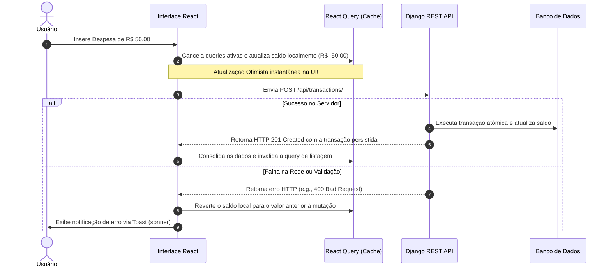
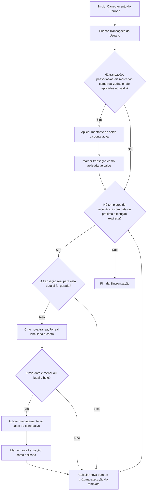

# 🏛️ Arquitetura Técnica — Vault Finance OS

Este documento detalha as decisões de engenharia, fluxos de dados, arquitetura de estado e padrões de integração híbrida que sustentam o **Vault Finance OS**. Ele serve como o guia definitivo para engenheiros que desenvolvem e escalam o ecossistema.

---

## 1. Visão Geral das Camadas (High-Level Architecture)

O Vault Finance OS é estruturado como um sistema híbrido desacoplado. O frontend atua como um cliente *Rich Single Page Application (SPA)* que pode ser empacotado nativamente como um app mobile, enquanto o backend funciona como uma API RESTful de alta performance transacional.

```mermaid
graph TD
    subgraph Camada de Apresentação (Frontend Híbrido)
        UI[React 18 + TailwindCSS] -->|Eventos| Zustand[Zustand Local State]
        UI -->|Ações Assíncronas| RQ[React Query Client]
        Cap[Capacitor Native Bridge] <-->|Eventos de Sistema| UI
    end

    subgraph Camada de Rede (Gateways)
        RQ -->|HTTPS / JSON REST| GW[Nginx / Vercel API Gateway]
    end

    subgraph Camada de Negócios (Backend API)
        GW --> DRF[Django REST Framework]
        DRF --> SimpleJWT[SimpleJWT + pyotp 2FA]
        DRF --> Domain[Lógica de Domínio YNAB / OFX / Moedas]
    end

    subgraph Camada de Dados (Persistência)
        Domain --> PG[(PostgreSQL / SQLite)]
    end
```

---

## 2. Gerenciamento de Estado & Ciclo de Sincronização (Zustand + React Query)

Para mitigar problemas de latência e possibilitar resiliência offline, o Vault Finance OS utiliza uma divisão estrita de responsabilidades entre o **Zustand** (Estado do Cliente e UI) e o **React Query** (Estado do Servidor).

### Divisão de Responsabilidades
* **Zustand (`/Ynab/src/store/`):** Controla o estado dinâmico local da interface. Isso inclui a visibilidade do modo privado (*Private Mode* para esconder saldos), o idioma selecionado, estados de modais, transições visuais, preferências persistidas localmente através do middleware `persist`, e o consentimento de cookies da LGPD/GDPR.
* **React Query (`@tanstack/react-query`):** Gerencia o cache de dados vindos da API do Django. Responsável pela invalidação de consultas (*query invalidation*), re-tentativas automáticas, sincronização em segundo plano e suporte a atualizações otimistas (*Optimistic Updates*).

### Gerenciamento de Consentimento de Cookies (GDPR & LGPD)
Para conferir conformidade total às diretrizes de privacidade de dados, implementamos um duto reativo e modular de consentimento:
* **`useConsentStore`:** Armazena de forma persistente (`localStorage`) o estado de aceite granular do usuário para três categorias de rastreadores: Essenciais (JWT de sessão - sempre ativos), Analíticos (métricas de uso) e Marketing (pixels e campanhas).
* **`useConsentTracker`:** Hook reativo global acoplado no ponto de montagem principal do app (`App.tsx`). Ele ouve as mudanças do Zustand e injeta ou remove scripts de terceiros (como Google Analytics, Facebook Pixel ou PostHog) dinamicamente na DOM do browser apenas se o usuário fornecer consentimento positivo (*opt-in*). Caso o consentimento seja revogado, os scripts e seus elementos DOM correspondentes são limpos em tempo real.


### Pipeline de Atualizações Otimistas (Optimistic Updates)
Quando o usuário cria uma nova transação, o sistema não espera o retorno do servidor para atualizar o balanço na tela. O fluxo ocorre da seguinte forma:



---

## 3. Ponte Híbrida Mobile (Capacitor ⇄ Django)

A transformação da SPA React em aplicativo móvel nativo sem perdas de performance é realizada pelo **Capacitor v8**. O comportamento do app varia dinamicamente dependendo do ambiente detectado em runtime.

```mermaid
graph LR
    subgraph Dispositivo Móvel (Android/iOS)
        A[WebView Local] <-->|Ponte Javascript Nativa| B[Capacitor Core]
        B <--> C[Plugins Nativos: Biometria, Google Auth, Secure Storage]
    end
    A <-->|Requisições Seguras HTTPS| D[Django Backend API]
```

### Arquitetura de Autenticação Híbrida (Google OAuth2)
Para manter o fluxo de autenticação consistente entre o navegador web e o aplicativo móvel nativo, a ponte de autenticação funciona em dois fluxos coordenados:

1. **Fluxo Web (Navegador):** O componente `@react-oauth/google` abre o modal padrão do Google, captura o `credential` (ID Token) e o envia diretamente para o endpoint de autenticação social do Django `/api/auth/google/`.
2. **Fluxo Mobile (Capacitor):** O plugin nativo `@codetrix-studio/capacitor-google-auth` intercepta a chamada e invoca o diálogo de Login do Google nativo do sistema operacional (utilizando chaves de assinatura SHA-1 e SHA-256 configuradas no Firebase). Após a aprovação do usuário, o plugin retorna o `idToken`, que é enviado ao backend Django pelo mesmo endpoint `/api/auth/google/`.

O backend Django valida a assinatura criptográfica do token usando a biblioteca oficial do Google e, caso o token seja legítimo, emite um par de tokens JWT (`Access Token` e `Refresh Token`) gerenciado pelo SimpleJWT.

---

## 4. Ciclo de Vida da Transação e Ajuste de Balanço (Pendente vs. Realizada)

Um pilar central da metodologia de orçamento YNAB é a precisão dos saldos. O sistema lida com transações em dois estados (`status`): `pending` (Pendente) e `realized` (Efetivada).

### Matriz de Impacto de Saldo

| Tipo de Transação | Data da Transação | Status | Altera o Saldo da Conta? | Justificativa |
| :--- | :--- | :--- | :--- | :--- |
| **Qualquer** | Futura (`date > hoje`) | `pending` ou `realized` | ❌ Não | Transações agendadas não devem afetar o dinheiro disponível no presente. |
| **Receita / Despesa** | Passada ou Atual | `pending` | ❌ Não | Transações pendentes (como compras autorizadas mas não faturadas no cartão de crédito) não alteram o saldo líquido ativo até serem efetivadas. |
| **Receita** | Passada ou Atual | `realized` | 🟢 Sim (Aumenta) | Dinheiro efetivamente depositado e conciliado na conta corrente. |
| **Despesa** | Passada ou Atual | `realized` | 🔴 Sim (Diminui) | Dinheiro efetivamente debitado e deduzido da conta do usuário. |

---

### Processador de Agendamento Recorrente (Engine)
A sincronização e criação de transações agendadas/recorrentes é acionada de forma transparente sempre que o usuário carrega sua árvore de categorias ou lista suas transações. 

A função `sync_recurring_transactions` varre os templates de transação recorrentes (`is_recurring=True`) pertencentes ao usuário e projeta as novas instâncias de transação até o final do período visualizado:



### 4.1 Geração Automática de Ajustes de Saldo em Subcontas
Para facilitar a reconciliação e o lançamento de saldos iniciais de envelopes/subcontas sem a necessidade de digitação manual de transações repetitivas, o backend (`AccountViewSet`) intercepta as operações de criação e atualização de saldos em subcontas (`parent is not None`).
* **Na criação de uma subconta**: Se o saldo atual for maior que zero, é gerada automaticamente uma transação de receita com a descrição `'Saldo Inicial de [Nome]'` e valor equivalente, pré-aplicada ao saldo (`is_applied_to_balance=True`, `status='realized'`).
* **Na atualização de uma subconta**: Se o saldo atual for alterado, o sistema calcula a diferença ($\Delta$) entre o saldo anterior e o novo saldo. Se $\Delta > 0$, cria-se um ajuste de receita automática no valor de $\Delta$. Se $\Delta < 0$, cria-se um ajuste de despesa automática no valor de $|\Delta|$. Ambas as transações são criadas com `is_applied_to_balance=True` e `status='realized'`.

---

## 5. Arquitetura de Segurança: Pipeline JWT + 2FA

Para blindar os dados financeiros dos clientes, o Vault Finance OS implementa uma política rígida de segurança em camadas para todas as conexões baseada no protocolo OAuth2 com autenticação multifator opcional (MFA/2FA).

### Fluxo de Login Seguro e Rotação de Tokens

```mermaid
sequenceDiagram
    autonumber
    actor User as Cliente
    participant FE as Frontend React
    participant API as Django Auth Endpoint
    participant Profile as Perfil do Usuário (DB)

    User->>FE: Digita Usuário e Senha
    FE->>API: POST /api/token/ (Username/Password)
    API->>Profile: Verifica credenciais de acesso
    
    alt Credenciais Inválidas
        API-->>FE: Retorna HTTP 401 Unauthorized
        FE-->>User: Exibe mensagem de erro de login
    else Credenciais Válidas
        API->>Profile: Consulta se 2FA está ativo
        
        alt 2FA Ativo
            API-->>FE: Retorna HTTP 200 OK com {"2fa_required": true, "user_id": 123}
            FE->>User: Exibe tela estilizada de OTP (6 dígitos)
            User->>FE: Digita o código gerado no Authenticator
            FE->>API: POST /api/2fa/login/ {"user_id": 123, "code": "987654"}
            API->>Profile: Valida código TOTP (pyotp) usando secret criptografado
            
            alt Código OTP Inválido
                API-->>FE: Retorna HTTP 400 Bad Request {"error": "Código inválido"}
                FE-->>User: Exibe alerta vermelho de código incorreto
            else Código OTP Válido
                API-->>FE: Retorna tokens JWT {"access": "...", "refresh": "..."}
                FE->>User: Libera acesso ao Dashboard do App
            end
            
        alt 2FA Inativo
            API-->>FE: Retorna tokens JWT {"access": "...", "refresh": "..."}
            FE->>User: Libera acesso direto ao Dashboard do App
        end
    end
```

### Segurança nos Endpoints (Tokens de Vida Curta)
* **Access Token:** Possui tempo de expiração curto (e.g., 5 a 15 minutos) e trafega no cabeçalho `Authorization: Bearer <token>` de cada requisição HTTPS.
* **Refresh Token:** Possui tempo de expiração longo (e.g., 7 a 30 dias) e é armazenado de forma segura no frontend (ou via `SecureStorage` nativo no mobile) para solicitar novos Access Tokens de forma silenciosa e invisível para o usuário.

### 🛡️ Isolação Multitenant & Prevenção Absoluta de IDOR/BOLA
A integridade dos dados financeiros e o isolamento de inquilinos (*tenant isolation*) são impostos de forma programática na camada do banco de dados (PostgreSQL) usando os recursos do ORM do Django:
* **Filtros no Contexto do Usuário Authenticated:** Todas as views e endpoints REST baseados no `django-rest-framework` estendem permissões seguras que interceptam o JWT e preenchem `request.user`.
* **Queries Blindadas:** Métodos críticos de CRUD e agregação (como listagem de contas, saldos de envelopes e transferências) filtram as tabelas PostgreSQL usando explicitamente o ID do usuário conectado (ex: `Account.objects.filter(user=request.user)`).
* **Bloqueio de Parâmetros Arbitrários:** Tentativas maliciosas de ler ou modificar recursos alterando o identificador ID na rota HTTP ou payload JSON (ataque de IDOR - *Insecure Direct Object Reference* ou BOLA - *Broken Object Level Authorization*) resultam em bloqueio imediato e erro `HTTP 404 Not Found` ou `HTTP 403 Forbidden`, protegendo as sub-contas de forma hermética.

### 🔍 Auditorias Contínuas de Segurança & Pentests
Para garantir que a implementação corresponda ao nível exigido por instituições financeiras de alta auditoria, mantemos uma rotina ativa:
* **Varredura Estática e Dinâmica (SAST/DAST):** Pipelines de deploy automatizados rodando scanners de dependências e analisadores de código estático para eliminar vulnerabilidades comuns da OWASP (como injeção SQL, quebras de autenticação e vazamento acidental de chaves de ambiente).
* **Testes de Penetração Periódicos (Pentesting):** O sistema passa por simulações reais de invasão coordenadas por especialistas em cibersegurança e scripts automatizados, auditando robustez de rede, tratamento de CORS, cabeçalhos de segurança (HSTS, CSP) e a resiliência criptográfica da autenticação MFA/2FA.
