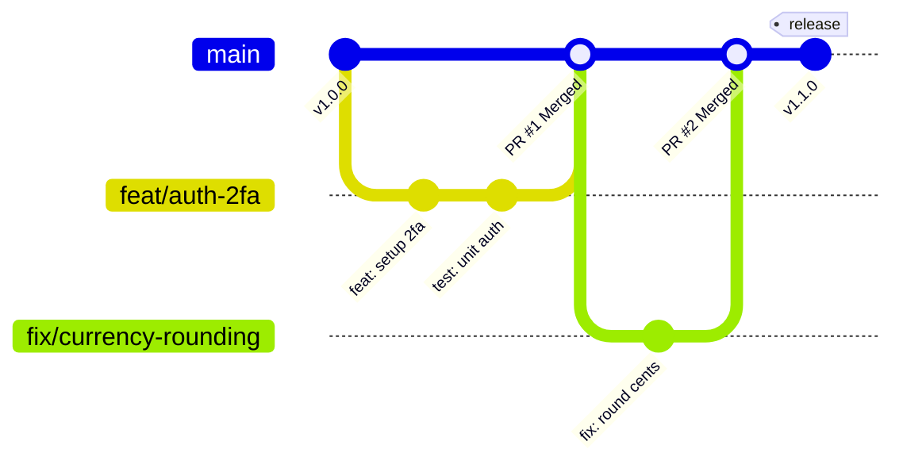

# Guia de Contribuição, Padronização e Git Workflow — Vault Finance OS

Este documento estabelece as regras de governança, padrões de código e fluxos de trabalho do repositório **Vault Finance OS**. Qualquer contribuidor interno ou externo deve ler e aplicar estas diretrizes estritamente antes de submeter alterações ao projeto.

---

## 1. Padrão de Commits (Conventional Commits)

Adotamos a especificação dos [Conventional Commits](https://www.conventionalcommits.org/) para estruturar mensagens de commit consistentes. Isso facilita a leitura automática de históricos e a geração automatizada de relatórios de versão (*Changelogs*).

### Formato Geral

```text
<tipo>(<escopo>): <descrição curta>

[corpo explicativo detalhado, se necessário]

[rodapé de metadados, ex: "Refs: #123" ou "Co-authored-by: Name"]
```

### Tipos Permitidos

| Tipo | Descrição | Exemplo |
| :--- | :--- | :--- |
| **`feat`** | Introdução de nova funcionalidade ou endpoint. | `feat(2fa): adiciona validação de código totp pyotp` |
| **`fix`** | Resolução de bug ou comportamento inesperado. | `fix(budget): corrige vazamento de decimais no arredondamento` |
| **`docs`** | Alterações exclusivas na documentação ou Wikis. | `docs(wiki): adiciona página de arquitetura multimoedas` |
| **`style`** | Ajustes de formatação visual (CSS, Tailwind, espaços), sem alteração de lógica. | `style(selector): moderniza visual do dropdown de idiomas` |
| **`refactor`**| Refatoração de código que não altera comportamento nem adiciona features. | `refactor(accounts): simplifica recursão de busca de filhos` |
| **`test`** | Criação ou ajuste de testes automatizados (Pytest/Vitest). | `test(auth): implementa testes unitários para rota de login` |
| **`chore`** | Ajustes de build, pacotes, npm, CI/CD ou dependências. | `chore(deps): atualiza drf-spectacular para v0.29` |

### Regras de Escrita
* Use letras minúsculas no cabeçalho do commit.
* Escreva mensagens em **Português do Brasil** ou **Inglês** (desde que padronizado no escopo).
* Não termine o cabeçalho com ponto final.

---

## 2. Padrões de Código e Guias de Estilo

Mantemos réguas estritas de linter e formatação de código para garantir leitura homogênea entre diferentes engenheiros.

### A. Python (Backend)
Seguimos estritamente as diretrizes da **PEP 8**.

* **Linter e Formatação:** Adotamos o **Ruff** (linter e formatador ultrarrápido) e o **Black** como formatadores oficiais.
* **Imports:** Devem ser organizados em blocos:
  1. Biblioteca padrão do Python (ex: `os`, `uuid`, `datetime`).
  2. Bibliotecas de terceiros (ex: `django`, `rest_framework`, `pyotp`).
  3. Módulos internos do projeto.
* **Tipagens:** Sempre que aplicável, utilize *Type Hints* nativas do Python (`from typing import List, Optional`).

### B. TypeScript & React (Frontend)
Seguimos as regras do **ESLint** e **Prettier** configuradas na raiz da pasta `Ynab`.

* **Estilo Visual (CSS):** Priorize o uso de **Tailwind CSS** combinado com componentes utilitários **Shadcn/ui** de alta fidelidade e ícones estruturados via **FontAwesome**.
* **Tipagem Estrita:** É proibido o uso de tipo `any`. Defina explicitamente as tipagens no arquivo compartilhado [types/index.ts](file:///C:/Users/mathe/PROJETO-YNAB/Ynab/src/types/index.ts).
* **Documentação:** Utilize anotações inline do **JSDoc** para documentar o comportamento de funções críticas de estado (Zustand) ou formatações utilitárias.

---

## 3. Fluxo de Ramificação (Git Workflow)

Adotamos o modelo de **Trunk-Based Development** adaptado para equipes ágeis, com Branches de Tópico de curta duração combinados com Pull Requests protegidos.



### Passo a Passo do Desenvolvimento

1. **Atualize seu branch local principal:**
   ```bash
   git checkout main
   git pull origin main
   ```
2. **Crie um branch de tópico curto:** Use nomenclaturas auto-descritivas prefixadas pelo tipo de tarefa:
   * `feat/nome-da-funcionalidade`
   * `fix/correcao-do-bug`
   * `docs/nome-do-documento`
   ```bash
   git checkout -b feat/setup-2fa
   ```
3. **Execute os testes locais e compile constantemente** durante o ciclo de desenvolvimento para garantir conformidade.

---

## 4. O Gatekeeper de Integração (Quality Gates)

Antes de enviar qualquer código para revisão em um Pull Request ou fundir com a branch `main`, as regras globais e verificações técnicas de integridade **devem ser validadas sem exceções**:

### Checklists Obrigatórios antes do Push

1. **Rode os testes automatizados do Backend (Pytest):**
   ```bash
   cd backend
   venv\Scripts\pytest
   ```
   * *Critério de aceitação:* 100% de testes passando sem regressões.
2. **Rode os testes automatizados do Frontend (Vitest):**
   ```bash
   cd Ynab
   npm run test -- --run
   ```
   * *Critério de aceitação:* 100% de testes passando com cobertura estável.
3. **Valide a compilação de produção do Frontend (Vite Build):**
   ```bash
   cd Ynab
   npm run build
   ```
   * *Critério de aceitação:* Compilação limpa com 0 erros de sintaxe ou tipagem TypeScript.
4. **Deploy Final de Produção via Vercel:**
   ```bash
   cd PROJETO-YNAB
   vercel --prod --yes
   ```
   * *Critério de aceitação:* O link gerado pela Vercel deve carregar a landing page e a aplicação perfeitamente sem telas brancas.
