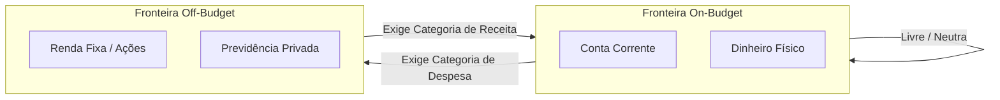

# Manual de Instruções: Operação do Ledger Contábil (Padrão Actual Budget)

Bem-vindo ao manual de transição e operação contábil do **Vault Finance OS**. Com as novas atualizações inspiradas na engenharia padrão-ouro do **Actual Budget** e na metodologia clássica do **YNAB**, o sistema ganhou um controle contábil extremamente rigoroso e à prova de falhas.

Este guia prático foi desenhado especificamente para explicar de forma simples e direta o funcionamento e o passo a passo de operação das duas áreas mais nobres do sistema: **Contas Off-Budget (Investimentos)** e **Cartões de Crédito (Credit Cards & Installments)**, além do novo fluxo de **Reconciliação Bancária**.

---

## 1. Contas de Investimento e a Fronteira do Orçamento (Off-Budget / Tracking)

No sistema tradicional, o dinheiro de todas as contas se misturava no orçamento. Agora, há uma **fronteira rígida** regida pela propriedade `is_on_budget` (No Orçamento).

### O Conceito Fundamental
* **Contas On-Budget (Checking, Cash, Poupança):** Contas líquidas cujo dinheiro você usa para pagar contas no dia a dia. Todo o saldo dessas contas é somado e fica disponível nos seus envelopes de categorias.
* **Contas Off-Budget / Tracking (Investimentos, Previdência, Imóveis):** Contas de patrimônio. O saldo delas existe no seu patrimônio líquido, mas o dinheiro **não** pode ser usado para orçar despesas cotidianas (está "fora do orçamento").

### 1.1 Contas de Empréstimos Concedidos (A Receber - LOAN_GIVEN)

Para acompanhar dinheiro emprestado a terceiros de forma simples e integrada:
* **Finalidade:** Representa ativos que você concedeu como empréstimo e que tem a receber no futuro.
* **Badge "A Receber":** Contas cadastradas com este tipo exibem uma identificação visual discreta com o ícone de mãos com moedas (`HandCoins`) e o texto **"A Receber"**.
* **Inversão Visual de Saldo:** O saldo total da conta de empréstimo concedido com valor positivo é mostrado como negativo no painel lateral de contas (ex: R$ 500,00 emprestados são mostrados como -R$ 500,00 em vermelho). Isso reflete visualmente que esse montante está cedido temporariamente a terceiros e não compõe o seu saldo líquido imediatamente disponível.

---

### 🚀 PASSO A PASSO: Transferindo dinheiro da Conta Corrente para um Investimento

Sempre que você transfere dinheiro de uma conta **On-Budget** (ex: Conta Corrente) para uma conta **Off-Budget** (ex: Corretora de Investimentos), aos olhos do seu orçamento, esse dinheiro **saiu do seu fluxo de caixa disponível**. Portanto, você **deve** obrigatoriamente atribuir uma categoria a essa transferência.

1. **Abra o Painel de Transações** e clique em **Nova Transação** (ou realizar uma transferência).
2. **Preencha os Campos:**
   - **Conta de Origem:** Escolha sua conta corrente (ex: *Itaú Corrente*).
   - **Beneficiário (Payee):** Escolha o Payee automático de transferência para sua conta de investimento (ex: *Transferência: XP Investimentos*).
   - **Valor:** Digite o montante transferido (ex: `R$ 500,00`).
   - **Categoria:** **Obrigatório!** Escolha a categoria de envelope destinada a isso (ex: *Investimento Mensal* ou *Futuro/Aposentadoria*).
3. **Clique em Salvar.**
4. **O que acontece nos bastidores?**
   - R$ 500,00 são debitados do saldo da sua conta corrente.
   - O envelope *"Investimento Mensal"* consome R$ 500,00 do seu orçamento mensal.
   - Uma transação espelhada de entrada de R$ 500,00 é gerada de forma automática e atômica na sua conta da XP Investimentos, aumentando o saldo de investimento dela sem afetar o seu RTA (Ready to Assign) do mês.

---

### 🚀 PASSO A PASSO: Resgatando um Investimento para a Conta Corrente

Quando você traz o dinheiro de volta dos Investimentos (Off-Budget) para a Conta Corrente (On-Budget), esse dinheiro **entra** como nova receita no seu orçamento.

1. **Crie uma Transação** definindo a conta de investimentos (ex: *XP Investimentos*) como a de origem.
2. **Defina o Beneficiário** como a transferência para sua conta corrente (ex: *Transferência: Itaú Corrente*).
3. **Selecione a Categoria:** Defina como **"Ready to Assign"** (Pronto para Atribuir) ou uma categoria específica de entrada de capital.
4. **Salve a transação.** O saldo do seu investimento é reduzido e o dinheiro entra na sua conta corrente corrente, ficando disponível para ser distribuído nos seus envelopes de despesas.

> [!TIP]
> **Transferências Internas Neutras (Mesma Fronteira):** 
> Se você transferir dinheiro de uma conta corrente para sua conta de dinheiro físico (ambas On-Budget), ou de uma conta de ações para uma conta de renda fixa (ambas Off-Budget), a categoria **não deve** ser preenchida (será limpa como `None`). O dinheiro apenas mudou de gaveta, sem alterar o limite total do seu orçamento diário.

---

### 📈 Acompanhando a Evolução dos Investimentos e Patrimônio

Tanto as contas On-Budget quanto as contas Off-Budget (Investimentos, Previdência, Ações) alimentam de forma automática a base de dados do módulo de **Relatórios** (`/reports`), onde é possível auditar e gerenciar a evolução do seu patrimônio:

1. **Evolução do Patrimônio Líquido (Net Worth):** No menu de relatórios (painéis *Iniciante* e *Intermediário*), o gráfico de **Patrimônio Líquido** exibe de forma consolidada a soma dos saldos de todas as suas contas de ativos (Corrente + Investimentos) menos seus passivos (faturas de cartão e dívidas) ao longo do tempo.
2. **Distribuição de Ativos (Treemap):** Na aba **Avançado**, o gráfico de Treemap exibe a distribuição percentual física dos seus investimentos. Cada bloco representa uma carteira ou corretora (ex: *XP*, *Wise*, *Binance*), facilitando a visualização da alocação de ativos.
3. **Projeções Futuras (Forecasting):** Também na aba **Avançado**, o painel de projeção calcula a velocidade de crescimento do seu patrimônio com base nos seus aportes históricos de investimentos.
4. **Impacto Cambial e Multimoedas:** Se você possui investimentos internacionais (contas em USD, EUR, etc.), o relatório de **Volatilidade Cambial** calcula o impacto da oscilação de mercado e taxas de câmbio sobre a sua carteira global.

---

## 2. A Aba Cartão de Crédito e Controle de Parcelamentos (Credit Cards & Installments)

Diferente do método antigo de tratar o cartão de crédito como uma conta de despesa comum, o padrão YNAB/Actual trata o cartão com uma **mecanica de reserva de pagamento**.

### Como funciona a Reserva de Pagamento?
Quando você faz uma compra orçada (ex: R$ 50,00 de Supermercado) no cartão de crédito:
1. O dinheiro de R$ 50,00 é deduzido do envelope *"Supermercado"*.
2. O sistema **move de forma automática** esses R$ 50,00 para o envelope de **Pagamento do Cartão de Crédito**.
3. Esse dinheiro fica reservado ali para garantir que, quando a fatura vencer, você tenha exatamente o dinheiro necessário para pagar a fatura inteira sem criar dívidas!

---

### 🚀 PASSO A PASSO: Como lançar um gasto no Cartão de Crédito

1. No menu lateral, selecione a conta do seu **Cartão de Crédito** (ex: *Nubank Visa*).
2. Clique em **Nova Transação**.
3. Preencha os detalhes:
   - **Beneficiário:** Estabelecimento onde realizou a compra (ex: *Pão de Açúcar*).
   - **Valor:** O valor total da compra.
   - **Categoria:** Escolha a categoria correspondente ao gasto (ex: *Alimentação*).
4. **Salve a transação.** 
   - O saldo negativo do seu cartão aumentará (representando a fatura acumulando).
   - O valor disponível no envelope *"Alimentação"* diminuirá.
   - O valor no envelope de pagamento do cartão *"Nubank Visa"* aumentará na mesma proporção para garantir o pagamento.

---

### 🚀 PASSO A PASSO: Como lançar uma compra parcelada (Installments)

Se você comprou um produto parcelado (ex: uma TV de R$ 1.200,00 em 12 parcelas de R$ 100,00):

1. **Acesse a aba Cartão de Crédito** no seu menu ou utilize a homologação do **Inbox Inteligente**.
2. **Ao criar um parcelamento:**
   - Defina o **Número de Parcelas** (ex: `12`).
   - Defina o **Valor da Parcela** (ex: `R$ 100,00`).
   - Indique a **Categoria** original do gasto (ex: *Eletrônicos*).
3. **Fluxo das Parcelas:**
   - O sistema criará as parcelas futuras na agenda.
   - **Mês 1 (Atual):** A primeira parcela de R$ 100,00 é lançada imediatamente como transação real realized no cartão, consumindo R$ 100,00 do seu envelope *"Eletrônicos"* e reservando R$ 100,00 no envelope de pagamento do cartão.
   - **Meses 2 a 12 (Futuros):** Todo mês, no dia configurado, o motor de parcelamento (`sync_recurring_transactions`) fará o disparo automático da próxima parcela de R$ 100,00 de forma 100% ACID, consumindo o orçamento do envelope *"Eletrônicos"* do respectivo mês de vencimento. Você não precisa se lembrar de lançar manualmente todos os meses!

---

### 🚀 PASSO A PASSO: Como pagar a fatura do Cartão de Crédito

Quando chegar o dia do vencimento do cartão e você for efetuar o pagamento bancário da fatura:

1. Acesse a tela de **Transações** e clique em **Nova Transação** (ou Transferência).
2. **Configure o Lançamento de Pagamento:**
   - **Conta de Origem:** Escolha a conta corrente de onde sairá o dinheiro (ex: *Itaú Corrente*).
   - **Beneficiário (Payee):** Escolha o Payee automático de transferência para o cartão de crédito (ex: *Transferência: Nubank Visa*).
   - **Valor:** O valor que você está pagando da fatura (ex: `R$ 800,00`).
   - **Categoria:** **Deixe em Branco (None)**. Como o dinheiro já foi reservado no envelope de pagamento no momento das compras, você não precisa orçar o pagamento novamente!
3. **Clique em Salvar.**
   - O saldo da sua conta corrente diminuirá em R$ 800,00.
   - O saldo devedor do seu cartão de crédito diminuirá em R$ 800,00.
   - O envelope de pagamento do cartão reduzirá os R$ 800,00 que foram devidamente transferidos ao banco.

> [!WARNING]
> **O que acontece se eu estourar uma categoria no Cartão? (Credit Overspending)**
> Se você gastar R$ 100,00 em *"Restaurantes"* usando o cartão de crédito, mas só tinha R$ 60,00 disponíveis no envelope, ocorrerá um **Credit Overspending** (Estouro em Cartão).
> * O envelope de *"Restaurantes"* ficará com saldo negativo vermelho de `-R$ 40,00`.
> * No mês seguinte, o envelope zera. Porém, esses R$ 40,00 de estouro **não serão deduzidos** do seu Ready to Assign (RTA) do próximo mês.
> * Ao invés disso, eles se transformam em **Dívida Acumulada** na fatura do seu cartão de crédito. Para cobrir essa dívida no futuro, você precisará alocar dinheiro diretamente no envelope de pagamento do cartão de crédito manualmente no mês seguinte.

---

## 3. Reconciliação Bancária e Auditoria (Statement Auditing)

A reconciliação é a ação de auditar suas contas para garantir que os saldos exibidos no Vault Finance OS coincidam perfeitamente com os extratos reais fornecidos pelo seu banco.

### Status de uma Transação
No Ledger, cada lançamento agora possui dois indicadores visuais e físicos:
* **Cleared 🟢 (Compensada/Liquidada):** A transação já aparece no extrato online do seu aplicativo bancário ou comprovante. O dinheiro de fato já saiu/entrou na conta corrente real.
* **Uncleared ⚪ (Pendente):** A transação foi lançada no sistema, mas ainda está pendente de processamento bancário (ex: um boleto pago que demora 2 dias para compensar).
* **Reconciled 🔒 (Reconciliada/Travada):** A transação foi conferida contra o extrato oficial físico e está **fisicamente travada**. Ela não pode mais ser alterada ou excluída acidentalmente para proteger a integridade histórica.

---

### 🚀 PASSO A PASSO: Reconciliando sua conta bancária

Faça isso pelo menos uma vez por semana ou mensalmente ao receber o PDF do extrato bancário:

1. **Abra a tela da Conta** que deseja reconciliar (ex: *Itaú Corrente*).
2. **Confira os lançamentos:** Para cada transação que já está consolidada no seu extrato real, certifique-se de marcar a opção **Cleared** (Compensada) como ativada (ícone verde).
3. **Clique no botão Reconciliar Conta** no painel superior:
   - O sistema solicitará que você digite o **Saldo Atual do Extrato** (o valor exato exibido no aplicativo do banco hoje).
4. **O Motor de Auditoria fará o cálculo:**
   - **Cenário A (Tudo Bate):** Se a soma das transações marcadas como `Cleared` bater perfeitamente com o valor informado, a reconciliação é aprovada imediatamente.
   - **Cenário B (Divergência de Valores):** Se os valores divergirem (ex: o sistema calcula R$ 1.020,00 compensados, mas o extrato real mostra R$ 1.000,00):
     - O sistema oferecerá a criação de um **Ajuste Automático**.
     - Ao aceitar, o sistema insere uma transação automática de `-R$ 20,00` sob a descrição *"Ajuste automático de reconciliação de saldo"*, marcada como `Cleared=True`, corrigindo instantaneamente a inconsistência contábil sem você precisar revirar meses de extratos.
5. **Finalizar Reconciliação:**
   - Clique em **Finalizar Reconciliação**.
   - O sistema atualizará todas as transações compensadas (`cleared=True`) para o status de reconciliação fechado (`reconciled=True`).
   - A partir deste momento, esses lançamentos históricos estão **fisicamente bloqueados e blindados** contra qualquer exclusão ou modificação acidental!
   - A conta registra a data de hoje no campo `last_reconciled`.

---

### 🚀 PASSO A PASSO: Destravando uma transação reconciliada (Unlock)

Se você identificou um erro em uma transação antiga que já foi reconciliada e travada (`reconciled=True`), você precisará destravá-la antes de editá-la:

1. **Selecione a Transação Travada** (ela exibirá um ícone de cadeado).
2. **Clique em Destravar Transação (Unlock):**
   - Esta ação dispara uma chamada segura para o endpoint de auditoria.
   - O status `reconciled` da transação é alterado de volta para `False`.
3. **Realize a alteração ou correção** desejada (valor, data, descrição).
4. **Clique em Salvar.**
5. **Reconcilie a conta novamente** para travar o lote com a informação correta e garantir que o livro caixa permaneça auditável e consistente de forma ACID!
