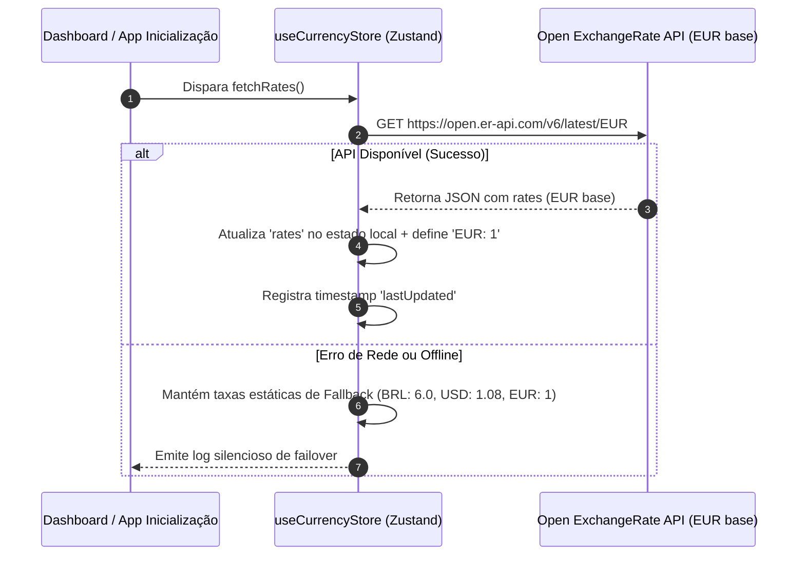

# ✦ Wiki — Arquitetura Multimoedas & Consolidação Patrimonial

Este documento descreve detalhadamente a engenharia por trás do suporte a múltiplas moedas no **Vault Finance OS**. Ele abrange o pipeline de captura de taxas de câmbio, o algoritmo de conversão matemática indireta e o motor de consolidação patrimonial utilizado para exibir o Patrimônio Líquido (*Net Worth*) unificado do usuário.

---

## 1. Introdução ao Suporte Multimoedas

Como um sistema operacional financeiro de alta performance, o Vault Finance OS permite que o usuário gerencie contas correntes, investimentos, poupanças e cartões operados em **qualquer uma das 160+ moedas globais** suportadas pela especificação ISO 4217. 

O sistema realiza a conversão dinâmica em runtime para consolidar os saldos e exibi-los sob a ótica de uma única **Moeda Base de Preferência** configurada pelo usuário (ex: BRL ou EUR).

---

## 2. Pipeline de Sincronização de Câmbio (Exchange Rates)

A sincronização de câmbio é gerenciada de forma reativa pelo store do Zustand [useCurrencyStore.ts](file:///C:/Users/mathe/PROJETO-YNAB/Ynab/src/store/useCurrencyStore.ts).



### Taxas Estáticas de Fallback (Failover)
Caso o dispositivo esteja sem conexão à internet ou o gateway de câmbio falhe, o sistema opera de forma resiliente usando um mapa estático de taxas de segurança:
* `EUR: 1.0000` (Âncora base do sistema)
* `BRL: 6.0000`
* `USD: 1.0800`

---

## 3. Modelo Matemático de Conversão de Moedas

Para evitar a complexidade de manter uma matriz cruzada de $160 \times 160$ taxas de câmbio de todas as moedas para todas as moedas, o Vault Finance OS adota o padrão de **Moeda Âncora Pivot (EUR)**. Todas as conversões são resolvidas em duas operações matemáticas consecutivas utilizando o Euro como ponte.

### Formulação Matemática

Seja $A$ o valor monetário na moeda de origem $O$.  
Seja $T$ a moeda de destino desejada.  
Seja $R(C)$ a taxa de câmbio da moeda $C$ em relação ao Euro (onde $R(\text{EUR}) = 1.00$).

Para converter o montante $A$ de $O$ para $T$, o algoritmo executa:

1. **Conversão de Origem para Âncora (EUR):**
   $$A_{\text{EUR}} = \frac{A}{R(O)}$$

2. **Conversão de Âncora (EUR) para Destino ($T$):**
   $$A_{T} = A_{\text{EUR}} \times R(T)$$

### Equação Consolidada de Conversão Indireta

Unificando ambas as etapas, obtemos a fórmula computacional direta implementada no método `convert()`:

$$V_{\text{convertido}}(A, O, T) = A \times \left( \frac{R(T)}{R(O)} \right)$$

### Exemplo Prático: Converter R$ 300,00 (BRL) para Dólares (USD)
Considerando as taxas:
* $R(\text{BRL}) = 6.0$
* $R(\text{USD}) = 1.2$

$$V_{\text{convertido}}(300, \text{BRL}, \text{USD}) = 300 \times \left( \frac{1.2}{6.0} \right) = 300 \times 0.2 = 60.00 \text{ USD}$$

---

## 4. Algoritmo de Consolidação Patrimonial (Net Worth)

Sempre que a interface do painel principal (Dashboard) é carregada, o componente [NetWorthHeader.tsx](file:///C:/Users/mathe/PROJETO-YNAB/Ynab/src/components/dashboard/NetWorthHeader.tsx) calcula o patrimônio líquido total convertendo os saldos de todas as contas para a Moeda Base escolhida pelo usuário.

### Formulação do Patrimônio Líquido Consolidado

Seja $\mathbf{Accounts}$ o conjunto de todas as contas ativas do usuário.  
Seja $B(a)$ o saldo direto da conta $a$.  
Seja $M(a)$ a moeda em que a conta $a$ opera.  
Seja $B_{\text{base}}$ a Moeda Base escolhida pelo usuário para visualização geral do dashboard.

O Patrimônio Líquido Consolidado ($P_c$) é dado por:

$$P_c = \sum_{a \in \mathbf{Accounts}} V_{\text{convertido}}\left( B(a), M(a), B_{\text{base}} \right)$$

```mermaid
graph TD
    Sub1["💵 BB Corrente: R$ 6.000,00 (BRL)"] -->|Converter para EUR| Base1["€ 1.000,00"]
    Sub2["💵 Wise Euro: € 500,00 (EUR)"] -->|Moeda Base Anchor| Base2["€ 500,00"]
    Sub3["💵 Broker US: $ 1.100,00 (USD)"] -->|Converter para EUR (1.10)| Base3["€ 1.000,00"]
    
    Base1 --> Sum[Somatório em EUR Base]
    Base2 --> Sum
    Base3 --> Sum
    
    Sum -->|Resultado Consolidado| Final["Patrimônio Líquido: € 2.500,00"]
```

---

## 5. Formatação Localizada Inteligente (`formatMoney`)

Para garantir uma experiência estética premium em qualquer região, os valores formatados não usam concatenações manuais de strings, mas sim a API nativa de internacionalização do navegador (`Intl.NumberFormat`), que adapta pontuações de milhares e decimais automaticamente com base na moeda.

O utilitário [currency-utils.ts](file:///C:/Users/mathe/PROJETO-YNAB/Ynab/src/lib/currency-utils.ts) realiza a formatação dinâmica baseada no seguinte mapeamento:

```typescript
export function getCurrencyLocale(currency: string): string {
  const mapping: Record<string, string> = {
    EUR: "pt-PT",
    BRL: "pt-BR",
    USD: "en-US",
    GBP: "en-GB",
    JPY: "ja-JP",
    CAD: "en-CA",
    AUD: "en-AU",
    CHF: "fr-CH",
    CNY: "zh-CN",
    INR: "en-IN",
  };
  return mapping[currency] || "en-US";
}
```

### Regras de Exibição de Decimais
* O sistema consulta o estado global de configurações para decidir se deve exibir centavos. Se `showDecimals` for `false`, os valores decimais são ocultados/arredondados na renderização:
  * Ex: **R$ 1.500,80** vira **R$ 1.501** se as frações estiverem ocultas.

### Ocular Saldos (Modo Privado - Blur Translúcido)
Se o usuário ativar o **Modo Privado** (`isPrivateMode=true`), as strings de saldo são interceptadas imediatamente pelo formatador e transformadas em máscara protegida, mantendo visível apenas o símbolo monetário adequado:
* Ex: **R$ 12.540,00** vira **R$ ••••**
* Ex: **$ 5,500.00** vira **$ ••••**
