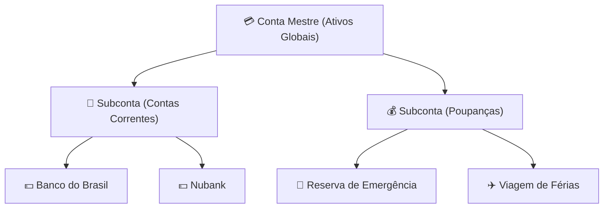
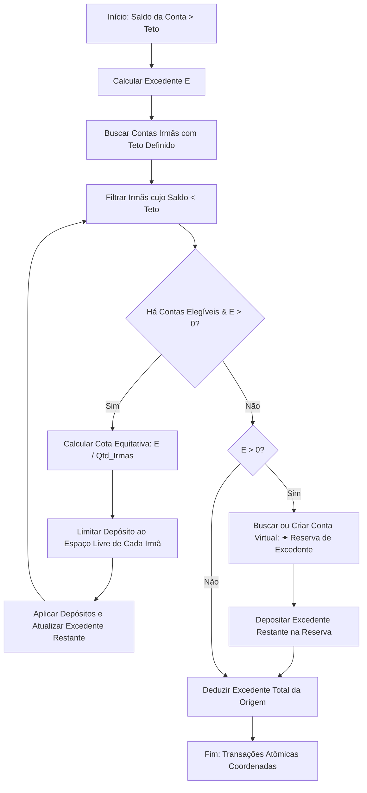

# ✦ Wiki — Recursividade Infinita & Matemática de Envelopes

Este documento constitui o guia conceitual e matemático definitivo sobre o funcionamento do modelo de **Recursividade Infinita** para Contas e Categorias (Envelopes) implementado no **Vault Finance OS**. Ele explica a lógica de acumulação, regras de partilha proporcional e os algoritmos transacionais de tratamento de déficits e superávits.

---

## 1. O Paradigma de Recursão de Contas (Envelopes)

No YNAB clássico, as contas são lineares e as categorias são agrupadas em no máximo dois níveis. No Vault Finance OS, implementamos uma **árvore recursiva auto-referenciada** onde qualquer Conta ou Categoria pode possuir infinitos níveis de subcontas ou subcategorias.

### Estrutura de Chave Estrangeira Auto-Referenciada (Self-ForeignKey)
Tanto o modelo de Contas (`Account`) quanto o de Categorias (`Category`) usam Chaves Estrangeiras apontando para si mesmos:

```python
parent = models.ForeignKey('self', on_delete=models.CASCADE, null=True, blank=True, related_name='children')
```



---

## 2. A Matemática da Consolidação de Saldos

Cada nó da árvore possui seu saldo individual direto, mas o saldo visível na interface para nós superiores (Contas Mestre ou Grupos) deve ser o somatório recursivo de toda a sua subárvore descendente.

### Modelo de Cálculo do Saldo Consolidado

Seja $A$ um nó na árvore de Contas. O saldo consolidado de $A$, denotado por $S_c(A)$, é definido indutivamente como:

$$S_c(A) = S_d(A) + \sum_{C \in \text{Children}(A)} S_c(C)$$

Onde:
* $S_d(A)$ representa o saldo direto e exclusivo daquele nó (transações aplicadas diretamente à conta $A$).
* $\text{Children}(A)$ é o conjunto de todas as contas que possuem $A$ como conta pai imediata.

### Exemplo Prático de Acumulação

```
[Conta Mestre: Banco Central] (S_d = 0.00) -> S_c = 1.500,00
   ├── [Subconta: Cartões] (S_d = -500.00) -> S_c = -500,00
   └── [Subconta: Bancos] (S_d = 200.00) -> S_c = 2.000,00
         ├── [Nubank] (S_d = 800.00) -> S_c = 800,00
         └── [Itaú] (S_d = 1000.00) -> S_c = 1.000,00
```

---

## 3. Algoritmo de Cobertura de Saldo Negativo (`cover_overspending`)

Quando uma subconta fica com saldo negativo (déficit), o sistema disponibiliza uma ação inteligente em lote para zerar o saldo negativo retirando fundos proporcionalmente de suas subcontas irmãs (subcontas sob o mesmo pai imediato).

### Regras Matemáticas de Cobertura Proporcional (*Fair Share*)

Dado um déficit de valor absoluto $D = |S_d(A_{neg})|$ na conta negativa $A_{neg}$, e um conjunto de $N$ contas irmãs elegíveis positivas $\{S_1, S_2, \dots, S_N\}$ operando na mesma moeda:

1. O déficit restante $R$ é inicializado como $D$.
2. Para cada conta irmã positiva $S_i$, calcula-se a cota ideal (divisão justa) para aquela iteração:

$$\text{Cota Justa} = \text{Arredondar}\left( \frac{R}{N - i}, 2 \right)$$

Onde $N - i$ representa o número de contas irmãs restantes que ainda podem contribuir.
3. O débito efetivo $D_i$ aplicado à conta $S_i$ é limitado pela Cota Justa e pelo saldo disponível na conta:

$$D_i = \min(\text{Cota Justa}, S_i.\text{balance})$$

4. O déficit restante $R$ é atualizado: $R \leftarrow R - D_i$.
5. O processo se repete até que o déficit seja zerado ($R = 0$) ou que as contas positivas fiquem sem fundos.

### Proteção Contra Diferenças de Arredondamento
Na última iteração ($i = N-1$), se a conta final possuir saldo suficiente para cobrir todo o déficit restante, o valor integral de $R$ é debitado dela, anulando qualquer diferença de centavos causada pela divisão fracionária periódica (ex: dividir R$ 10,00 por 3 contas).

---

## 4. Algoritmo de Transbordo e Distribuição de Excedentes (`distribute_excess`)

Para automatizar rotinas de poupança inteligente, as contas admitem a configuração de um teto de saldo (`ceiling`). Se o saldo direto da conta ultrapassar esse valor limite, o excedente é distribuído de forma coordenada.

### O Fluxo do Algoritmo de Overflow

Seja $E$ o excedente da conta de origem: $E = S_d(A) - \text{Teto}(A)$.



### Exemplo Prático:

1. **Conta Origem (Poupança Férias):** Saldo = R$ 1.200,00 | Teto = R$ 1.000,00.
   * **Excedente a Distribuir ($E$):** R$ 200,00.
2. **Irmã A (Reserva Celular):** Saldo = R$ 450,00 | Teto = R$ 500,00 (Espaço livre: R$ 50,00).
3. **Irmã B (Reserva Carro):** Saldo = R$ 200,00 | Teto = R$ 600,00 (Espaço livre: R$ 400,00).

* **Rodada 1:**
  * Divisão justa provisória por 2 contas elegíveis: $200 / 2 = 100$.
  * **Irmã A:** O espaço livre é R$ 50,00. Depósito limitado a **R$ 50,00**. (Saldo atinge o teto de R$ 500,00 e ela sai da lista de elegíveis).
  * **Irmã B:** Recebe seu limite provisório de **R$ 100,00**.
  * **Excedente Restante ($E$):** $200 - 50 - 100 = 50$.
* **Rodada 2:**
  * Apenas **Irmã B** está elegível (espaço restante: R$ 300,00).
  * Ela recebe os **R$ 50,00** restantes.
  * **Excedente Restante ($E$):** R$ 0,00.
* **Resultado Final:** Todo o excedente foi distribuído perfeitamente dentro dos limites de cada subconta sem transbordar para a reserva genérica.

---

## 5. Garantias de Integridade (Gotchas & Proteções)

### A. Prevenção de Referências Circulares (Loops de Recursão)
Se o usuário puder definir uma conta como filha de uma subconta que, por sua vez, é sua própria descendente, o cálculo do saldo entraria em loop infinito (*Stack Overflow*). Para evitar isso, os formulários do Frontend e os serializadores do Django validam as alterações:
* Uma conta nunca pode ter a si mesma como `parent`.
* O seletor de contas pai filtra e oculta a própria conta editada e toda a sua árvore de descendentes diretos.

### B. Atomicidade Transacional Completa
Ações complexas que alteram saldos de múltiplas contas de forma distribuída (como cobertura e transbordo) são encapsuladas no bloco `@transaction.atomic` do Django:
* Se qualquer inserção de transação falhar ou se uma conta for excluída por concorrência no mesmo instante, a operação inteira é desfeita (*rollback*), garantindo que os saldos nunca fiquem dessincronizados de suas transações de histórico.
