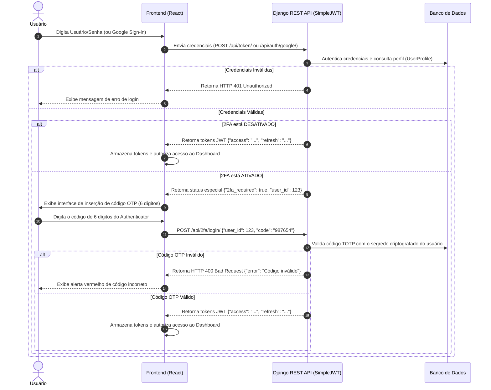
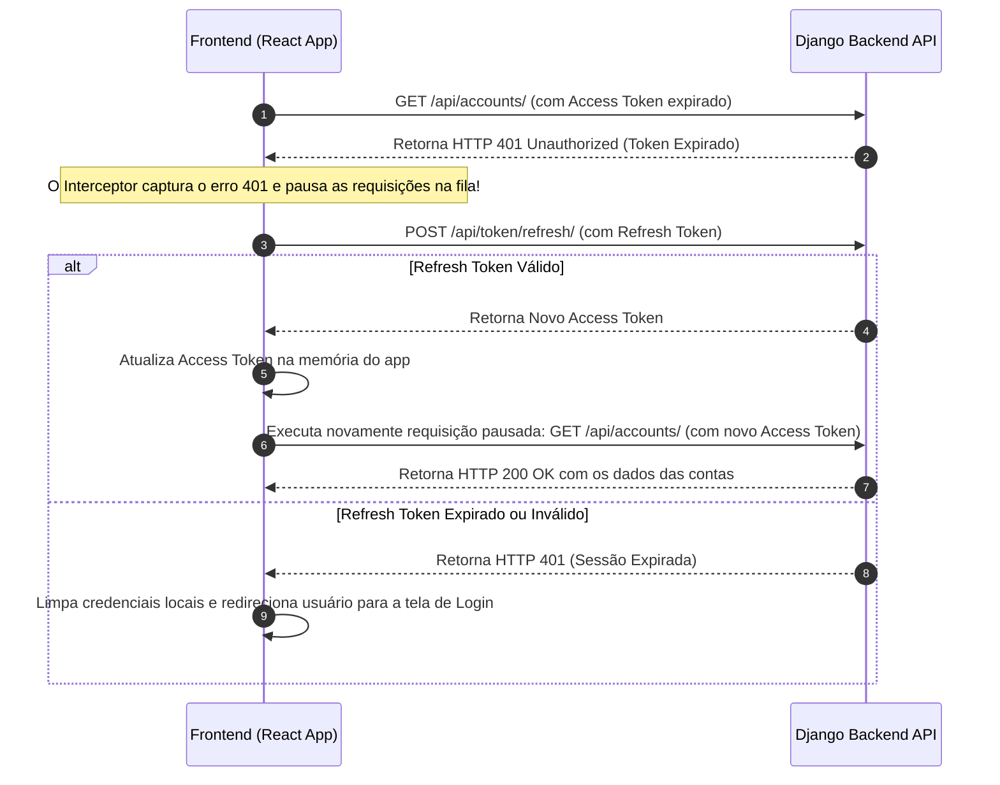

# ✦ Wiki — Pipeline de Segurança & Autenticação JWT + 2FA

Este documento descreve detalhadamente a arquitetura de segurança, criptografia e controle de acesso implementada no **Vault Finance OS**. Ele serve como especificação técnica dos fluxos de autenticação em dois fatores (2FA) e do gerenciamento do ciclo de vida de tokens JWT.

---

## 1. Visão Geral da Arquitetura de Segurança

O Vault Finance OS implementa uma estratégia de **Segurança em Múltiplas Camadas (Defense in Depth)** para proteger as informações financeiras dos usuários, consistindo em:

* **Autenticação Híbrida:** Suporte a credenciais tradicionais (Usuário/Senha) e Login Social (Google OAuth2).
* **Autenticação Multifator (MFA/2FA):** Proteção baseada no protocolo TOTP (Time-Based One-Time Password).
* **Autorização sem Estado (Stateless):** Emissão de tokens JWT assinalados criptograficamente.
* **Criptografia de Dados em Trânsito:** Comunicação blindada de ponta a ponta via protocolo HTTPS com cifras SSL/TLS.

---

## 2. Fluxo Geral de Autenticação Híbrida

O processo de autenticação é executado em duas fases caso o usuário possua a autenticação de dois fatores ativada em seu perfil.

---

## 3. O Segundo Fator: Algoritmo TOTP (RFC 6238)

A validação de dois fatores do Vault Finance OS baseia-se no algoritmo **TOTP (Time-Based One-Time Password)** especificado pela RFC 6238.

### Funcionamento Matemático
O OTP gerado pelo aplicativo autenticador do usuário (ex: Google Authenticator) baseia-se na chave secreta simétrica compartilhada em Base32 ($K$) e no tempo do sistema ($T$):

1. **Obtenção do Contador Temporal ($C$):**
   $$C = \lfloor \frac{\text{Timestamp Atual} - T_0}{X} \rfloor$$
   * Onde $T_0 = 0$ (Epoch Unix) e $X = 30$ segundos (janela de validade do código).

2. **Geração do Hash HMAC-SHA1:**
   $$H = \text{HMAC-SHA1}(K, C)$$

3. **Truncamento Dinâmico (Dynamic Truncation):**
   Extrai-se uma sequência numérica de 4 bytes a partir do hash $H$ e calcula-se o módulo matemático por $10^6$ para gerar o código numérico final de 6 dígitos apresentado na tela do celular.

### Sincronização e Tolerância Visando Latência
Como o tempo do servidor e do celular do usuário podem sofrer pequenas variações (dessincronização de relógio), o backend do Django utiliza a biblioteca `pyotp` configurada com uma tolerância de **1 janela temporal anterior e 1 posterior (±30 segundos)**. Isso impede que o usuário seja bloqueado devido a pequenos atrasos na rede ou diferenças de milissegundos no dispositivo.

---

## 4. Ciclo de Vida do JWT (JSON Web Token)

O acesso aos endpoints protegidos da API financeira utiliza o padrão de autenticação `Bearer Token` do SimpleJWT.

### Matriz de Atributos dos Tokens

| Tipo de Token | Tempo de Vida | Destino de Armazenamento | Propósito |
| :--- | :--- | :--- | :--- |
| **Access Token** | 15 minutos | Memória volátil (React State) | Assinar requisições HTTP adicionando o cabeçalho `Authorization: Bearer <token>`. |
| **Refresh Token** | 7 dias | `SecureStorage` (Mobile) / `localStorage` (Web) | Obter novos Access Tokens de forma silenciosa e transparente sem forçar novo login. |

---

## 5. Middleware de Rotação Silenciosa e Interceptadores (Frontend)

Para evitar que a sessão do usuário expire repentinamente a cada 15 minutos, o cliente frontend implementa um padrão de interceptor de requisições de rede (via Axios ou Fetch Wrapper).

### Diagrama de Rotação de Tokens em Runtime

---

## 6. Boas Práticas de Proteção de Segredos no Banco de Dados

* **Armazenamento de Senhas:** O Django armazena as senhas utilizando o algoritmo de hashing unidirecional **PBKDF2** com salt individual por usuário e rotações de chave SHA256, inviabilizando ataques de dicionário (*Rainbow Tables*).
* **Segredos 2FA:** A chave secreta base32 gerada pela view `TwoFactorSetupView` é mantida de forma privada no banco de dados e nunca deve ser compartilhada com outros usuários ou exposta em endpoints que não sejam o de inicialização de segurança de autoria do próprio usuário logado.

---

## 7. Manual do Usuário: Segurança e Privacidade na Prática

Além da infraestrutura técnica, o Vault Finance OS oferece interfaces claras para que o usuário gerencie sua própria segurança. A seguir, detalhamos os fluxos visuais e operacionais.

### 7.1 Acesso Híbrido Seguro (Web e Mobile)

O sistema suporta duas vias principais de autenticação, projetadas para funcionar de maneira idêntica independentemente do dispositivo (Navegador Desktop ou App Android/iOS empacotado via Capacitor).

1. **Login Local (E-mail e Senha):**
   - Acesse a tela inicial do aplicativo e insira suas credenciais cadastradas.
   - O sistema fará a validação em banco e, caso o 2FA esteja ativado, exigirá o segundo fator antes de liberar os tokens.

2. **Login via Google SSO (Single Sign-On):**
   - Na tela de login, clique no botão "Continuar com o Google".
   - **Na Web:** Um pop-up padrão do Google será exibido.
   - **No App Mobile (Capacitor):** O sistema chamará a ponte nativa do sistema operacional (Android/iOS), garantindo que você utilize a conta do Google já vinculada e autenticada biometricamente no seu celular, conferindo máxima segurança.

> [!WARNING]
> Nunca compartilhe suas credenciais. Caso sinta que sua senha foi comprometida, altere-a imediatamente através do painel de Configurações de Perfil e encerre as sessões abertas.

### 7.2 Configuração do 2FA (Passo a Passo)

A Ativação do Segundo Fator de Autenticação (2FA) é altamente recomendada para blindar sua conta financeira contra acessos indevidos.

**Como Ativar:**
1. Navegue até **Configurações > Segurança**.
2. Clique no botão **Ativar 2FA**.
3. O sistema gerará um **QR Code** único e criptografado na tela.
4. Abra um aplicativo autenticador em seu smartphone (como o **Google Authenticator**, **Authy** ou **Microsoft Authenticator**).
5. Selecione a opção "Escanear um código QR" na câmera do aplicativo e aponte para a tela.
6. O aplicativo começará a gerar códigos numéricos de 6 dígitos que mudam a cada 30 segundos.
7. Digite o código de 6 dígitos gerado pelo app no campo de validação do Vault Finance OS e clique em **Confirmar**.

> [!WARNING]
> O QR Code e a chave secreta de backup só são exibidos uma única vez durante a configuração inicial. Guarde a chave de segurança física (texto impresso) em local seguro; ela é a única forma de recuperar sua conta caso você perca acesso ao seu smartphone.

### 7.3 Gestão de Privacidade e LGPD

O Vault Finance OS é desenvolvido com privacidade desde a concepção (Privacy by Design), em conformidade total com a Lei Geral de Proteção de Dados (LGPD) e o Regulamento Geral sobre a Proteção de Dados (GDPR). 

Ao acessar o aplicativo pela primeira vez, ou através da aba **Privacidade e Cookies** nas Configurações, o usuário controla categoricamente a coleta de rastreadores (Cookies):

* **Cookies Essenciais (Obrigatórios):** Responsáveis pela segurança da sessão (armazenamento criptografado do seu JWT) e proteção contra fraudes (CSRF). Não podem ser desativados pois o aplicativo não funciona sem eles.
* **Cookies Analíticos (Opcionais):** Ao ativar esta chave, você nos autoriza a coletar dados anônimos de performance, tempo de carregamento de tela e uso de funcionalidades, nos ajudando a otimizar a velocidade do aplicativo.
* **Cookies de Marketing (Opcionais):** Se ativados, permitem que serviços de parceiros rastreiem conversões de métricas.

**Reatividade Dinâmica:** O `useConsentStore` intercepta e desliga imediatamente qualquer script ou pixel de rastreamento de terceiros injetado na DOM do navegador assim que o botão de opt-out (desligar chave) é pressionado. A escolha é 100% sua.
